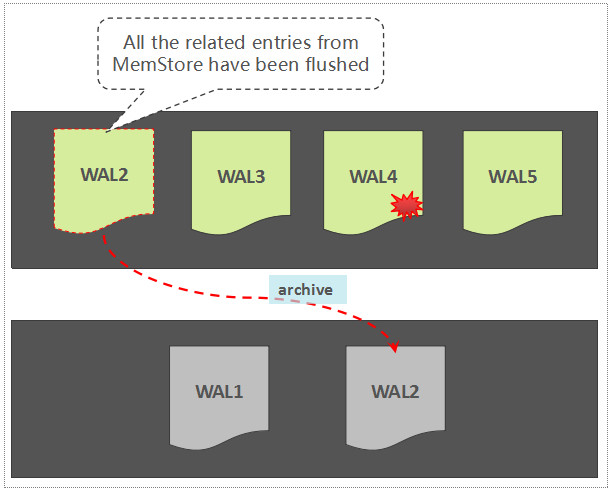

# 简明HBase入门教程-开篇

http://www.nosqlnotes.com/technotes/hbase/hbase-overview-concepts/

这是HBase入门系列的第1篇文章，介绍HBase的数据模型、适用场景、集群关键角色、建表流程以及所涉及的HBase基础概念，本文内容基于HBase 2.0 beta2版本。本文既适用于HBase新手，也适用于已有一定经验的HBase开发人员。

> **一些常见的HBase新手问题**
>
> 1. 什么样的数据适合用HBase来存储？
> 2. 既然HBase也是一个数据库，能否用它将现有系统中昂贵的Oracle替换掉？
> 3. 存放于HBase中的数据记录，为何不直接存放于HDFS之上？
> 4. 能否直接使用HBase来存储文件数据？
> 5. Region(HBase中的数据分片)迁移后，数据是否也会被迁移？
> 6. 为何基于Spark/Hive分析HBase数据时性能较差？

## 开篇

用惯了Oracle/MySQL的同学们，心目中的数据表，应该是长成这样的：


这种表结构规整，每一行都有固定的列构成，因此，非常适合结构化数据的存储。但在NoSQL领域，数据表的模样却往往换成了另外一种”画风”：

行由看似”杂乱无章”的列组成，行与行之间也无须遵循一致的定义，而这种定义恰好符合半结构化数据或非结构化数据的特点。本文所要讲述的HBase，就属于该派系的一个典型代表。这些”杂乱无章”的列所构成的多行数据，被称之为一个”稀疏矩阵”，而上图中的每一个”黑块块”，在HBase中称之为一个KeyValue。

Apache HBase官方给出了这样的定义：

> *[Apache](http://www.apache.org/) HBase™ is the [Hadoop](http://hadoop.apache.org/) database, a **distributed**, **scalable**, **big data store**.即：Apache HBase是基于Hadoop构建的一个**分布式**的、**可伸缩**的**海量数据存储系统**。*

HBase常被用来存放一些结构简单，但数据量非常大的数据(通常在TB/PB级别)，如历史订单记录，日志数据，监控Metris数据等等，HBase提供了简单的基于Key值的快速查询能力。

HBase在国内市场已经取得了非常广泛的应用，在搜索引擎中，也可以看出来，HBase在国内呈现出了逐年上升的势态：从Apache HBase所关联的github项目的commits统计信息来看，也可以看出来该项目非常活跃：(需要说明的一点：HBase中的每一次commit，都已经过社区Commiter成员严格的Review，在commit之前，一个Patch可能已经被修改了几十个版本)

令人欣喜的是，国内的开发者也积极参与到了HBase社区贡献中，而且被社区接纳了多名PMC以及Committer成员。

本文将以**一条数据在HBase中的“旅程”**为线索，介绍HBase的核心概念与流程，几乎每一部分都可以展开成一篇独立的长文，但本文旨在让读者能够快速的了解HBase的架构轮廓，所以很多特性/流程被被一言带过，但这些特性在社区中往往经历了漫长的开发过程。至于讲什么以及讲到什么程度，本文都做了艰难的取舍，在讲解的过程中，将会穿插解答本文开始所提出的针对初学者的一些常见问题。

本文适用于HBase新手，而对于具备一定经验的HBase开发人员，相信本文也可以提供一些有价值的参考。本文内容基于HBase 2.0 beta 2版本，对比于1.0甚至是更早期的版本，2.0出现了大量变化，下面这些问题的答案与部分关键的变化相关（新手可以直接跳过这些问题）：

> 1. HBase meta Region在哪里提供服务？
> 2. HBase是否可以保证单行操作的原子性？
> 3. Region中写WAL与写MemStore的顺序是怎样的？
> 4. 你是否遇到过Region长时间处于RIT的状态？ 
> 5. 你认为旧版本中Assignment Manager的主要问题是什么？
> 6. 在面对Full GC问题时，你尝试做过哪些优化？
> 7. 你是否深究过HBase Compaction带来的“写放大”有多严重？
> 8. HBase的RPC框架存在什么问题？导致查询时延毛刺的原因有哪些？


本系列文章的**整体行文思路**如下：

> 1. 介绍HBase数据模型
> 2. 基于数据模型介绍HBase的适用场景快速
> 3. 介绍集群关键角色以及集群部署建议
> 4. 示例数据介绍
> 5. 写数据流程
> 6. 读数据流程
> 7. 数据更新
> 8. 负载均衡机制
> 9. HBase如何存储小文件数据


这些内容将会被拆成几篇文章。至于集群服务故障的处理机制，集群工具，周边生态，性能调优以及最佳实践等进阶内容，暂不放在本系列文章范畴内。

## 约定

本文范围内针对一些关键特性/流程，使用了加粗以及加下划线的方式做了强调，如”**ProcedureV2**“。这些特性往往在本文中仅仅被粗浅提及，后续计划以独立的文章来介绍这些特性/流程。

**术语缩写**：对于一些进程/角色名称，在本文范围内可能通过缩写形式来表述：

## 数据模型

RowKey用来表示唯一一行记录的**主键**，HBase的数据是按照RowKey的**字典顺序**进行全局排序的，所有的查询都只能依赖于这一个排序维度。

> *通过下面一个例子来说明一下”**字典排序**“的原理：*
>
> *RowKey {“abc”, “a”, “bdf”, “cdf”, “defg”}按字典排序后的结果为{“a”, “abc”, “bdf”, “cdf”, “defg”}*
>
> *也就是说，当两个RowKey进行排序时，先对比两个RowKey的第一个字节，如果相同，则对比第二个字节，依此类推…如果在对比到第M个字节时，已经超出了其中一个RowKey的字节长度，那么，短的RowKey要被排在另外一个RowKey的前面*

## 稀疏矩阵

参考了Bigtable，HBase中一个表的数据是按照稀疏矩阵的方式组织的，”开篇”部分给出了一张关于HBase数据表的*抽象图*，我们再结合下表来加深大家关于”稀疏矩阵”的印象：

看的出来：**每一行中，列的组成都是灵活的，行与行之间并不需要遵循相同的列定义**， 也就是HBase数据表”**schema-less**“的特点。

## Region

区别于Cassandra/DynamoDB的”Hash分区”设计，HBase中采用了”Range分区”，将Key的完整区间切割成一个个的”Key Range” ，每一个”Key Range”称之为一个Region。也可以这么理解：将HBase中拥有数亿行的一个大表，**横向切割**成一个个”**子表**“，这一个个”**子表**“就是**Region**：Region是HBase中负载均衡的基本单元，当一个Region增长到一定大小以后，会自动分裂成两个。

## Column Family

如果将Region看成是一个表的**横向切割**，那么，一个Region中的数据列的**纵向切割**，称之为一个**Column Family**。每一个列，都必须归属于一个Column Family，这个归属关系是在写数据时指定的，而不是建表时预先定义。

## KeyValue

KeyValue的设计不是源自Bigtable，而是要追溯至论文”The log-structured merge-tree(LSM-Tree)”。每一行中的每一列数据，都被包装成独立的拥有**特定结构**的KeyValue，KeyValue中包含了丰富的自我描述信息:


看的出来，KeyValue是支撑”稀疏矩阵”设计的一个关键点：一些Key相同的任意数量的独立KeyValue就可以构成一行数据。但这种设计带来的一个显而易见的缺点：**每一个KeyValue所携带的自我描述信息，会带来显著的数据膨胀**。

## 适用场景

在介绍完了HBase的数据模型以后，我们可以回答本文一开始的前两个问题：

> 1. 什么样的数据适合用HBase来存储？
> 2. 既然HBase也是一个数据库，能否用它将现有系统中昂贵的Oracle替换掉？


HBase的数据模型比较简单，数据按照RowKey排序存放，适合HBase存储的数据，可以简单总结如下：

- 以**实体**为中心的数据

  实体可以包括但不限于如下几种：

  - 自然人／账户／手机号／车辆相关数据
  - 用户画像数据（含标签类数据）
  - 图数据（关系类数据）

描述这些实体的，可以有基础属性信息、实体关系(图数据)、所发生的事件(如交易记录、车辆轨迹点)等等。

- 以**事件**为中心的数据
  - 监控数据
  - 时序数据
  - 实时位置类数据
  - 消息/日志类数据

上面所描述的这些数据，有的是结构化数据，有的是半结构化或非结构化数据。HBase的“稀疏矩阵”设计，使其应对非结构化数据存储时能够得心应手，但在我们的实际用户场景中，结构化数据存储依然占据了比较重的比例。由于HBase仅提供了基于RowKey的单维度索引能力，在应对一些具体的场景时，依然还需要基于HBase之上构建一些专业的能力，如：

- **OpenTSDB** 时序数据存储，提供基于Metrics+时间+标签的一些组合维度查询与聚合能力

- **GeoMesa** 时空数据存储，提供基于时间+空间范围的索引能力

- **JanusGraph** 图数据存储，提供基于属性、关系的图索引能力


HBase擅长于存储结构简单的海量数据但索引能力有限，而Oracle等传统关系型数据库(RDBMS)能够提供丰富的查询能力，但却疲于应对TB级别的海量数据存储，HBase对传统的RDBMS并不是取代关系，而是一种补充。

HBase与HDFS

我们都知道HBase的数据是存储于HDFS里面的，相信大家也都有这么的认知：

> HBase是一个**分布式数据库**，HDFS是一个**分布式文件系统**

理解了这一点，我们先来粗略回答本文已开始提出的其中两个问题：

> 1. **HBase中的数据为何不直接存放于HDFS之上？**
>
>    HBase中存储的海量数据记录，通常在几百Bytes到KB级别，如果将这些数据直接存储于HDFS之上，会导致大量的小文件产生，为HDFS的元数据管理节点(NameNode)带来沉重的压力。
>
> 2. **文件能否直接存储于HBase里面？**
>
>    如果是几MB的文件，其实也可以直接存储于HBase里面，我们暂且将这类文件称之为小文件，HBase提供了一个名为MOB的特性来应对这类小文件的存储。但如果是更大的文件，强烈不建议用HBase来存储，关于这里更多的原因，希望你在详细读完本文所有内容之后能够自己解答。


## 集群角色


> ***关于集群环境，你可以使用国内外大数据厂商的平台，如Cloudera，Hontonworks以及国内的华为，都发行了自己的企业版大数据平台，另外，华为云、阿里云中也均推出了全托管式的HBase服务。***

我们假设集群环境已经Ready了，先来看一下集群中的**关键角色**：

相信大部分人对这些角色都已经有了一定程度的了解，我们快速的介绍一下各个角色在集群中的**主要**职责(**注意**：这里不是列出所有的职责)：

**ZooKeeper**

在一个拥有多个节点的分布式系统中，假设，只能有一个节点是主节点，如何快速的选举出一个主节点而且让所有的节点都认可这个主节点？这就是HBase集群中存在的一个最基础命题。利用ZooKeeper就可以非常简单的实现这类”仲裁”需求，ZooKeeper还提供了基础的事件通知机制，所有的数据都以 ZNode的形式存在，它也称得上是一个”微型数据库”。

**NameNode**

HDFS作为一个分布式文件系统，自然需要文件目录树的**元数据**信息，另外，在HDFS中每一个文件都是按照Block存储的，文件与Block的关联也通过**元数据**信息来描述。NameNode提供了这些**元数据信息的存储**。

- **DataNode**

HDFS的数据存放节点。

- **RegionServer**

HBase的**数据服务节点**。

- **Master

HBase的管理节点，通常在一个集群中设置一个主Master，一个备Master，主备角色的”仲裁”由ZooKeeper实现。 Master**主要职责**：

1. 负责管理所有的RegionServer

2. 建表/修改表/删除表等DDL操作请求的服务端执行主体

3. 管理所有的数据分片(Region)到RegionServer的分配如果一个RegionServer宕机或进程故障，由Master负责将它原来所负责的Regions转移到其它的RegionServer上继续提供服务

4. Master自身也可以作为一个RegionServer提供服务，该能力是可配置的

   

## 集群部署建议

如果基于物理机/虚拟机部署，通常建议：

- RegionServer与DataNode联合部署，RegionServer与DataNode按1:1比例设置。

这种部署的优势在于，RegionServer中的数据文件可以存储一个副本于本机的DataNode节点中，从而在读取时可以利用HDFS中的”**短路径读取(Short Circuit)**“来绕过网络请求，降低读取时延。


- 管理节点独立于数据节点部署

如果是基于物理机部署，每一台物理机节点上可以设置几个RegionServers/DataNodes来提升资源使用率。

也可以选择基于容器来部署，如在HBaseCon Asia 2017大会知乎的演讲主题中，就提到了知乎基于Kubernetes部署HBase服务的实践。

对于公有云HBase服务而言，为了降低总体拥有成本(*TCO*)，通常选择”**计算与存储物理分离**“的方式，从架构上来说，可能导致平均时延略有下降，但可以借助于共享存储底层的IO优化来做一些”弥补”。HBase集群中的RegionServers可以按逻辑划分为多个Groups，一个表可以与一个指定的Group绑定，可以将RegionServer Group理解成将一个大的集群划分成了多个逻辑子集群，借此可以实现多租户间的隔离，这就是HBase中的**RegionServer Group**特性。

## 示例数据

给出一份我们日常都可以接触到的数据样例，先简单给出示例数据的字段定义：

如上定义与实际的通话记录字段定义相去甚远，本文力求简洁，仅给出了最简单的示例。如下是”虚构”的样例数据：


在本文大部分内容中所涉及的一条数据，是上面加粗的最后一行”**Mobile1**“为”**13400006666**“这行记录。

## 写数据之前：建立连接

### Login

在启用了安全特性的前提下，Login阶段是为了完成**用户认证**(确定用户的合法身份)，这是后续一切**安全访问控制**的基础。当前Hadoop/HBase仅支持基于Kerberos的用户认证，ZooKeeper除了Kerberos认证，还能支持简单的用户名/密码认证，但都基于静态的配置，无法动态新增用户。如果要支持其它第三方认证，需要对现有的安全框架做出比较大的改动。

### 创建ConnectionConnection

可以理解为一个HBase集群连接的抽象，建议使用ConnectionFactory提供的工具方法来创建。因为HBase当前提供了两种连接模式：同步连接，异步连接，这两种连接模式下所创建的Connection也是不同的。我们给出ConnectionFactory中关于获取这两种连接的典型方法定义：

```
CompletableFuture<AsyncConnection> createAsyncConnection(Configuration conf,  User user);  

Connection createConnection(Configuration conf, ExecutorService pool, User user)      throws IOException;
```

Connection中主要维护着两类共享的资源：

- 线程池
- Socket连接

这些资源都是在真正使用的时候才会被创建，因此，此时的连接还只是一个”虚拟连接”。

## 写数据之前：创建数据表

### DDL操作的抽象接口 – Admin

Admin定义了常规的DDL接口，列举几个典型的接口：

```
void createNamespace(final NamespaceDescriptor descriptor) throws IOException; 
void createTable(final HTableDescriptor desc, byte[][] splitKeys) throws IOException;
TableName[] listTableNames() throws IOException;
```


### 预设合理的数据分片 – Region

分片数量会给读写吞吐量带来直接的影响，因此，建表时通常建议由用户主动指定划分**Region分割点**，来设定Region的数量。HBase中数据是按照RowKey的字典顺序排列的，为了能够划分出合理的Region分割点，需要依据如下几点信息：

- Key的组成结构

- Key的数据分布预估

  如果不能基于Key的组成结构来预估数据分布的话，可能会导致数据在Region间的分布不均匀

- 读写并发度需求

  依据读写并发度需求，设置合理的Region数量

### 为表定义合理的Schema

既然HBase号称”schema-less”的数据存储系统，那何来的是schema? 的确，在数据库范式的支持上，HBase非常弱，这里的Schema，主要指如下一些信息的设置：

- NameSpace设置

- Column Family的数量

- 每一个Column Family中所关联的一些**关键配置**：

  - Compression

  		HBase当前可以支持Snappy，GZ，LZO，LZ4，Bzip2以及ZSTD压缩算法

  - DataBlock Encoding

  		HBase针对自身的特殊数据模型所做的一种压缩编码

  - BloomFilter

  		可用来协助快速判断一条记录是否存在

  - TTL

  		指定数据的过期时间

  - StoragePolicy

  		指定Column Family的存储策略，可选配置有：“ALL_SSD”，”ONE_SSD”，”HOT”，”WARM”，”COLD”，”LAZY_PERSIST”

  HBase中并不需要预先设置Column定义信息，这就是HBase schema-less设计的核心。

## Client发送建表请求到Master

建表的请求是通过RPC的方式由Client发送到Master:

- RPC接口基于Protocol Buffer定义

- 建表相关的描述参数，也由Protocol Buffer进行定义及序列化

Client端侧调用了Master服务的什么接口，参数是什么，这些信息都被通过RPC通信传输到Master侧，Master再依据这些接口\参数描述信息决定要执行的操作。2.0版本中，HBase目前已经支持基于Netty的**异步RPC框架**。

> ***关于HBase RPC框架***
>
> *早期的HBase RPC框架，完全借鉴了Hadoop中的实现，那时，Netty项目尚不盛行。*

Master侧接收到Client侧的建表请求以后，一些主要操作包括：

1. 生成每一个Region的描述信息对象HRegionInfo，这些描述信息包括：Region ID, Region名称，Key范围，表名称等信息

2. 生成每一个Region在HDFS中的文件目录

3. 将HRegionInfo信息写入到记录元数据的hbase:meta表中。

   

> ***说明***
>
> *meta表位于名为”hbase”的namespace中，因此，它的全称为”hbase:meta”。*
>
> *但在本系列文章范畴内，常将其缩写为”meta”。*

整个过程中，新表的状态也是记录在hbase:meta表中的，而不用再存储在ZooKeeper中。如果建表执行了一半，Master进程挂掉了，如何处理？这里是由HBase自身提供的一个名为**Procedure(V2)**的框架来保障操作的事务性的，备Master接管服务以后，将会继续完成整个建表操作。

一个被创建成功的表，还可以被执行如下操作：

- **Disable** 将所有的Region下线，该表暂停读写服务
- **Enable** 将一个Disable过的表重新Enable，也就是上线所有的Region来正常提供读写服务
- **Alter** 更改表或列族的描述信息

## Master分配Regions到各个RegionServers

新创建的所有的Regions，通过**AssignmentManager**将这些Region按照轮询(Round-Robin)的方式分配到每一个RegionServer中，具体的分配计划是由**LoadBalancer**来提供的。

AssignmentManager负责所有Regions的分配/迁移操作，Master中有一个定时运行的线程，来检查集群中的Regions在各个RegionServer之间的负载是否是均衡的，如果不均衡，则通过LoadBalancer生成相应的Region迁移计划，HBase中支持多种负载均衡算法，有最简单的仅考虑各RegionServer上的Regions数目的负载均衡算法，有基于迁移代价的负载均衡算法，也有数据本地化率优先的负载均衡算法，因为这一部分已经提供了插件化机制，用户也可以自定义负载均衡算法。

## 总结

到目前为止，文章介绍了如下关键内容：

1. HBase项目概述，呈现了HBase社区的活跃度以及搜索引擎热度等信息
2. HBase数据模型部分，讲到了RowKey，稀疏矩阵，Region，Column Family，KeyValue等概念
3. 基于HBase的数据模型，介绍了HBase的适合场景（以实体/事件为中心的简单结构的数据）介绍了HBase与HDFS的关系
4. 介绍了集群的关键角色：ZooKeeper, Master, RegionServer，NameNode, DataNode
5. 集群部署建议
6. 给出了一些示例数据
7. 写数据之前的准备工作：建立集群连接，建表（建表时应该定义合理的Schema以及设置合理的Region数量），建表由Master处理，新创建的Regions由Region AssignmentManager负责分配到各个RegionServer。下一篇文章将正式开始介绍写数据的流程。


# 简明HBase入门教程-Write全流程

http://www.nosqlnotes.com/technotes/hbase/hbase-overview-writeflow/

如果将上篇内容理解为一个冗长的”铺垫”，那么，从本文开始，剧情才开始正式展开。本文基于提供的样例数据，介绍了写数据的接口，RowKey定义，数据在客户端的组装，数据路由，打包分发，以及RegionServer侧将数据写入到Region中的全部流程。

**本文整体思路：**

1. 前文内容回顾
2. 示例数据
3. HBase可选接口介绍
4. 表服务接口介绍
5. 介绍几种写数据的模式
6. 如何构建Put对象(包含RowKey定义以及列定义)
7. 数据路由
8. Client侧的分组打包
9. Client发RPC请求到RegionServer
10. 安全访问控制
11. RegionServer侧处理：Region分发
12. Region内部处理：写WAL
13. Region内部处理：写MemStore


为了保证”故事”的完整性，导致本文篇幅过长，非常抱歉，读者可以按需跳过不感兴趣的内容。

 

## 前文回顾

 

上篇文章主要介绍了如下内容：

- HBase项目概况(搜索引擎热度/社区开发活跃度)
- HBase数据模型(RowKey，稀疏矩阵，Region，Column Family，KeyValue)
- 基于HBase的数据模型，介绍了HBase的适合场景（以**实体/事件**为中心的简单结构的数据）
- 介绍了HBase与HDFS的关系，集群关键角色以及部署建议
- 写数据前的准备工作：建立连接，建表


## 示例数据

（上篇文章已经提及，这里再复制一次的原因，一是为了让下文内容更容易理解，二是个别字段名称做了调整） 

给出一份我们日常都可以接触到的数据样例，先简单给出示例数据的字段定义： 

 

本文力求简洁，仅给出了最简单的几个字段定义。如下是”虚构”的样例数据： 

 


在本文大部分内容中所涉及的一条数据，是上面加粗的最后一行”**Mobile1**“为”**13400006666**“这行记录。 

在下面的流程图中，我们使用下面这样一个红色小图标来表示该数据所在的位置： 


## 写数据

### 可选接口

HBase中提供了如下几种主要的接口： 

- **Java Client API** 

HBase的基础API，应用最为广泛。 

- **HBase Shell** 

基于Shell的命令行操作接口，基于Java Client API实现。 

- **Restful API** 

Rest Server侧基于Java Client API实现。 

- **Thrift API** 

Thrift Server侧基于Java Client API实现。 

- **MapReduce Based Batch Manipulation API** 

基于MapReduce的批量数据读写API。 


除了上述主要的API，HBase还提供了**基于Spark的批量操作接口**以及**C++ Client**接口，但这两个特性都被规划在了3.0版本中，当前尚在开发中。 

无论是HBase Shell/Restful API还是Thrift API，都是基于Java Client API实现的。因此，接下来关于流程的介绍，都是基于Java Client API的调用流程展开的。 


### 关于表服务接口的抽象

同步连接与异步连接，分别提供了不同的表服务接口抽象： 

- Table 同步连接中的表服务接口定义 
- AsyncTable 异步连接中的表服务接口定义 

异步连接AsyncConnection获取AsyncTable实例的接口默认实现： 

```
default AsyncTable<AdvancedScanResultConsumer> getTable(TableName tableName) {
    return getTableBuilder(tableName).build();
}
```

同步连接ClusterConnection的实现类ConnectionImplementation中获取Table实例的接口实现： 

```
@Override
public Table getTable(TableName tableName) throws IOException {
    return getTable(tableName, getBatchPool());
}
```

### 写数据的几种方式

- **Single Put** 


单条记录单条记录的随机put操作。Single Put所对应的接口定义如下： 

在AsyncTable接口中的定义： 

```
CompletableFuture<Void> put(Put put);
```

在Table接口中的定义： 

```
void put(Put put) throws IOException;
```

- **Batch Put** 


汇聚了几十条甚至是几百上千条记录之后的**小批次**随机put操作。 

Batch Put只是本文对该类型操作的称法，实际的接口名称如下所示： 

在AsyncTable接口中的定义：

```
List<CompletableFuture<Void>> put(List<Put> puts);
```

在Table接口中的定义：

```
void put(List<Put> puts) throws IOException;
```

- **Bulkload**

基于MapReduce API提供的数据批量导入能力，导入数据量通常在GB级别以上，Bulkload能够绕过Java Client API直接生成HBase的底层数据文件(HFile)。

### 构建Put对象

#### 设计合理的RowKey

RowKey通常是一个或若干个字段的直接组合或经一定处理后的信息，因为一个表中所有的数据都是基于RowKey排序的，RowKey的设计对读写都会有直接的性能影响。

我们基于本文的样例数据，先给出两种RowKey的设计，并简单讨论各自的优缺点：

**样例数据：**


**owKey Format 1**： Mobile1 + StartTime

为了方便读者理解，我们在两个字段之间添加了连接符”^”。如下是RowKey以及相关排序结果：


**RowKey Format 2**： StartTime + Mobile1


从上面两个表格可以看出来，不同的字段组合顺序设计，带来截然不同的排序结果，我们将RowKey中的第一个字段称之为“**先导字段**”。第一种设计，有利于查询”手机号码XXX的在某时间范围内的数据记录”，但不利于查询”某段时间范围内有哪些手机号码拨出了电话？”，而第二种设计却恰好相反。


上面是两种设计都是两个字段的直接组合，这种设计在实际应用中，会带来读写**热点**问题，难以保障数据读写请求在所有Regions之间的负载均衡。避免热点的常见方法有如下几种：


**Reversing**

如果先导字段本身会带来热点问题，但该字段尾部的信息却具备良好的随机性，此时，可以考虑将先导字段做反转处理，将尾部几位直接提前到前面，或者直接将整个字段完全反转。

将**先导字段**Mobile1翻转后，就具备非常好的随机性。

**例如：**

13400001111^201803010800

将先导字段Mobile1反转后的RowKey变为：

11110000431^201803010800

**Salting**

Salting的原理是在RowKey的前面添加固定长度的随机Bytes，随机Bytes能保障数据在所有Regions间的负载均衡。


Salting能很好的保障写入时将数据均匀分散到各个Region中，但对于读取却是不友好的，例如，如果读取Mobile1为”13400001111″在20180301这一天的数据记录时，因为Salting Bytes信息是随机选择添加的，查询时并不知道前面添加的Salting Bytes是”A”，因此{“A”, “B”, “C”}所关联的Regions都得去查看一下。


**Hashing**

Hashing是将一个RowKey通过一个Hash函数生成一组固定长度的bytes，Hash函数能保障所生成的随机bytes具备良好的离散度，从而也能够均匀打散到各个Region中。Hashing既有利于随机写入，又利于基于知道RowKey各字段的确切信息之后的随机读取操作，但如果是基于RowKey范围的Scan或者是RowKey的模糊信息进行查询的话，就会带来显著的性能问题，因为原来在字典顺序相邻的RowKey列表，通过Hashing打散后导致这些数据被分散到了多个Region中。

因此，**RowKey的设计，需要充分考虑业务的读写特点**。


本文内容假设RowKey设计：**reversing(Mobile1) +StartTime**

也就是说，RowKey由反转处理后的Mobile1与StartTime组成。对于我们所关注的这行数据：


RowKey应该为： **66660000431^201803011300**

因为创建表时预设的Region与RowKey强相关，我们现在才可以给出本文样例所需要创建的表的”**Region分割点**“信息：

假设，Region分割点为“1,2,3,4,5,6,7,8,9”，基于这9个分割点，可以预先创建10个Region，这10个Region的StartKey和StopKey如下所示：


- 第一个Region的StartKey为空，最后一个Region的StopKey为空
- 每一个Region区间，都包含StartKey本身，但不包含StopKey
- **由于Mobile1字段的最后一位是0~9之间的随机数字，因此，可以均匀打散到这10个Region中**

#### 定义列

每一个列在HBase中体现为一个KeyValue，而每一个KeyValue拥有特定的组成结构，这一点在上一篇文章的数据模型章节已经提到过。

所谓的定义列，就是需要定义出每一个列要存放的列族(Column Family)以及列标识(Qualifier)信息。

我们假设，存放样例数据的这个表名称为”**TelRecords**” ，为了简单起见，仅仅设置了1个名为”I”的列族。


因为Mobile1与StartTime都已经被包含在RowKey中，所以，不需要再在列中存储一份。关于列族名称与列标识名称，建议应该简短一些，因为这些信息都会被包含在KeyValue里面，过长的名称会导致数据膨胀。

基于RowKey和列定义信息，就可以组建HBase的Put对象，**一个Put对象用来描述待写入的一行数据**，一个Put可以理解成与某个RowKey关联的1个或多个KeyValue的集合。

至此，这条数据已经转变成了Put对象，如下图所示：


### 数据路由

#### 初始化ZooKeeper Session

因为meta Region的**路由信息**存放于ZooKeeper中，在第一次从ZooKeeper中读取META Region的地址时，需要先初始化一个ZooKeeper Session。ZooKeeper Session是ZooKeeper Client与ZooKeeper Server端所建立的一个会话，通过心跳机制保持长连接。

#### 获取Region路由信息

通过前面建立的连接，从ZooKeeper中读取meta Region所在的RegionServer，这个读取流程，当前已经是异步的。获取了meta Region的路由信息以后，再从meta Region中定位要读写的RowKey所关联的Region信息。如下图所示：


因为每一个用户表Region都是一个RowKey Range，meta Region中记录了每一个用户表Region的路由以及状态信息，以RegionName(包含表名，Region **StartKey**，Region ID，副本ID等信息)作为RowKey。基于一条用户数据RowKey，快速查询该RowKey所属的Region的方法其实很简单：只需要基于表名以及该用户数据RowKey，构建一个虚拟的Region Key，然后通过Reverse Scan的方式，读到的第一条Region记录就是该数据所关联的Region。如下图所示：


Region只要不被迁移，那么获取的该Region的路由信息就是一直有效的，因此，HBase Client有一个Cache机制来缓存Region的路由信息，避免每次读写都要去访问ZooKeeper或者meta Region。

> **进阶内容1：meta Region究竟在哪里？**
>
> meta Region的路由信息存放在ZooKeeper中，但meta Region究竟在哪个RegionServer中提供读写服务？
>
> 在1.0版本中，引入了一个新特性，使得Master可以”兼任”一个RegionServer角色(可参考HBASE-5487, HBASE-10569)，从而可以将一些系统表的Region分配到Master的这个RegionServer中，这种设计的初衷是为了简化/优化Region Assign的流程，但这依然带来了一系列复杂的问题，尤其是Master初始化和RegionServer初始化之间的Race，因此，在2.0版本中将这个特性暂时关闭了。详细信息可以参考：HBASE-16367，HBASE-18511，HBASE-19694，HBASE-19785，HBASE-19828


### 客户端侧的数据分组“打包”

如果这条待写入的数据采用的是Single Put的方式，那么，该步骤可以略过（事实上，单条Put操作的流程相对简单，就是先定位该RowKey所对应的Region以及RegionServer信息后，Client直接发送写请求到RegionServer侧即可）。

但如果这条数据被混杂在其它的数据列表中，采用Batch Put的方式，那么，客户端在将所有的数据写到对应的RegionServer之前，会先分组”打包”，流程如下：

1. **按Region分组**：遍历每一条数据的RowKey，然后，依据meta表中记录的Region信息，确定每一条数据所属的Region。此步骤可以获取到Region到RowKey列表的映射关系。
2. **按RegionServer”打包”**：因为Region一定归属于某一个RegionServer（注：本文内容中如无特殊说明，都未考虑Region Replica特性），那属于同一个RegionServer的多个Regions的写入请求，被打包成一个MultiAction对象，这样可以一并发送到每一个RegionServer中。


### Client发送写数据请求到RegionServer

类似于Client发送建表到Master的流程，Client发送写数据请求到RegionServer，也是通过RPC的方式。只是，Client到Master以及Client到RegionServer，采用了不同的RPC服务接口。


single put请求与batch put请求，两者所调用的RPC服务接口方法是不同的，如下是Client.proto中的定义：

```
service ClientService {
  // single Put请求所涉及的RPC服务接口方法
  rpc Mutate(MutateRequest)
    returns(MutateResponse);

  // batch put请求所涉及的RPC服务接口方法
  rpc Multi(MultiRequest)
    returns(MultiResponse);
}
```

### 安全访问控制

如何保障UserA只能写数据到UserA的表中，以及禁止UserA改写其它User的表的数据，HBase提供了ACL机制。ACL通常需要与Kerberos认证配合一起使用，Kerberos能够确保一个用户的合法性，而ACL确保该用户仅能执行权限范围内的操作。


HBase将权限分为如下几类：

- READ(‘R’)
- WRITE(‘W’)
- EXEC(‘X’)
- CREATE(‘C’)
- ADMIN(‘A’)

可以为一个用户/用户组定义整库级别的权限集合，也可以定义Namespace、表、列族甚至是列级别的权限集合。

### RegionServer端处理：Region分发

RegionServer的RPC Server侧，接收到来自Client端的RPC请求以后，将该请求交给Handler线程处理。如果是single put，则该步骤比较简单，因为在发送过来的请求参数MutateRequest中，已经携带了这条记录所关联的Region，那么直接将该请求转发给对应的Region即可。如果是batch puts，则接收到的请求参数为MultiRequest，在MultiRequest中，混合了这个RegionServer所持有的多个Region的写入请求，每一个Region的写入请求都被包装成了一个RegionAction对象。RegionServer接收到MultiRequest请求以后，遍历所有的RegionAction，而后写入到每一个Region中，此过程是**串行**的:


**从这里可以看出来，并不是一个batch越大越好，大的batch size甚至可能导致吞吐量下降。**

### Region内部处理：写WAL

HBase也采用了LSM-Tree的架构设计：LSM-Tree利用了传统机械硬盘的“**顺序读写速度远高于随机读写速度**”的特点。随机写入的数据，如果直接去改写每一个Region上的数据文件，那么吞吐量是非常差的。因此，每一个Region中随机写入的数据，都暂时先缓存在内存中(HBase中存放这部分内存数据的模块称之为**MemStore**，这里仅仅引出概念，下一章节详细介绍)，为了保障数据可靠性，将这些随机写入的数据**顺序写入**到一个称之为WAL(Write-Ahead-Log)的日志文件中，WAL中的数据按时间顺序组织：


如果位于内存中的数据尚未持久化，而且突然遇到了机器断电，只需要将WAL中的数据回放到Region中即可:


在HBase中，默认一个RegionServer只有一个可写的WAL文件。WAL中写入的记录，以**Entry**为基本单元，而一个Entry中，包含：

1. **WALKey** 包含{Encoded Region Name，Table Name，Sequence ID，Timestamp}等关键信息，其中，Sequence ID在维持数据一致性方面起到了关键作用，可以理解为一个事务ID。
2. **WALEdit** WALEdit中直接保存待写入数据的所有的KeyValues，而这些KeyValues可能来自一个Region中的多行数据。

也就是说，通常，一个Region中的一个batch put请求，会被组装成一个Entry，写入到WAL中：


将Entry写到文件中时是支持压缩的，但该特性默认未开启。


#### WAL进阶内容

##### WAL Roll and Archive

当正在写的WAL文件达到一定大小以后，会创建一个新的WAL文件，上一个WAL文件依然需要被保留，因为这个WAL文件中所关联的Region中的数据，尚未被持久化存储，因此，该WAL可能会被用来回放数据。


如果一个WAL中所关联的所有的Region中的数据，都已经被持久化存储了，那么，这个WAL文件会被暂时归档到另外一个目录中：



注意，这里不是直接将WAL文件删除掉，这是一种稳妥且合理的做法，原因如下：

1. 避免因为逻辑实现上的问题导致WAL被误删，暂时归档到另外一个目录，为错误发现预留了一定的时间窗口
2. 按时间维度组织的WAL数据文件还可以被用于其它用途，如增量备份，跨集群容灾等等，因此，这些WAL文件通常不允许直接被删除，至于何时可以被清理，还需要额外的控制逻辑

另外，如果对写入HBase中的数据的可靠性要求不高，那么，HBase允许通过配置跳过写WAL操作。


> **思考：put与batch put的性能为何差别巨大？**
>
> 在网络分发上，batch put已经具备一定的优势，因为batch put是打包分发的。
>
> 而从写WAL这块，看的出来，batch put写入的一小批次Put对象，可以通过一次sync就持久化到WAL文件中了，有效减少了IOPS。
>
> 但前面也提到了，batch size并不是越大越好，因为每一个batch在RegionServer端是被串行处理的。

##### 利用**Disruptor**提升写并发性能

在高并发随机写入场景下，会带来大量的WAL Sync操作，HBase中采用了Disruptor的RingBuffer来减少竞争，思路是这样：如果将瞬间并发写入WAL中的数据，合并执行Sync操作，可以有效降低Sync操作的次数，来提升写吞吐量。


##### Multi-WAL

默认情形下，一个RegionServer只有一个被写入的WAL Writer，尽管WAL Writer依靠顺序写提升写吞吐量，在基于普通机械硬盘的配置下，此时只能有单块盘发挥作用，其它盘的IOPS能力并没有被充分利用起来，这是Multi-WAL设计的初衷。Multi-WAL可以在一个RegionServer中同时启动几个WAL Writer，可按照一定的策略，将一个Region与其中某一个WAL Writer绑定，这样可以充分发挥多块盘的性能优势。


##### 关于WAL的未来

WAL是基于机械硬盘的IO模型设计的，而对于新兴的非易失性介质，如3D XPoint，WAL未来可能会失去存在的意义，关于这部分内容，请参考文章[《从HBase中移除WAL？3D XPoint技术带来的变革》](http://www.nosqlnotes.com/technotes/hbase-on-aep/)。


### Region内部处理：写MemStore

每一个Column Family，在Region内部被抽象为了一个HStore对象，而每一个HStore拥有自身的MemStore，用来缓存一批最近被随机写入的数据，这是LSM-Tree核心设计的一部分。

MemStore中用来存放所有的KeyValue的数据结构，称之为CellSet，而CellSet的核心是一个ConcurrentSkipListMap，我们知道，ConcurrentSkipListMap是Java的跳表实现，数据按照Key值有序存放，而且在高并发写入时，性能远高于ConcurrentHashMap。

因此，写MemStore的过程，事实上是将batch put提交过来的所有的KeyValue列表，写入到MemStore的以ConcurrentSkipListMap为组成核心的CellSet中：


MemStore因为涉及到大量的随机写入操作，会带来大量Java小对象的创建与消亡，会导致大量的内存碎片，给GC带来比较重的压力，HBase为了优化这里的机制，借鉴了操作系统的内存分页的技术，增加了一个名为MSLab的特性，通过分配一些固定大小的Chunk，来存储MemStore中的数据，这样可以有效减少内存碎片问题，降低GC的压力。当然，ConcurrentSkipListMap本身也会创建大量的对象，这里也有很大的优化空间，去年阿里的一篇文章透露了阿里如何通过优化ConcurrentSkipListMap的结构来有效减少GC时间。


> **进阶内容2：先写WAL还是先写MemStore?**
>
> 0.94版本之前，Region中的写入顺序是先写WAL再写MemStore，这与WAL的定义也相符。
>
> 但在0.94版本中，将这两者的顺序颠倒了，当时颠倒的初衷，是为了使得行锁能够在WAL sync之前先释放，从而可以提升针对单行数据的更新性能。详细问题单，请参考HBASE-4528。
>
> 在2.0版本中，这一行为又被改回去了，原因在于修改了行锁机制以后(下面章节将讲到)，发现了一些性能下降，而HBASE-4528中的优化却无法再发挥作用，详情请参考HBASE-15158。改动之后的逻辑也更简洁了。

> **进阶内容3：关于行级别的ACID**
>
> 在之前的版本中，行级别的任何并发写入/更新都是互斥的，由一个行锁控制。但在2.0版本中，这一点行为发生了变化，多个线程可以同时更新一行数据，这里的考虑点为：
>
> 
>
> 如果多个线程写入同一行的不同列族，是不需要互斥的
>
> 多个线程写同一行的相同列族，也不需要互斥，即使是写相同的列，也完全可以通过HBase的MVCC机制来控制数据的一致性
>
> 当然，CAS操作(如checkAndPut)或increment操作，依然需要独占的行锁
>
> 更多详细信息，可以参考HBASE-12751。

至此，这条数据已经被同时成功写到了WAL以及MemStore中：


## 总结

本文主要内容总结如下：

1. 介绍HBase写数据可选接口以及接口定义。
2. 通过一个样例，介绍了RowKey定义以及列定义的一些方法，以及如何组装Put对象
3. 数据路由，数据分发、打包，以及Client通过RPC发送写数据请求至RegionServer
4. RegionServer接收数据以后，将数据写到每一个Region中。写数据流程先写WAL再写MemStore，这里展开了一些技术细节
5. 简单介绍了HBase权限控制模型

需要说明的一点，本文所讲到的MemStore其实是一种”简化”后的模型，在2.0版本中，这里已经变的更加复杂，这些内容将在下一篇介绍Flush与Compaction的流程中详细介绍。


# 简明HBase入门教程-Flush与Compaction

Flush与Compaction其实属于Write流程的继续，所以本文应该称之为”**Write后传**“。在2.0版本中，最主要的变化就是新增了In-memory Flush/Compaction，而DateTieredCompaction并不算2.0新加入的特性，2.0版本在Compaction核心算法方面并没有什么新的突破。本文将带你探讨Flush/Compaction的一些本质问题。 

在阅读本文之前，希望你已经阅读过： 

[一条数据的HBase之旅，简明HBase入门教程-开篇](http://www.nosqlnotes.com/technotes/hbase/hbase-overview-concepts/) 

[一条数据的HBase之旅，简明HBase入门教程-Write全流程](http://www.nosqlnotes.com/technotes/hbase/hbase-overview-writeflow/) 

## 前文回顾

前文《一条数据的HBase之旅，简明HBase入门教程：Write全流程》主要讲了如下内容： 

- 介绍HBase写数据可选接口以及接口定义
- 通过一个样例，介绍了RowKey定义以及列定义的一些方法，以及如何组装Put对象
- 数据路由，数据分发、打包，以及Client通过RPC发送写数据请求至RegionServer
- RegionServer接收数据以后，将数据写到每一个Region中。写数据流程先写WAL再写MemStore，这里展开了一些技术细节
- 简单介绍了HBase权限控制模型

至此，数据已经被写入WAL与MemStore，可以说数据已经被成功写到HBase中了。事实上，上篇文章讲到的Flush流程是”简化”后的流程，在2.0版本中，这里已经变的更加复杂。 

## 本文思路

1. 回顾Flush & Compaction旧流程
2. 介绍2.0版本的In-memory Flush & Compaction特性
3. 介绍Compaction要解决的本质问题是什么
4. 在选择合理的Compaction策略之前，用户应该从哪些维度调研自己的业务模型
5. HBase现有的Compaction策略有哪些，各自的适用场景是什么
6. Compaction如何选择待合并的文件
7. 关于Compaction更多的一些思考
8. 在文末的参考信息部分，列出了与Compaction有关的价值问题单

## Flush&Compaction旧流程回顾

这是1.X系列版本以及更早版本中的Flush&Compaction行为： 

**MemStore中的数据，达到一定的阈值，被Flush成HDFS中的HFile文件。** 

但随着Flush次数的不断增多，HFile的文件数量也会不断增多，那这会带来什么影响？在HBaseCon 2013大会上，Hontonworks的名为《Compaction Improvements in Apache HBase》的演讲主题中，提到了他们测试过的随着HFile的数量的不断增多对**读取时延**带来的影响： 

 

尽管关于Read的流程在后面文章中才会讲到，但下图可以帮助我们简单的理解这其中的原因： 

 


图中说明了从一个文件中指定RowKey为“66660000431^201803011300”的记录，以及从两个文件中读取该行记录的区别，明显，从两个文件中读取，**将导致更多的IOPS**。这就是HBase Compaction存在的一大初衷，Compaction可以将一些HFile文件合并成较大的HFile文件，也可以把所有的HFile文件合并成一个大的HFile文件，这个过程可以理解为：**将多个HFile的“交错无序状态”，变成单个HFile的“有序状态”，降低读取时延**。小范围的HFile文件合并，称之为Minor Compaction，一个列族中将所有的HFile文件合并，称之为Major Compaction。除了文件合并范围的不同之外，Major Compaction还会清理一些TTL过期/版本过旧以及被标记删除的数据。下图直观描述了旧版本中的Flush与Compaction流程： 

 

## Flush

在2.0版本中，Flush的行为发生了变化，默认的Flush，仅仅是将正在写的MemStore中的数据归档成一个不可变的Segment，而这个Segment依然处于**内存**中，这就是2.0的新特性：**In-memory Flush and Compaction** ~~，而且该特性在2.0版本中已被默认启用(**系统表除外**)~~。 

**Update**: 该特性因为导致性能明显下降，在正式发布的2.0版本中又被**默认禁用**了，详情请参考：HBASE-20464。 

上文中简单提到了MemStore的核心是一个CellSet，但到了这里，我们可以发现，MemStore的结构其实更加复杂：**MemStore由一个可写的Segment，以及一个或多个不可写的Segments构成**。 

 

MemStore中的数据先Flush成一个Immutable的Segment，多个Immutable Segments可以在内存中进行Compaction，当达到一定阈值以后才将内存中的数据持久化成HDFS中的HFile文件。 

看到这里，可能会有这样的疑问：**这样做的好处是什么？为何不直接调大MemStore的Flush Size？** 

如果MemStore中的数据被直接Flush成HFile，而多个HFile又被Compaction合并成了一个大HFile，随着一次次Compaction发生以后，一条数据往往被重写了多次，这带来显著的IO放大问题，另外，**频繁的Compaction对IO资源的抢占，其实也是导致HBase查询时延大毛刺的罪魁祸首之一**。而In-memory Flush and Compaction特性可以有力改善这一问题。 

那为何不干脆调大MemStore的大小？这里的本质原因在于，ConcurrentSkipListMap在存储的数据量达到一定大小以后，写入性能将会出现显著的恶化。 

在融入了In-Memory Flush and Compaction特性之后，Flush与Compaction的整体流程演变为： 


 


> **关于Flush执行的策略：** 
>
> 一个Region中是否执行Flush，原来的默认行为是通过计算Region中所有Column Family的整体大小，如果超过了一个阈值，则这个Region中所有的Column Family都会被执行Flush。 
>
> 2.0版本中合入了0.89-fb版本中的一个特性：HBASE-10201/HBASE-3149：Make flush decisions per column family。 
>
> 而2.0版本中默认启用的Flush策略为FlushAllLargeStoresPolicy，也就是说，这个策略使得每一次只Flush超出阈值大小的Column Family，如果都未超出大小，则所有的Column Family都会被Flush。 
>
> 改动之前，一个Region中所有的Column Family的Flush都是同步的，虽然容易导致大量的小HFile，但也有好处，尤其是对于WAL文件的快速老化，避免导致过多的WAL文件。而如果这些Column Family的Flush不同步以后，可能会导致过多的WAL文件(过多的WAL文件会触发一些拥有老数据的Column Family执行Flush)，这里需要结合业务场景实测一下。如果每一行数据的写入，多个Column Family的数据都是同步写入的，那么，这个默认策略可能并不合适。 

## Compaction

在这个章节，我们继续探讨HBase Compaction，主要是想理清这其中的一些”道”与”术”： 

“**道**“：HBase Compaction要解决的本质问题是什么？ 

“**术**“：针对HBase Compaction的问题本质，HBase有哪些具体的改进/优秀实践？ 

### Compaction会导致写入放大

我们先来看看Facebook在Fast 14提交的论文《Analysis of HDFS Under HBase: A Facebook Messages Case Study》所提供的一些测试结论（在我之前写的一篇文章《从HBase中移除WAL？3D XPoint技术带来的变革》已经提到过）： 

> 在Facebook Messages系统中，业务读写比为99:1，而最终反映到磁盘中，读写比却变为了36:64。WAL，HDFS Replication，Compaction以及Caching，共同导致了磁盘写IO的显著放大。 

虽然距离论文发表已经过去几年，但**问题本质并未发生明显变化**。尤其是在一个**写多读少**的应用中，因Compaction带来的**写放大（Write Amplification）**尤其明显，下图有助于你理解写放大的原因： 

 


随着不断的执行Minor Compaction以及Major Compaction，可以看到，**这条数据被反复读取/写入了多次**，这是导致写放大的一个关键原因，这里的写放大，涉及到**网络IO**与**磁盘IO**，因为数据在HDFS中默认有三个副本。 

### Compaction的本质

我们先来思考一下，在集群中执行Compaction，本质是为了什么？容易想到如下两点原因： 

- **减少HFile文件数量，减少文件句柄数量，降低读取时延** 
- **Major Compaction可以帮助清理集群中不再需要的数据**（过期数据，被标记删除的数据，版本数溢出的数据） 

很多HBase用户在集群中关闭了自动Major Compaction，为了降低Compaction对IO资源的抢占，但出于清理数据的需要，又不得不在一些非繁忙时段手动触发Major Compaction，这样既可以有效降低存储空间，也可以有效降低读取时延。 

而关于如何合理的执行Compaction，我们需要**结合业务数据特点**，不断的权衡如下两点： 

- **避免因文件数不断增多导致读取时延出现明显增大** 
- **合理控制写入放大** 

HFile文件数量一定会加大读取时延吗？也不一定，因为这里与**RowKey的分布特点**有关。 

我们通过列举几个典型场景来说明一下不同的RowKey分布，为了方便理解，我们先将一个Region的RowKey Range进一步划分成多个Sub-Range，来说明不同的RowKey分布是如何填充这些Sub-Ranges的： 

 

下面的不同行代表不同的时间点（我们使用不断递增的时间点T1,T2,T3,T4，来描述随着时间演变而产生的RowKey分布变化）： 

 

​                                                                 **分布A** 

在这个Region中，某一个时间段只填充与之有关的一个Sub-Range，RowKey随着时间的演进，**整体呈现递增趋势**。但在填充每一个Sub-Range的时候，又可能有如下两种情形（**以Sub-Range1的填充为例**，为了区别于T1~T4，我们使用了另外4个时间点Ta~Td）： 

 

​                                                                  **分布A-a** 

这种情形下，RowKey是严格递增的。 

 

​                                                                                      **分布A-b** 

这种情形下，RowKey在Sub-Range1的范围内是完全随机的。 

下面则是一种随机RowKey的场景，也就是说，每一个时间点产生的数据都是随机分布在所有的Sub-Range中的： 

 

​                                                                                               **分布B** 

对于分布A-a来说，不同的HFile文件在RowKey Range（该HFile文件所涉及到的最小数据RowKey与最大数据RowKey构成的RowKey区间）上并不会产生重叠，如果要基于RowKey读取一行数据，只需要查看一个文件即可，而不需要查看所有的文件，**这里完全可以通过优化读取逻辑来实现**。即使不做Compaction，对于读取时延的影响并不明显（当然，从降低文件句柄数量，降低HDFS侧的小文件数量的维度来考虑，Compaction还是有意义的）。 

对于分布B来说，如果有多个HFiles文件，如果想基于RowKey读取一行数据，则需要查看多个文件，因为不同的HFile文件的RowKey Range可能是重叠的，此时，Compaction对于降低读取时延是非常必要的。 

### 调研自己的业务模型

在选择一个合理的Compaction策略之前，**应该首先调研自己的业务模型**，下面是一些参考维度： 

- 写入数据类型／单条记录大小 (是否是KB甚至小于KB级别的小记录？还是MB甚至更大的图片/小文件数据？)
- 业务读写比例 
- 随着时间的不断推移，RowKey的数据分布呈现什么特点？ 
- 数据在读写上是否有冷热特点? 
- 是否只读取/改写最近产生的数据？ 
- 是否有频繁的更新与删除? 
- 数据是否有TTL限制? 
- 是否有较长时间段的业务高峰期和业务低谷期？ 


### 几种Compaction策略

HBase中有几种典型的Compaction策略，来应对几类典型的业务场景： 

#### Stripe Compaction

它的设计初衷是，Major Compaction占用大量的IO资源，所以很多HBase用户关闭了自动触发的Major Compaction，改为手动触发，因为Major Compaction依然会被用来清理一些不再需要的数据。 

随着时间的推移，Major Compaction要合并的文件总Size越来越大，但事实上，**真的有必要每一次都将所有的文件合并成一个大的HFile文件吗？**尤其是，不断的将一些较老的数据和最新的数据合并在一起，对于一些业务场景而言根本就是不必要的。 

因此，它的**设计思路**为： 

**将一个Region划分为多个Stripes(可以理解为Sub-Regions），Compaction可以控制在Stripe(Sub-Region)层面发生，而不是整个Region级别，这样可以有效降低Compaction对IO资源的占用。** 

那为何不直接通过设置更多的Region数量来解决这个问题？更多的Region意味着会加大HBase集群的负担，尤其是加重Region Assignment流程的负担，另外，Region增多，MemStore占用的总体内存变大，而在实际内存无法变大的情况下，只会使得Flush更早被触发，Flush的质量变差。 

新Flush产生的HFile文件，先放到一个称之为L0的区域，L0中Key Range是Region的完整Key Range，当对L0中的文件执行Compaction时，再将Compaction的结果输出到对应的Stripe中： 

 

HBase Document中这么描述Stripe Compaction的**适用场景**： 

> - **Large regions**. You can get the positive effects of smaller regions without additional overhead for MemStore and region management overhead. 
> - **Non-uniform keys,** such as time dimension in a key. Only the stripes receiving the new keys will need to compact. **Old data will not compact as often, if at all** 


在我们上面列举的几种RowKey分布的场景中，分布A(含分布A-a，分布A-b)就是特别适合Stripe Compaction的场景，因为仅仅新写入数据的Sub-Range合并即可，而对于老的Sub-Range中所关联的数据文件，根本没有必要再执行Compaction。 

Stripe Compaction关于Sub-Region的划分，**其实可以加速Region Split操作**，因为有的情形下，直接将所有的Stripes分成两部分即可。 

#### Date Tiered Compaction

我们假设有这样一种场景： 

- 新数据的产生与时间有关，而且无更新、删除场景
- 读取时通常会指定时间范围，而且通常读取最近的数据

在这种情形下，如果将老数据与新数据合并在一起，那么，指定时间范围读取时，就需要扫描一些不必要的老数据：因为合并后，数据按RowKey排序，RowKey排序未必与按照数据产生的时间排序一致，这使得新老数据交叉存放，而扫描时老数据也会被读到。 

这是Date Tiered Compaction的设计初衷，Date Tiered Compaction在选择文件执行合并的时候，会感知Date信息，使得Compaction时，不需要将新老数据合并在一起。这对于**基于Time Range的Scan操作**是非常有利的，**因为与本次Scan不相关的文件可以直接忽略**。 


> **什么是Time Range Based Scan?** 
>
> HBase的Scan查询，通常都是指定RowKey的Range的，但HBase也支持这样一类查询：通过指定一个起始的Timestamp，扫描出所有的落在此Timestamp Range中的所有数据，这就是Time Range Based Scan。 
>
> 可以参考接口：Scan#setTimeRange(long minStamp, long maxStamp) 
>
> Time Range Based Scan可以用来实现针对HBase数据表的**增量数据导出/备份**能力。 


容易想到，**时序数据**就是最典型的一个适用场景。但需要注意的是，如下场景并不适合使用Date Tiered Compaction: 

- 读取时通常不指定时间范围
- 涉及频繁的更新与删除
- 写入时主动指定时间戳，而且可能会指定一个未来的时间戳
- 基于bulk load加载数据，而且加载的数据可能会在时间范围上重叠

#### MOB Compaction

能否使用HBase来存储MB级别的Blob(如图片之类的小文件)数据？ 

这是很多应用面临的一个基础问题，因为这些数据相比于普通的存储于HBase中的结构化/半结构化数据显得过大了，而如果将这些数据直接存储成HDFS中的独立文件，会加重HDFS的NameNode的负担，再者，如何索引这些小文件也是一个极大的痛点。 

当然，也有人采用了这样的方式：将多个小文件合并成HDFS上的一个大文件，这样子可以减轻HDFS的NameNode的负担，但需要维护每一个小文件的索引信息（文件名以及每一个小文件的偏移信息）。 

如果存这些这些小文件时，像普通的结构化数据/半结构化数据一样，直接写到HBase中，会有什么问题？这样子多条数据可以被合并在较大的HFile文件中，减轻了NameNode的负担，同时解决了快速索引的问题。但基于前面的内容，我们已经清楚知道了**Compaction带来的写放大**问题。试想一下，数MB级别的Blob数据，被反复多次合并以后，会带来什么样的影响？**这对IO资源的抢占将会更加严重**。 

因此，HBase的MOB特性的**设计思想**为：将Blob数据与描述Blob的元数据**分离存储**，Blob元数据采用正常的HBase的数据存储方式，而Blob数据存储在额外的MOB文件中，但在Blob元数据行中，存储了这个MOB文件的路径信息。**MOB文件本质还是一个HFile文件，但这种HFile文件不参与HBase正常的Compaction流程**。仅仅合并Blob元数据信息，写IO放大的问题就得到了有效的缓解。 

MOB Compaction也主要是针对MOB特性而存在的，这里涉及到数据在MOB文件与普通的HFile文件之间的一些流动，尤其是MOB的阈值大小发生变更的时候(即当一个列超过预设的配置值时，才被认定为MOB)，本文暂不展开过多的细节。 

> 在HBase社区中，MOB特性(HBASE-11339)一直在一个独立的特性分支中开发的，直到2.0版本才最终合入进来（**华为的FusionInsight的HBase版本中，以及华为云的CloudTable的HBase版本中，都包含了完整的MOB特性**）。 

#### Default Compaction

就是默认的Compaction行为，2.0版本和旧版本中的行为没有什么明显变化。 

所谓的Default Compaction，具有更广泛的适用场景，它在选择待合并的文件时是在整个Region级别进行选择的，所以往往意味着更高的写IO放大。 

在实际应用中，应该结合自己的应用场景选择合适的Compaction策略，如果前几种策略能够匹配自己的应用场景，那么应该是优选的（这几个策略的质量状态如何尚不好判断，建议结合业务场景进行**实测观察**），否则应该选择Default Compaction。 

如果上述几种Compaction策略都无法很好的满足业务需求的话，用户还可以**自定义Compaction策略**，**因为HBase已经具备良好的Compaction插件化机制**。 

### 如何选择待合并的文件

无论哪种Compaction策略，都涉及一个**至关重要的问题**： “**如何选择待合并的文件列表**” 

Major Compaction是为了合并所有的文件，所以，不存在如何选择文件的问题。 选择文件时，应该考虑如下几个原则： 

- **选择合理的文件数量** 

**如果一次选择了过多的文件**： 对于读取时延的影响时间范围可能比较长，但Compaction产生的写IO总量较低。 

**如果一次选择了较少的文件**： 可能导致过于频繁的合并，导致写IO被严重放大。 

- 选择的文件**在时间产生顺序上应该是连续的**，即应该遵循HBase的Sequence ID的顺序 

 

这样子，HBase的读取时可以做一些针对性的优化，例如，如果在最新的文件中已经读到了一个RowKey的记录，那就没有必要再去看较老的文件。 

在HBase中，有一种”历史悠久”的选择文件的策略，名为**ExploringCompactionPolicy**，即使在最新的版本中，该策略依然在协助发挥作用，它选择文件的原理如下(下面的图片和例子源自HBASE-6371)： 

将HFile文件从老到新的顺序排序，通常，旧文件较大，因为旧文件更可能是被合并过的文件。 

每一次需要从文件队列中选取一个合适的开始文件位置，通过如下算法： 

 *f[start].size <= ratio \* (f[start+1].size + ….. + f[end – 1].size)* 

找到一个满足条件的开始位置，以及满足条件的文件组合。 

**举例：**假设ratio = 1.0： 

1. 如果候选文件[1200, 500, 150, 80, 50, 25, 12, 10]，则最终选择出来的需要合并的文件列表为[150, 80, 50, 25, 12, 10] 

    

2. 如果候选文件[1200, 500, 150, 80, 25, 10]，则选不出任何文件。 

每一次Minor Compaction所涉及的文件数目都有上下限。如果超过了，会减去一些文件，如果小于下限，则忽略此次Compaction操作。待选择的文件也有大小限制，如果超出了预设大小，就不会参与Compaction。这里可以理解为：Minor Compaction的初衷只是为了合并较小的文件。另外，BulkLoad产生的文件，在Minor Compaction阶段会被忽略。 

**RatioBasedCompactionPolicy**曾一度作为主力文件选择算法沿用了较长的时间，后来，出现了一种**ExploringCompactionPolicy**，它的设计初衷为： 

**RatioBasedCompactionPolicy**虽然选择出来了一种文件组合，但其实这个文件组合并不是最优的，因此它期望在所有的候选组合中，选择一组性价比更高的组合，性价比更高的定义为：**文件数相对较多，而整体大小却较小**。这样，即可以有效降低HFiles数量，又可能有效控制Compaction所占用的IO总量。 

也可以这么理解它们之间的一些不同： 

RatioBasedCompactionPolicy仅仅是在自定义的规则之下找到第一个”**可行解**“即可，而ExploringCompactionPolicy却在尽可能的去寻求一种自定义评价标准中的”**最优解**“。 

另外，需要说明的一点：ExploringCompactionPolicy在选择候选组合时，正是采用了RatioBasedCompactionPolicy中的文件选择算法。 

### 更多的一些思考

Compaction会导致**写入放大**，前面的内容中已经反复提及了很多次。在实际应用中，**你是否关注过Compaction对于查询毛刺的影响（查询时延总是会出现偶发性的陡增）**？ 

关于Compaction的参数调优，我们可能看到过这样的一些建议：尽可能的减少每一次Compaction的文件数量，目的是为了减短每一次Compaction的执行时间。这就好比，采用Java GC算法中的CMS算法时，每一次回收少量的无引用对象，尽管GC被触发的频次会增大，但可以有效降低Full GC的发生次数和发生时间。 

但在实践中，**这可能并不是一个合理的建议**，例如，HBase默认的触发Minor Compaction的最小文件数量为3，但事实上，对于大多数场景而言，这可能是一个非常不合理的默认值，在我们的测试中，我们将最小文件数加大到10个，**我们发现对于整体的吞吐量以及查询毛刺，都有极大的改进**，所以，这里的建议为：**Minor Compaction的文件数量应该要结合实际业务场景设置合理的值**。另外，在实践中，**合理的限制Compaction资源的占用也是非常关键的**，如Compaction的并发执行度，以及Compaction的吞吐量以及网络带宽占用等等。 

另外，需要关注到的一点：**Compaction会影响Block Cache**，因为HFile文件发生合并以后，旧HFile文件所关联的被Cache的Block将会失效。这也会影响到读取时延。HBase社区有一个问题单(HBASE-20045)，试图在Compaction时缓存一些最近的Blocks。 

在Facebook的那篇论文中，还有一个比较有意思的实践： 

 

他们将Compaction下推到存储层(HDFS)执行，这样，每一个DateNode在本地合并自己的文件，这样可以**降低一半以上的网络IO请求**，但本地磁盘IO请求会增大，这事实上是**用磁盘IO资源来换取昂贵的网络IO资源**。在我们自己的测试中也发现，**将Compaction下推到HDFS侧执行，能够明显的优化读写时延毛刺问题**。 

### 总结

本文基于2.0版本阐述了Flush与Compaction流程，讲述了Compaction所面临的本质问题，介绍了HBase现有的几种Compaction策略以及各自的适用场景，更多是从原理层面展开的，并没有过多讲述如何调整参数的实际建议，唯一的建议为：请一定要结合实际的业务场景，选择合理的Compaction策略，通过不断的测试和观察，**选择合理的配置**，何谓合理？可以观察如下几点： 

- 写入吞吐量能否满足要求。随着时间的推移，写入吞吐量是否会不断降低？ 
- 读取时延能否满足要求。随着时间的推移，读取时延是否出现明显的增大？ 
- 观察过程中，建议不断的统计分析Compaction产生的IO总量，以及随着时间的变化趋势。2.0版本中尽管增加了一些与Compaction相关的Metrics信息，但关于Compaction IO总量的统计依然是非常不充分的，这一点可以自己定制实现，**如果你有兴趣，也完全可以贡献给社区**。 


### References

- HBASE-4463：Off-peak Compaction

- HBASE-7516：Make Compaction policy pluggable
- HBASE-6371/HBASE-7055：Tier-Based Compaction
- HBASE-7519：Support level compaction
- **HBASE-7667：Stripe compactions**
- **HBASE-7842**：Exploring compation selection
- HBASE-11339：HBase MOB
- **HBASE-15181**:  A simple implementation of data based tiered compaction
- HBASE-14918：In-memory MemStore Flush and Compaction
- HBASE-14383：Compaction improvements
- HBASE-20045：When running compaction, cache recent blocks.
- HBASE-3149/HBASE-10201：Make flush decisions per column family
- HBASE-14575：Relax region read lock for compactions
- **HBASE-15464：Flush/Compation Metrics revisited**
- HBASE-15400：Use DateTieredCompactor for Date Tiered Compaction
- HBASE-15728：Per-table region/store/flush/compaction related metrics.
- HBASE-17914：Create a new reader instead of cloning a new StoreFile when compaction
- HBASE-17910：Use separated StoreFileReader for streaming read
- HBASE-18220：Compaction scanners need not reopen store file scanners while trying to switch over from pread to stream
- HBASE-15077：Support OffheapKV write in compaction with out copying data on heap
- **HBASE-11439**：StripeCompaction may not obey the off-peak rule to compaction
- HBASE-11882：Row level consistency may not be maintained with bulk load and compaction
- HBASE-13473：Deleted cell come back alive after the stripe compaction\
- **HBASE-13560：Large compaction queue should steal from small compaction queue when idle**
- HBASE-14098：Allow dropping caches behind compactions
- HBASE-14263：ExploringCompactionPolicy logic around file selection is broken
- HBASE-15133：Data loss after compaction when a row has more than Integer.MAX_VALUE columns
- HBASE-16012：Major compaction can’t work due to obsolete scanner read point in RegionServer
- HBASE-16362：Mob compaction does not set cacheBlocks to false when creating StoreScanner
- HBASE-16578：**Mob** **data loss** after mob compaction and normal compaction
- HBASE-18158：Two running in-memory compation threads may lose data
- **HBASE-19199**：RatioBasedCompactionPolicy#shouldPerformMajorCompaction() always return true when only one file needs to compact.
- HBASE-15134：Add visibility into Flush and Compaction queues
- HBASE-17928：Shell tool to clear compaction queues
- HBASE-8329：Limit compaction speed
- HBASE-11195：Potentially improve block locality during major compaction for old regions.
- HBASE-11702：Better introspection of long running compactions
- HBASE-12411：Optionally enable p-reads and private readers for compactions.
- HBASE-12986：Compaction pressure based client pushback
- **HBASE-14387**：**Compaction improvements**: **Maximum off-peak compaction size**
- HBASE-14467：**Compaction improvements**: DefaultCompactor should not compact TTL-expired files
- HBASE-14468：**Compaction improvements**: FIFO Compaction policy
- HBASE-15339：Improve DateTieredCompactionPolicy
- HBASE-16147：Shell command for getting compaction state 