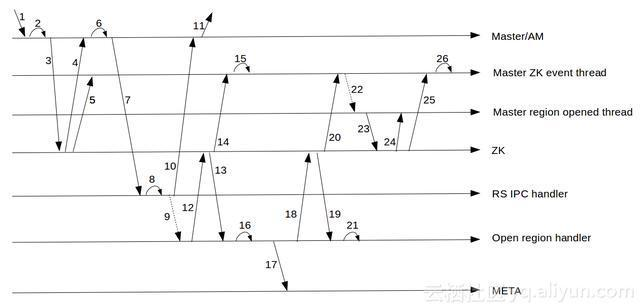

## 深入解读HBase2.0新功能之AssignmentManagerV2


从事机器

百家号06-1209:27

背景

AssignmentManager模块是HBase中一个非常重要的模块，Assignment Manager（之后简称AM）负责了HBase中所有region的Assign，UnAssign，以及split/merge过程中region状态变化的管理等等。在HBase-0.90之前，AM的状态全部存在内存中，自从HBASE-2485之后，AM把状态持久化到了Zookeeper上。在此基础上，社区对AM又修复了大量的bug和优化（见此文章），最终形成了用在HBase-1.x版本上的这个AM。

老Assignment Mananger的问题

相信深度使用过HBase的人一般都会被Region RIT的状态困扰过，长时间的region in transition状态简直令人抓狂。

除了一些确实是由于Region无法被RegionServer open的case，大部分的RIT，都是AM本身的问题引起的。总结一下HBase-1.x版本中AM的问题，主要有以下几点：

region状态变化复杂



这张图很好地展示了region在open过程中参与的组件和状态变化。可以看到，多达7个组件会参与region状态的变化。并且在region open的过程中多达20多个步骤！越复杂的逻辑意味着越容易出bug

region状态多处缓存

region的状态会缓存在多个地方，Master中RegionStates会保存Region的状态，Meta表中会保存region的状态，Zookeeper上也会保存region的状态，要保持这三者完全同步是一件很困难的事情。同时，Master和RegionServer都会修改Meta表的状态和Zookeeper的状态，非常容易导致状态的混乱。如果出现不一致，到底以哪里的状态为准？每一个region的transition流程都是各自为政，各自有各自的处理方法

重度依赖Zookeeper

在老的AM中，region状态的通知完全通过Zookeeper。比如说RegionServer打开了一个region，它会在Zookeeper把这个region的RIT节点改成OPEN状态，而不去直接通知Master。Master会在Zookeeper上watch这个RIT节点，通过Zookeeper的通知机制来通知Master这个region已经发生变化。Master再根据Zookeeper上读取出来的新状态进行一定的操作。严重依赖Zookeeper的通知机制导致了region的上线/下线的速度存在了一定的瓶颈。特别是在region比较多的时候，Zookeeper的通知会出现严重的滞后现象。

正是这些问题的存在，导致AM的问题频发。我本人就fix过多个AM导致region无法open的issue。比如说这三个相互关联的“连环”case：HBASE-17264,HBASE-17265,HBASE-17275。

Assignment Mananger V2

面对这些问题的存在，社区也在不断尝试解决这些问题，特别是当region的规模达到100w级别的时候，AM成为了一个严重的瓶颈。HBASE-11059中提出的ZK-less Region Assignment就是一个非常好的改良设计。在这个设计中，AM完全摆脱了Zookeeper的限制，在测试中，zk-less的assign比zk的assign快了一个数量级！


但是在这个设计中，它摒弃了Zookeeper这个持久化的存储，一些region transition过程中的中间状态无法被保存。因此，在此基础上，社区又更进了一步，提出了Assignment Mananger V2在这个方案。在这个方案中，仍然摒弃了Zookeeper参与Assignment的整个过程。但是，它引入了ProcedureV2这个持久化存储来保存Region transition中的各个状态，保证在master重启时，之前的assing/unassign，split等任务能够从中断点重新执行。具体的来说，AMv2方案中，主要的改进有以下几点：

Procedure V2

关于Procedure V2，我之后将独立写文章介绍。这里，我只大概介绍下ProcedureV2和引入它所带来的价值。

我们知道，Master中会有许多复杂的管理工作，比如说建表，region的transition。这些工作往往涉及到非常多的步骤，如果master在做中间某个步骤的时候宕机了，这个任务就会永远停留在了中间状态（RIT因为之前有Zookeeper做持久化因此会继续从某个状态开始执行）。比如说在enable/disable table时，如果master宕机了，可能表就停留在了enabling/disabling状态。需要一些外部的手段进行恢复。那么从本质上来说，ProcedureV2提供了一个持久化的手段（通过ProcedureWAL，一种类似RegionServer中WAL的日志持久化到HDFS上），使master在宕机后能够继续之前未完成的任务继续完成。同时，ProcedureV2提供了非常丰富的状态转换并支持回滚执行，即使执行到某一个步骤出错，master也可以按照用户的逻辑对之前的步骤进行回滚。比如建表到某一个步骤失败了，而之前已经在HDFS中创建了一些新region的文件夹，那么ProcedureV2在rollback的时候，可以把这些残留删除掉。


Procedure中提供了两种Procedure框架，顺序执行和状态机，同时支持在执行过程中插入subProcedure，从而能够支持非常丰富的执行流程。在AMv2中，所有的Assign，UnAssign，TableCreate等等流程，都是基于Procedure实现的。


去除Zookeeper依赖

有了Procedure V2之后，所有的状态都可以持久化在Procedure中，Procedure中每次的状态变化，都能够持久化到ProcedureWAL中，因此数据不会丢失，宕机后也能恢复。同时，AMv2中region的状态扭转（OPENING，OPEN，CLOSING，CLOSE等）都会由Master记录在Meta表中，不需要Zookeeper做持久化。再者，之前的AM使用的Zookeeper watch机制通知master region状态的改变，而现在每当RegionServer Open或者close一个region后，都会直接发送RPC给master汇报，因此也不需要Zookeeper来做状态的通知。综合以上原因，Zookeeper已经在AMv2中没有了存在的必要。

减少状态冲突的可能性

之前我说过，在之前的AM中，region的状态会同时存在于meta表，Zookeeper和master的内存状态。同时Master和regionserver都会去修改Zookeeper和meta表，维护状态统一的代价非常高，非常容易出bug。而在AMv2中，只有master才能去修改meta表。并在region整个transition中做为一个“权威”存在，如果regionserver汇报上来的region状态与master看到的不一致，则master会命令RegionServer abort。Region的状态，都以master内存中保存的RegionStates为准。

除了上述这些优化，AMv2中还有许多其他的优化。比如说AMv2依赖Procedure V2提供的一套locking机制，保证了对于一个实体，如一张表，一个region或者一个RegionServer同一时刻只有一个Procedure在执行。同时，在需要往RegionServer发送命令，如发送open，close等命令时，AMv2实现了一个RemoteProcedureDispatcher来对这些请求做batch，批量把对应服务器的指令一起发送等等。在代码结构上，之前处理相应region状态的代码散落在AssignmentManager这个类的各个地方，而在AMv2中，每个对应的操作，都有对应的Procedure实现，如AssignProcedure，DisableTableProcedure，SplitTableRegionProcedure等等。这样下来，使AssignmentManager这个之前杂乱的类变的清晰简单，代码量从之前的4000多行减到了2000行左右。

AssignProcedure

AMv2中有太多的Procedure对应各种不同的transition，这里不去详细介绍每个Procedure的操作。我将以AssignProcedure为例，讲解一下在AMv2中，一个region是怎么assign给一个RegionServer，并在对应的RS上Open的。


AssignProcedure是一个基于Procedure实现的状态机。它拥有3个状态：

REGION_TRANSITION_QUEUE： Assign开始时的状态。在这个状态时，Procedure会对region状态做一些改变和存储，并丢到AssignmentManager的assign queue中。对于单独region的assign，AssignmentManager会把他们group起来，再通过LoadBalancer分配相应的服务器。当这一步骤完成后，Procedure会把自己标为REGION_TRANSITION_DISPATCH，然后看是否已经分配服务器，如果还没有被分配服务器的话，则会停止继续执行，等待被唤醒。

REGION_TRANSITION_DISPATCH： 当AssignmentManager为这个region分配好服务器时，Procedure就会被唤醒。或者Procedure在执行完REGION_TRANSITION_QUEUE状态时master宕机，Procedure被恢复后，也会进入此步骤执行。所以在此步骤下，Procedure会先检查一下是否分配好了服务器，如果没有，则把状态转移回REGION_TRANSITION_QUEUE，否则的话，则把这个region交给RemoteProcedureDispatcher，发送RPC给对应的RegionServer来open这个region。同样的，RemoteProcedureDispatcher也会对相应的指令做一个batch，批量把一批region open的命令发送给某一台服务器。当命令发送完成之后，Procedure又会进入休眠状态，等待RegionServer成功OPen这个region后，唤醒这个Procedure

REGION_TRANSITION_FINISH： 当有RegionServer汇报了此region被打开后，会把Procedure的状态置为此状态，并唤醒Procedure执行。此时，AssignProcedure会做一些状态改变的工作，并修改meta表，把meta表中这个region的位置指向对应的RegionServer。至此，region assign的工作全部完成。

AMv2中提供了一个Web页面（Master页面中的‘Procedures&Locks’链接）来展示当前正在执行的Procedure和持有的锁。

其实通过log，我们也可以看到Assign的整个过程。

假设，一台server宕机，此时master会产生一个ServerCrashProcedure 来处理，在这个Procedure中，会做一系列的工作，比如WAL的restore。当这些前置的工作做完后，就会开始assign之前在宕掉服务器上的region，比如56f985a727afe80a184dac75fbf6860c。此时会在ServerCrashProcedure产生一系列的子任务：

2017-05-23 12:04:24,175 INFO [ProcExecWrkr-30] procedure2.ProcedureExecutor: Initialized subprocedures=[{pid=1178, ppid=1176, state=RUNNABLE:REGION_TRANSITION_QUEUE; AssignProcedure table=IntegrationTestBigLinkedList, region=bfd57f0b72fd3ca77e9d3c5e3ae48d76, target=ve0540.halxg.cloudera.com,16020,1495525111232}, {pid=1179, ppid=1176, state=RUNNABLE:REGION_TRANSITION_QUEUE; AssignProcedure table=IntegrationTestBigLinkedList, region=56f985a727afe80a184dac75fbf6860c, target=ve0540.halxg.cloudera.com,16020,1495525111232}]

可以看到，ServerCrashProcedure的pid（Procedure ID）为1178，在此Procedure中产生的assign 56f985a727afe80a184dac75fbf6860c这个region的子Procedure的pid为1179，同时他的ppid（Parent Procedure ID）为1178。在AMv2中，通过追踪这些ID，就非常容易把一个region的transition整个过程全部串起来。

接下来，pid=1170这个Procedure开始执行,首先执行的是REGION_TRANSITION_QUEUE状态的逻辑，然后进入睡眠状态。

2017-05-23 12:04:24,241 INFO [ProcExecWrkr-30] assignment.AssignProcedure: Start pid=1179, ppid=1176, state=RUNNABLE:REGION_TRANSITION_QUEUE; AssignProcedure table=IntegrationTestBigLinkedList, region=56f985a727afe80a184dac75fbf6860c, target=ve0540.halxg.cloudera.com,16020,1495525111232; rit=OFFLINE, location=ve0540.halxg.cloudera.com,16020,1495525111232; forceNewPlan=false, retain=false

当target server被指定时，Procedure进入REGION_TRANSITION_DISPATCH状态，dispatch了region open的请求，同时把meta表中region的状态改成了OPENING，然后再次进入休眠状态

2017-05-23 12:04:24,494 INFO [ProcExecWrkr-38] assignment.RegionStateStore: pid=1179 updating hbase:meta row=IntegrationTestBigLinkedList,H\xE3@\x8D\x964\x9D\xDF\x8F@9'\x0F\xC8\xCC\xC2,1495566261066.56f985a727afe80a184dac75fbf6860c., regionState=OPENING, regionLocation=ve0540.halxg.cloudera.com,16020,1495525111232 2017-05-23 12:04:24,498 INFO [ProcExecWrkr-38] assignment.RegionTransitionProcedure: Dispatch pid=1179, ppid=1176, state=RUNNABLE:REGION_TRANSITION_DISPATCH; AssignProcedure table=IntegrationTestBigLinkedList, region=56f985a727afe80a184dac75fbf6860c, target=ve0540.halxg.cloudera.com,16020,1495525111232; rit=OPENING, location=ve0540.halxg.cloudera.com,16020,1495525111232

最后，当RegionServer打开了这个region后，会发RPC通知master，那么在通知过程中，这个Procedure再次被唤醒，开始执行REGION_TRANSITION_FINISH的逻辑，最后更新meta表，把这个region置为打开状态。

2017-05-23 12:04:26,643 DEBUG [RpcServer.default.FPBQ.Fifo.handler=46,queue=1,port=16000] assignment.RegionTransitionProcedure: Received report OPENED seqId=11984985, pid=1179, ppid=1176, state=RUNNABLE:REGION_TRANSITION_DISPATCH; AssignProcedure table=IntegrationTestBigLinkedList, region=56f985a727afe80a184dac75fbf6860c, target=ve0540.halxg.cloudera.com,16020,1495525111232; rit=OPENING, location=ve0540.halxg.cloudera.com,16020,1495525111232 2017-05-23 12:04:26,643 INFO [ProcExecWrkr-9] assignment.RegionStateStore: pid=1179 updating hbase:meta row=IntegrationTestBigLinkedList,H\xE3@\x8D\x964\x9D\xDF\x8F@9'\x0F\xC8\xCC\xC2,1495566261066.56f985a727afe80a184dac75fbf6860c., regionState=OPEN, openSeqNum=11984985, regionLocation=ve0540.halxg.cloudera.com,16020,14955251112322017-05-23 12:04:26,836 INFO [ProcExecWrkr-9] procedure2.ProcedureExecutor: Finish suprocedure pid=1179, ppid=1176, state=SUCCESS; AssignProcedure table=IntegrationTestBigLinkedList, region=56f985a727afe80a184dac75fbf6860c, target=ve0540.halxg.cloudera.com,16020,1495525111232

一路看下来，由于整个region assign的过程都是在Procedure中执行，整个过程清晰明了，非常容易追述，也没有了Zookeeper一些event事件的干扰。

总结

Assignment Mananger V2依赖Procedure V2实现了一套清晰明了的region transition机制。去除了Zookeeper依赖，减少了region状态冲突的可能性。整体上来看，代码的可读性更强，出了问题也更好查错。对于解决之前AM中的一系列“顽疾”，AMv2做了很好的尝试，也是一个非常好的方向。

AMv2之所以能保持简洁高效的一个重要原因就是重度依赖了Procedure V2，把一些复杂的逻辑都转移到了Procedure V2中。但是这样做的问题是：一旦ProcedureWAL出现了损坏，或者Procedure本身存在bug，这个后果就是灾难性的。事实上在我们的测试环境中，就出现过PRocedureWAL损坏导致region RIT的情况。

另外需要注意的是，截止目前为止，HBCK仍然无法支持AMv2，这会导致一旦出现问题，修复起来会比较困难。

当然，新的事务还是要有一段成熟期，相信经过一段时间的bug修复和完善后，我相信AMv2一定会完美解决之前的一些问题，给HBase的运维上带来一些不同的体验。愿世界不再被HBase的RIT困扰 :-)。

云端使用

阿里HBase目前已经在阿里云提供商业化服务，任何有需求的用户都可以在阿里云端使用深入改进的、一站式的HBase服务。云HBase版本与自建HBase相比在运维、可靠性、性能、稳定性、安全、成本等方面均有很多的改进。

同时，云HBase2.0 在2018年6月6日正式发布，点击了解更多！


## HBase原理–所有Region切分的细节都在这里了

HBase系统中Region自动切分是如何实现的?这里面涉及很多知识点，比如Region切分的触发条件是什么?Region切分的切分点在哪里?如何切分才能最大的保证Region的可用性?如何做好切分过程中的异常处理?切分过程中要不要将数据移动?

- 作者：佚名来源：[有态度的HBase](http://www.tuicool.com/articles/MbiAbib)|*2017-08-28 16:40*

  [ 收藏](javascript:favorBox('open');)[  分享](javascript:;)

Region自动切分是HBase能够拥有良好扩张性的最重要因素之一，也必然是所有分布式系统追求无限扩展性的一副良药。HBase系统中Region自动切分是如何实现的?这里面涉及很多知识点，比如Region切分的触发条件是什么?Region切分的切分点在哪里?如何切分才能最大的保证Region的可用性?如何做好切分过程中的异常处理?切分过程中要不要将数据移动?等等，这篇文章将会对这些细节进行基本的说明，一方面可以让大家对HBase中Region自动切分有更加深入的理解，另一方面如果想实现类似的功能也可以参考HBase的实现方案。

**Region切分触发策略**

在最新稳定版(1.2.6)中，HBase已经有多达6种切分触发策略。当然，每种触发策略都有各自的适用场景，用户可以根据业务在表级别选择不同的切分触发策略。常见的切分策略如下图：

[](http://s2.51cto.com/wyfs02/M01/A2/D8/wKioL1mjyuSjy_9oAAAjEFQ20JA132.jpg-wh_651x-s_333393195.jpg)

**ConstantSizeRegionSplitPolicy：0.94版本前默认切分策略。**这是最容易理解但也最容易产生误解的切分策略，从字面意思来看，当region大小大于某个阈值(hbase.hregion.max.filesize)之后就会触发切分，实际上并不是这样，真正实现中这个阈值是对于某个store来说的，即一个region中最大store的大小大于设置阈值之后才会触发切分。另外一个大家比较关心的问题是这里所说的store大小是压缩后的文件总大小还是未压缩文件总大小，实际实现中store大小为压缩后的文件大小(采用压缩的场景)。ConstantSizeRegionSplitPolicy相对来来说最容易想到，但是在生产线上这种切分策略却有相当大的弊端：切分策略对于大表和小表没有明显的区分。阈值(hbase.hregion.max.filesize)设置较大对大表比较友好，但是小表就有可能不会触发分裂，极端情况下可能就1个，这对业务来说并不是什么好事。如果设置较小则对小表友好，但一个大表就会在整个集群产生大量的region，这对于集群的管理、资源使用、failover来说都不是一件好事。

**I ncreasingToUpperBoundRegionSplitPolicy : 0.94版本~2.0版本默认切分策略。**这种切分策略微微有些复杂，总体来看和ConstantSizeRegionSplitPolicy思路相同，一个region中最大store大小大于设置阈值就会触发切分。但是这个阈值并不像ConstantSizeRegionSplitPolicy是一个固定的值，而是会在一定条件下不断调整，调整规则和region所属表在当前regionserver上的region个数有关系 ：(#regions) * (#regions) * (#regions) * flush size * 2，当然阈值并不会无限增大，最大值为用户设置的MaxRegionFileSize。这种切分策略很好的弥补了ConstantSizeRegionSplitPolicy的短板，能够自适应大表和小表。而且在大集群条件下对于很多大表来说表现很优秀，但并不完美，这种策略下很多小表会在大集群中产生大量小region，分散在整个集群中。而且在发生region迁移时也可能会触发region分裂。

**SteppingSplitPolicy: 2.0版本默认切分策略。**这种切分策略的切分阈值又发生了变化，相比 IncreasingToUpperBoundRegionSplitPolicy 简单了一些，依然和待分裂region所属表在当前regionserver上的region个数有关系，如果region个数等于1，切分阈值为flush size * 2，否则为MaxRegionFileSize。这种切分策略对于大集群中的大表、小表会比 IncreasingToUpperBoundRegionSplitPolicy 更加友好，小表不会再产生大量的小region，而是适可而止。

另外，还有一些其他分裂策略，比如使用DisableSplitPolicy:可以禁止region发生分裂;而KeyPrefixRegionSplitPolicy，DelimitedKeyPrefixRegionSplitPolicy对于切分策略依然依据默认切分策略，但对于切分点有自己的看法，比如KeyPrefixRegionSplitPolicy要求必须让相同的PrefixKey待在一个region中。

在用法上，一般情况下使用默认切分策略即可，也可以在cf级别设置region切分策略，命令为：

```
create ’table’, {NAME => ‘cf’, SPLIT_POLICY => ‘org.apache.hadoop.hbase.regionserver. ConstantSizeRegionSplitPolicy'} 
```

**Region切分准备工作-寻找SplitPoint**

region切分策略会触发region切分，切分开始之后的第一件事是寻找切分点-splitpoint。所有默认切分策略，无论是ConstantSizeRegionSplitPolicy、 IncreasingToUpperBoundRegionSplitPolicy 抑或是SteppingSplitPolicy，对于切分点的定义都是一致的。当然，用户手动执行切分时是可以指定切分点进行切分的，这里并不讨论这种情况。

那切分点是如何定位的呢? 整个region中最大store中的最大文件中最中心的一个block的首个rowkey 。这是一句比较消耗脑力的语句，需要细细品味。另外，HBase还规定，如果定位到的rowkey是整个文件的首个rowkey或者最后一个rowkey的话，就认为没有切分点。

什么情况下会出现没有切分点的场景呢?最常见的就是一个文件只有一个block，执行split的时候就会发现无法切分。很多新同学在测试split的时候往往都是新建一张新表，然后往新表中插入几条数据并执行一下flush，再执行split，奇迹般地发现数据表并没有真正执行切分。原因就在这里，这个时候仔细的话你翻看debug日志是可以看到这样的日志滴:

[](http://s3.51cto.com/wyfs02/M00/A2/D9/wKioL1mjyvGTGr-9AAAqj8lEaF0815.jpg)

**Region核心切分流程**

HBase将整个切分过程包装成了一个事务，意图能够保证切分事务的原子性。整个分裂事务过程分为三个阶段：prepare – execute – (rollback) ，操作模版如下：

[](http://s1.51cto.com/wyfs02/M00/A2/DB/wKioL1mjy7XgEFs8AAAdjErIOZo200.jpg)

- prepare阶段：在内存中初始化两个子region，具体是生成两个HRegionInfo对象，包含tableName、regionName、startkey、endkey等。同时会生成一个transaction journal，这个对象用来记录切分的进展，具体见rollback阶段。
- execute阶段：切分的核心操作。见下图(来自 Hortonworks )：

[](http://s5.51cto.com/wyfs02/M00/04/28/wKiom1mjyw2jkDE2AACG3viC158735.jpg)

1. regionserver 更改ZK节点 /region-in-transition 中该region的状态为SPLITING。
2. master通过watch节点/region-in-transition检测到region状态改变，并修改内存中region的状态，在master页面RIT模块就可以看到region执行split的状态信息。
3. 在父存储目录下新建临时文件夹.split保存split后的daughter region信息。
4. 关闭parent region：parent region关闭数据写入并触发flush操作，将写入region的数据全部持久化到磁盘。此后短时间内客户端落在父region上的请求都会抛出异常NotServingRegionException。
5. 核心分裂步骤：在.split文件夹下新建两个子文件夹，称之为daughter A、daughter B，并在文件夹中生成reference文件，分别指向父region中对应文件。这个步骤是所有步骤中最核心的一个环节，生成reference文件日志如下所示：

```
2017-08-12 11:53:38,158 DEBUG [StoreOpener-0155388346c3c919d3f05d7188e885e0-1] regionserver.StoreFileInfo: reference 'hdfs://hdfscluster/hbase-rsgroup/data/default/music/0155388346c3c919d3f05d7188e885e0/cf/d24415c4fb44427b8f698143e5c4d9dc.00bb6239169411e4d0ecb6ddfdbacf66' to region=00bb6239169411e4d0ecb6ddfdbacf66 hfile=d24415c4fb44427b8f698143e5c4d9dc。 
```

其中reference文件名为d24415c4fb44427b8f698143e5c4d9dc.00bb6239169411e4d0ecb6ddfdbacf66，格式看起来比较特殊，那这种文件名具体什么含义呢?那来看看该reference文件指向的父region文件，根据日志可以看到，切分的父region是00bb6239169411e4d0ecb6ddfdbacf66，对应的切分文件是d24415c4fb44427b8f698143e5c4d9dc，可见reference文件名是个信息量很大的命名方式，如下所示：

[](http://s2.51cto.com/wyfs02/M01/04/28/wKiom1mjyxrg_i6iAAAXDxn-_P0243.jpg)

除此之外，还需要关注reference文件的文件内容，reference文件是一个引用文件(并非linux链接文件)，文件内容很显然不是用户数据。文件内容其实非常简单，主要有两部分构成：其一是切分点 splitkey，其二是一个boolean类型的变量(true或者false)，true表示该reference文件引用的是父文件的上半部分(top)，而false表示引用的是下半部分 (bottom)。为什么存储的是这两部分内容?且听下文分解。

看官可以使用hadoop命令 亲自来查看reference文件的具体内容：

```
hadoop dfs -cat /hbase-rsgroup/data/default/music/0155388346c3c919d3f05d7188e885e0/cf/d24415c4fb44427b8f698143e5c4d9dc.00bb6239169411e4d0ecb6ddfdbacf66 
```

\6. 父region分裂为两个子region后， 将daughter A、daughter B拷贝到HBase根目录下，形成两个新的region。

\7. parent region通知修改 hbase.meta 表后下线，不再提供服务。下线后parent region在meta表中的信息并不会马上删除，而是标注split列、offline列为true，并记录两个子region。为什么不立马删除?且听下文分解。

[](http://s3.51cto.com/wyfs02/M01/04/29/wKiom1mjyyejVU8XAAA6lEp3Gf8160.jpg)

\8. 开启daughter A、daughter B两个子region。通知修改 hbase.meta 表，正式对外提供服务。

[](http://s2.51cto.com/wyfs02/M01/04/29/wKiom1mjyzWx6vEGAAA-Rr4zyq0854.jpg)

rollback阶段：如果execute阶段出现异常，则执行rollback操作。为了实现回滚，整个切分过程被分为很多子阶段，回滚程序会根据当前进展到哪个子阶段清理对应的垃圾数据。代码中使用 JournalEntryType 来表征各个子阶段，具体见下图：

[](http://s1.51cto.com/wyfs02/M01/A2/DA/wKioL1mjyy_xVQ-gAACIJcAHPJQ635.jpg)

**Region切分事务性保证**

整个region切分是一个比较复杂的过程，涉及到父region中HFile文件的切分、两个子region的生成、系统meta元数据的更改等很多子步骤，因此必须保证整个切分过程的事务性，即要么切分完全成功，要么切分完全未开始，在任何情况下也不能出现切分只完成一半的情况。

为了实现事务性，hbase设计了使用状态机(见SplitTransaction类)的方式保存切分过程中的每个子步骤状态，这样一旦出现异常，系统可以根据当前所处的状态决定是否回滚，以及如何回滚。遗憾的是，目前实现中这些中间状态都只存储在内存中，因此一旦在切分过程中出现regionserver宕机的情况，有可能会出现切分处于中间状态的情况，也就是RIT状态。这种情况下需要使用hbck工具进行具体查看并分析解决方案。在2.0版本之后，HBase实现了新的分布式事务框架Procedure V2(HBASE-12439)，新框架将会使用HLog存储这种单机事务(DDL操作、Split操作、Move操作等)的中间状态，因此可以保证即使在事务执行过程中参与者发生了宕机，依然可以使用HLog作为协调者对事务进行回滚操作或者重试提交，大大减少甚至杜绝RIT现象。这也是是2.0在可用性方面最值得期待的一个亮点!!!

**Region切分对其他模块的影响**

通过region切分流程的了解，我们知道整个region切分过程并没有涉及数据的移动，所以切分成本本身并不是很高，可以很快完成。切分后子region的文件实际没有任何用户数据，文件中存储的仅是一些元数据信息-切分点rowkey等，那通过引用文件如何查找数据呢?子region的数据实际在什么时候完成真正迁移?数据迁移完成之后父region什么时候会被删掉?

**1. 通过reference文件如何查找数据?**

这里就会看到reference文件名、文件内容的实际意义啦。整个流程如下图所示：

[](http://s3.51cto.com/wyfs02/M00/A2/DA/wKioL1mjyzzBwAYNAAA_3RaL030580.jpg)

(1)根据reference文件名(region名+真实文件名)定位到真实数据所在文件路径

(2)定位到真实数据文件就可以在整个文件中扫描待查KV了么?非也。因为reference文件通常都只引用了数据文件的一半数据，以切分点为界，要么上半部分文件数据，要么下半部分数据。那到底哪部分数据?切分点又是哪个点?还记得上文又提到reference文件的文件内容吧，没错，就记录在文件中。

**2. 父region的数据什么时候会迁移到子region目录?**

答案是子region发生major_compaction时。我们知道compaction的执行实际上是将store中所有小文件一个KV一个KV从小到大读出来之后再顺序写入一个大文件，完成之后再将小文件删掉，因此compaction本身就需要读取并写入大量数据。子region执行major_compaction后会将父目录中属于该子region的所有数据读出来并写入子region目录数据文件中。可见将数据迁移放到compaction这个阶段来做，是一件顺便的事。

**3. 父region什么时候会被删除?**

实际上HMaster会启动一个线程定期遍历检查所有处于splitting状态的父region，确定检查父region是否可以被清理。检测线程首先会在meta表中揪出所有split列为true的region，并加载出其分裂后生成的两个子region(meta表中splitA列和splitB列)， 只需要检查此两个子region是否还存在引用文件，如果都不存在引用文件就可以认为该父region对应的文件可以被删除。现在再来看看上文中父目录在meta表中的信息，就大概可以理解为什么会存储这些信息了：

[](http://s5.51cto.com/wyfs02/M01/A2/DA/wKioL1mjy0eTa9icAAA6PY71EPU081.jpg)

**4. split模块在生产线的一些坑?**

有些时候会有同学反馈说集群中部分region处于长时间RIT，region状态为spliting。通常情况下都会建议使用hbck看下什么报错，然后再根据hbck提供的一些工具进行修复，hbck提供了部分命令对处于split状态的rit region进行修复，主要的命令如下：

```
-fixSplitParents  Try to force offline split parents to be online.   -removeParents    Try to offline and sideline lingering parents and keep daughter regions.   -fixReferenceFiles  Try to offline lingering reference store files 
```

其中最常见的问题是 ：

```
ERROR: Found lingering reference file hdfs://mycluster/hbase/news_user_actions/3b3ae24c65fc5094bc2acfebaa7a56de/meta/0f47cda55fa44cf9aa2599079894aed6.b7b3faab86527b88a92f2a248a54d3dc” 
```

简单解释一下，这个错误是说reference文件所引用的父region文件不存在了，如果查看日志的话有可能看到如下异常：

```
java.io.IOException: java.io.IOException: java.io.FileNotFoundException: File does not exist:/hbase/news_user_actions/b7b3faab86527b88a92f2a248a54d3dc/meta/0f47cda55fa44cf9aa2599079894aed 
```

父region文件为什么会莫名其妙不存在?经过和朋友的讨论，确认有可能是因为官方bug导致，详见HBASE-13331。这个jira是说HMaster在确认父目录是否可以被删除时，如果检查引用文件(检查是否存在、检查是否可以正常打开)抛出IOException异常，函数就会返回没有引用文件，导致父region被删掉。正常情况下应该保险起见返回存在引用文件，保留父region，并打印日志手工介入查看。如果大家也遇到类似的问题，可以看看这个问题，也可以将修复patch打到线上版本或者升级版本。