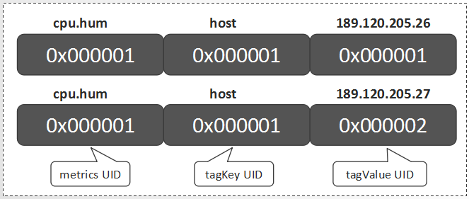
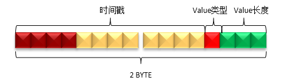
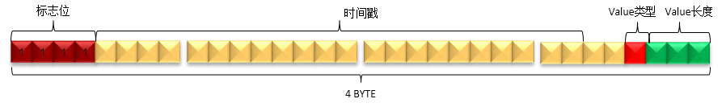
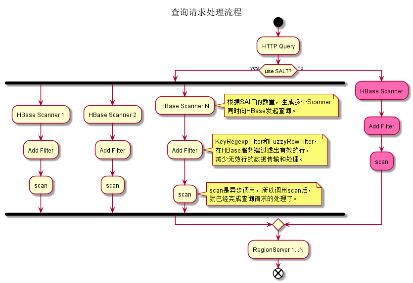
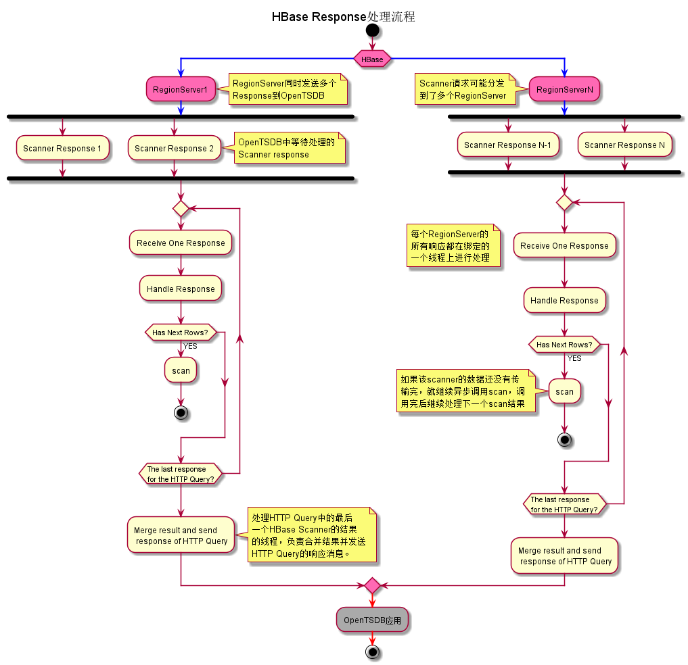
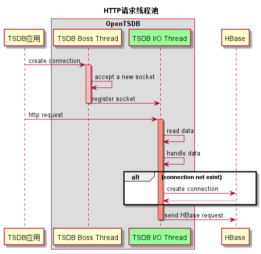
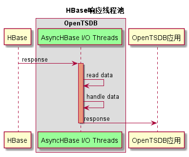

# OpenTSDB原理系列：元数据模型

http://www.nosqlnotes.com/technotes/opentsdb-schema/


本文作为介绍OpenTSDB原理系列文章的第一篇，主要介绍了时序数据以及OpenTSDB的一些基础概念，以及OpenTSDB中的元数据模型定义。 

## 什么是时序数据？

Wiki中关于”**时间序列（Time Series）**“的定义： 

> **时间序列**（Time Series）是一组按照时间发生先后顺序进行排列的**数据点序列**，通常一组时间序列的时间间隔为一恒定值（如1秒，5分钟，1小时等）。 

**时间序列数据**可被简称为**时序数据**。 

**实时监控**系统所收集的监控指标数据，通常就是**时序数据** 。时序数据具有如下特点： 

- 每一个**时间序列**通常为某一**固定类型**的**数值** 
- 数据按一定的时间间隔持续产生，每条数据拥有自己的**时间戳**信息 
- 通常只会不断的**写入**新的数据，几乎不会有**更新**、**删除**的场景 
- 在读取上，也往往倾向于**读取最近写入**的数据。 


正是因为这些特点，通常使用专门的时序数据库来存储，因为这类数据库更能理解**时序数据((TSDB))**的特点，而且在读写上做一些针对性的优化。相信在在即将大范围普及的**物联网(IoT)**应用场景中，**时序数据库(TSDB)**会得到更加广泛的应用。 


## OpenTSDB


OpenTSDB是其中一种**时序数据库**实现，因为基于HBase生态构建而获得了广泛的关注。目前，华为云的CloudTable服务已经推出了OpenTSDB特性。 

如下是源自OpenTSDB官方资料中的**时序数据样例**： 

> sys.cpu.user host=webserver01 1356998400 50 
>
> sys.cpu.user host=webserver01,cpu=0 1356998400 1 
>
> sys.cpu.user host=webserver01,cpu=1 1356998400 0 
>
> sys.cpu.user host=webserver01,cpu=2 1356998400 2 
>
> sys.cpu.user host=webserver01,cpu=3 1356998400 0 
>
> ………… 
>
> sys.cpu.user host=webserver01,cpu=63 1356998400 1 

对于上面的任意一行数据，在OpenTSDB中称之为一个**时间序列**中的一个**Data Point**。以最后一行为例我们说明一下OpenTSDB中关于Data Point的每一部分组成定义如下： 

|   构成信息   |    名称     |
| :----------: | :---------: |
| sys.cpu.user | **metrics** |
|     host     |   tagKey    |
| webserver01  |  tagValue   |
|     cpu      |   tagKey    |
|      63      |  tagValue   |
|  1356998400  |  timestamp  |
|      1       |    value    |

可以看出来，每一个Data Point，都关联一个metrics名称，但可能关联多组<tagKey,tagValue>信息。而关于时间序列，事实上就是具有相同的metrics名称以及相同的<tagKey,tagValue>组信息的Data Points的集合。在存储这些Data Points的时候，大家也很容易可以想到，可以将这些metrics名称以及<tagKey,tagValue>信息进行特殊编码来优化存储，否则会带来极大的数据冗余。OpenTSDB中为每一个metrics名称，tagKey以及tagValue都定义了一个唯一的数字类型的标识码(UID)。 


### UID设计


UID的全称为Unique Identifier。这些UID信息被保存在OpenTSDB的元数据表中，默认表名为”tsdb-uid”。 

OpenTSDB分配UID时遵循如下规则： 

- metrics、tagKey和tagValue的UID分别独立分配 
- 每个metrics名称（tagKey/tagValue）的UID值都是唯一。不存在不同的metrics（tagKey/tagValue）使用相同的UID，也不存在同一个metrics（tagKey/tagValue）使用多个不同的UID 
- UID值的范围是0x000000到0xFFFFFF，即metrics（或tagKey、tagValue）最多只能存在16777216个不同的值。  

### 元数据HBase表设计

为了从UID索引到metrics（或tagKey、tagValue），同时也要从metrics（或tagKey、tagValue）索引到UID，OpenTSDB同时保存这两种映射关系数据。 在元数据表中，把这两种数据分别保存到两个名为”id”与”name”的Column Family中，Column Family描述信息如下所示： 

> {NAME => ‘id’, BLOOMFILTER => ‘ROW’, COMPRESSION => ‘SNAPPY’}
>
>  {NAME =>’name’,BLOOMFILTER => ‘ROW’, COMPRESSION => ‘SNAPPY’, MIN_VERSIONS => ‘0’, BLOCKCACHE => ‘true’, BLOCKSIZE => ‘65536’, REPLICATION_SCOPE => ‘0’} 


### 元数据模型

关于metrics名为”cpu.hum”，tagKey值为”host”，tagValue值分别为”189.120.205.26″、”189.120.205.27″的UID信息定义如下： 


说明： 

- RowKey为”0″的行中，分别保存了metrics、tagKey和tagValue的当前UID的最大值。当为新的metrics、tagKey和tagValue分配了新的UID后，会更新对应的最大值 
- RowKey为”1″的行中，RowKey为UID，Qualifier为”id:metrics”的值”metrics”，Qualifier为”id:tagk”的值为tagKey，Qualifier为id:tagv的值为tagValue 
- RowKey为”2″的行中，RowKey为UID，Qualifier为”id:tagv”的值为tagValue，暂不存在UID为”2″的metrics和tagKey 
- RowKey为”189.120.205.26″的行中，Qualifer为”name:tagv”的值为UID。表示当”189.120.205.26″为tagValue时，其UID为1 
- RowKey为”189.120.205.27″的行中，Qualifer为”name:tagv”的值为UID。表示当”189.120.205.26″为tagValue时，其UID为2 
- RowKey为”cpu.hum”的行中，Qualifer为”name:metrics”的值为UID。表示当cpu.hum为metrics时，其UID为1 
- RowKey为”host”的行中，Qualifer为”name:tagk”的值为UID。表示当host为tagValue时，其UID为1 

下面为Hbase shell一段代码的执行过程：

> hbase(main):009:0> scan 'tsdb-uid'
> ROW                                        COLUMN+CELL                                                                                                                 
>  \x00                                      column=id:metrics, timestamp=1530288910326, value=\x00\x00\x00\x00\x00\x00\x00\x12                                          
>  \x00                                      column=id:tagk, timestamp=1529652270537, value=\x00\x00\x00\x00\x00\x00\x00\x0A                                             
>  \x00                                      column=id:tagv, timestamp=1530288910343, value=\x00\x00\x00\x00\x00\x00\x00\x12                                             
>  \x00\x00\x01                              column=name:metrics, timestamp=1528879705241, value=sys.cpu.user                                                             \x00\x00\x01                              column=name:tagk, timestamp=1528879705280, value=host                                                                        \x00\x00\x01                              column=name:tagv, timestamp=1528879705313, value=web01                                                                       \x00\x00\x02                              column=name:metrics, timestamp=1528880100259, value=sys.cpu.sys                                                              \x00\x00\x02                              column=name:tagk, timestamp=1528879705347, value=user                                                                        \x00\x00\x02                              column=name:tagv, timestamp=1528879705377, value=10001                                                                       \x00\x00\x03                              column=name:metrics, timestamp=1528962192246, value=metricA                                                                  \x00\x00\x03                              column=name:tagk, timestamp=1529574234656, value=dc                                                                          \x00\x00\x03                              column=name:tagv, timestamp=1528965987449, value=10.0.101.145                                                                \x00\x00\x04                              column=name:metrics, timestamp=1528962192259, value=metricB                                                                  \x00\x00\x04                              column=name:tagk, timestamp=1529648725057, value=a                                                                           \x00\x00\x04                              column=name:tagv, timestamp=1528968931442, value=1                                                                           \x00\x00\x05                              column=name:tagk, timestamp=1529652213865, value=city                                                                        \x00\x00\x05                              column=name:tagv, timestamp=1529574746120, value=web02                                                                       \x00\x00\x06                              column=name:metrics, timestamp=1528967584681, value=metricC                                                                  \x00\x00\x06                              column=name:tagk, timestamp=1529652213894, value=district                                                                    \x00\x00\x06                              column=name:tagv, timestamp=1529636497119, value=lga                                                                         \x00\x00\x07                              column=name:metrics, timestamp=1528968931430, value=metricD                                                                  \x00\x00\x07                              column=name:tagk, timestamp=1529652213919, value=prov                                                                        \x00\x00\x07                              column=name:tagv, timestamp=1529648725071, value=foo                                                                         \x00\x00\x08                              column=name:metrics, timestamp=1529028217606, value=metricF                                                                  \x00\x00\x08                              column=name:tagk, timestamp=1529652270494, value=latitude                                                                    \x00\x00\x08                              column=name:tagv, timestamp=1529649560735, value=sw                                                                          \x00\x00\x09                              column=name:metrics, timestamp=1529574234633, value=sys.test.shan                                                            \x00\x00\x09                              column=name:tagk, timestamp=1529652270516, value=zip_code                                                                    \x00\x00\x09                              column=name:tagv, timestamp=1529652213881, value=cit_0_0                                                                     \x00\x00\x0A                              column=name:metrics, timestamp=1529636497101, value=sys.cpu.nice                                                             \x00\x00\x0A                              column=name:tagk, timestamp=1529652270542, value=longitude                                                                   \x00\x00\x0A                              column=name:tagv, timestamp=1529652213906, value=district_0_0_6                                                              \x00\x00\x0B                              column=name:metrics, timestamp=1529648725026, value=mymetric.test.data                                                      
>  \x00\x00\x0B                              column=name:tagv, timestamp=1529652213932, value=prov_0                                                                      \x00\x00\x0C                              column=name:metrics, timestamp=1529652213853, value=city.pm25                                                                \x00\x00\x0C                              column=name:tagv, timestamp=1529652270481, value=??                                                                          \x00\x00\x0D                              column=name:metrics, timestamp=1529652270468, value=shan_temperature                                                        
>  \x00\x00\x0D                              column=name:tagv, timestamp=1529652270505, value=39.913078                                                                   \x00\x00\x0E                              column=name:metrics, timestamp=1529653382675, value=shan.temperature                                                        
>  \x00\x00\x0E                              column=name:tagv, timestamp=1529652270530, value=100000                                                                      \x00\x00\x0F                              column=name:metrics, timestamp=1529657714078, value=sys.cpu.vice                                                             \x00\x00\x0F                              column=name:tagv, timestamp=1529652270553, value=116.39718                                                                   \x00\x00\x10                              column=name:metrics, timestamp=1529912577231, value=test.cpu.system1                                                        
>  \x00\x00\x10                              column=name:tagv, timestamp=1529657092899, value=xyd_host                                                                    \x00\x00\x11                              column=name:metrics, timestamp=1529912577262, value=test.cpu.system2                                                        
>  \x00\x00\x11                              column=name:tagv, timestamp=1529912577249, value=116.39719                                                                   \x00\x00\x12                              column=name:metrics, timestamp=1530288910336, value=mytest.cpu                                                               \x00\x00\x12                              column=name:tagv, timestamp=1530288910345, value=master1                                                                     1                                         column=id:tagv, timestamp=1528968931444, value=\x00\x00\x04                                                                  10.0.101.145                              column=id:tagv, timestamp=1528965987451, value=\x00\x00\x03                                                                  100000                                    column=id:tagv, timestamp=1529652270532, value=\x00\x00\x0E                                                                  10001                                     column=id:tagv, timestamp=1528879705387, value=\x00\x00\x02                                                                  116.39718                                 column=id:tagv, timestamp=1529652270555, value=\x00\x00\x0F                                                                  116.39719                                 column=id:tagv, timestamp=1529912577251, value=\x00\x00\x11                                                                  39.913078                                 column=id:tagv, timestamp=1529652270507, value=\x00\x00\x0D                                                                  ??                                        column=id:tagv, timestamp=1529652270483, value=\x00\x00\x0C                                                                  a                                         column=id:tagk, timestamp=1529648725059, value=\x00\x00\x04                                                                  cit_0_0                                   column=id:tagv, timestamp=1529652213883, value=\x00\x00\x09                                                                  city                                      column=id:tagk, timestamp=1529652213868, value=\x00\x00\x05                                                                  city.pm25                                 column=id:metrics, timestamp=1529652213855, value=\x00\x00\x0C                                                               dc                                        column=id:tagk, timestamp=1529574234659, value=\x00\x00\x03                                                                  district                                  column=id:tagk, timestamp=1529652213896, value=\x00\x00\x06                                                                  district_0_0_6                            column=id:tagv, timestamp=1529652213909, value=\x00\x00\x0A                                                                  foo                                       column=id:tagv, timestamp=1529648725074, value=\x00\x00\x07                                                                  host                                      column=id:tagk, timestamp=1528879705287, value=\x00\x00\x01                                                                  latitude                                  column=id:tagk, timestamp=1529652270496, value=\x00\x00\x08                                                                  lga                                       column=id:tagv, timestamp=1529636497121, value=\x00\x00\x06                                                                  longitude                                 column=id:tagk, timestamp=1529652270544, value=\x00\x00\x0A                                                                  master1                                   column=id:tagv, timestamp=1530288910347, value=\x00\x00\x12                                                                  metricA                                   column=id:metrics, timestamp=1528962192249, value=\x00\x00\x03                                                               metricB                                   column=id:metrics, timestamp=1528962192261, value=\x00\x00\x04                                                               metricC                                   column=id:metrics, timestamp=1528967584683, value=\x00\x00\x06                                                               metricD                                   column=id:metrics, timestamp=1528968931432, value=\x00\x00\x07                                                               metricF                                   column=id:metrics, timestamp=1529028217612, value=\x00\x00\x08                                                               mymetric.test.data                        column=id:metrics, timestamp=1529648725029, value=\x00\x00\x0B                                                               mytest.cpu                                column=id:metrics, timestamp=1530288910338, value=\x00\x00\x12                                                               prov                                      column=id:tagk, timestamp=1529652213922, value=\x00\x00\x07                                                                  prov_0                                    column=id:tagv, timestamp=1529652213935, value=\x00\x00\x0B                                                                  shan.temperature                          column=id:metrics, timestamp=1529653382678, value=\x00\x00\x0E                                                               shan_temperature                          column=id:metrics, timestamp=1529652270470, value=\x00\x00\x0D                                                               sw                                        column=id:tagv, timestamp=1529649560737, value=\x00\x00\x08                                                                  sys.cpu.nice                              column=id:metrics, timestamp=1529636497104, value=\x00\x00\x0A                                                               sys.cpu.sys                               column=id:metrics, timestamp=1528880100264, value=\x00\x00\x02                                                               sys.cpu.user                              column=id:metrics, timestamp=1528879705251, value=\x00\x00\x01                                                               sys.cpu.vice                              column=id:metrics, timestamp=1529657714081, value=\x00\x00\x0F                                                               sys.test.shan                             column=id:metrics, timestamp=1529574234637, value=\x00\x00\x09                                                               test.cpu.system1                          column=id:metrics, timestamp=1529912577234, value=\x00\x00\x10                                                               test.cpu.system2                          column=id:metrics, timestamp=1529912577264, value=\x00\x00\x11                                                               user                                      column=id:tagk, timestamp=1528879705356, value=\x00\x00\x02                                                                  web01                                     column=id:tagv, timestamp=1528879705321, value=\x00\x00\x01                                                                  web02                                     column=id:tagv, timestamp=1529574746123, value=\x00\x00\x05                                                                  xyd_host                                  column=id:tagv, timestamp=1529657092903, value=\x00\x00\x10                                                                  zip_code                                  column=id:tagk, timestamp=1529652270518, value=\x00\x00\x09

由于HBase的存储数据类型是Bytes，所以UID在存储时会被转换为3个字节长度的Bytes数组进行存储。 


### TSUID

对每一个Data Point，metrics、timestamp、tagKey和tagValue都是必要的构成元素。除timestamp外，metrics、tagKey和tagValue的UID就可组成一个TSUID，每一个TSUID关联一个**时间序列**，如下所示： 

> *<metrics_UID><tagKey1_UID><tagValue1_UID>[…<tagKeyN_UID><tagValueN_UID>]* 

在上一章节的例子中，就涉及两个TSUID，分别是： 




# OpenTSDB原理系列: 数据表设计

http://www.nosqlnotes.com/technotes/opentsdb-tabledesign/

上一篇文章《[OpenTSDB原理系列-元数据模型](http://www.nosqlnotes.com/technotes/opentsdb-schema/)》讲到了OpenTSDB的基础概念，以及元数据模型，这篇文章介绍OpenTSDB的HBase数据表设计。OpenTSDB共涉及两种类型的数据：Metrics数据以及Annotation(注释)数据，在将这些数据存到HBase表中时，针对RowKey, Qualifier以及Value信息都做了特殊设计，从而使得存储更加高效。

## Metrics RowKey设计

metrics数据的HBase RowKey中包含主要组成部分为：盐值（Salt）、metrics名称、时间戳、tagKey、tagValue等部分。上篇文章已经讲到，为了统一各个值的长度以及节省空间，对metrics名称、tagKey和tagValue分配了UID信息。所以，在HBase RowKey中实际写入的metrics UID、tagKey UID和tagValue UID。

HBase RowKey的数据模型如下图所示：

 

- SALT：建议开启SALT功能，可以有效提高性能。SALT数据的长度是变长的：如果SALT的值值少于256，那么只用一个字节表示即可；如果需要设置更大的SALT值，也会相应地占用更多的空间。
- Metric ID：metrics名经过编码后，每个Metric ID的长度为三个字节。
- Timestamp：这里是整点小时时间戳。
- tagKey UID & tagValue UID：tagKey和tagValue经过编码后，每个tagKey UID和tagValue UID的长度都为三个字节。tagKey UID和tagValue UID必须成对出现，最少必须存在1对，最多存在8对。


> net.opentsdb.core.IncomingDataPoints

```
/**
 * Returns a partially initialized row key for this metric and these tags. The
 * only thing left to fill in is the base timestamp.
 */
static byte[] rowKeyTemplate(final TSDB tsdb, final String metric,
    final Map<String, String> tags) {
  final short metric_width = tsdb.metrics.width();
  final short tag_name_width = tsdb.tag_names.width();
  final short tag_value_width = tsdb.tag_values.width();
  final short num_tags = (short) tags.size();

  int row_size = (Const.SALT_WIDTH() + metric_width + Const.TIMESTAMP_BYTES 
      + tag_name_width * num_tags + tag_value_width * num_tags);
  final byte[] row = new byte[row_size];

  short pos = (short) Const.SALT_WIDTH();

  copyInRowKey(row, pos,
      (tsdb.config.auto_metric() ? tsdb.metrics.getOrCreateId(metric)
          : tsdb.metrics.getId(metric)));
  pos += metric_width;

  pos += Const.TIMESTAMP_BYTES;

  for (final byte[] tag : Tags.resolveOrCreateAll(tsdb, tags)) {
    copyInRowKey(row, pos, tag);
    pos += tag.length;
  }
  return row;
}
```

## Metrics Qualifier设计

Qualifier用于保存一个或多个DataPoint中的时间戳、数据类型、数据长度等信息。

由于时间戳中的小时级别的信息已经保存在RowKey中了，所以Qualifier只需要保存一个小时中具体某秒或某毫秒的信息即可，这样可以减少数据占用的空间。

一个小时中的某一秒（少于3600）最多需要2个字节即可表示，而某一毫秒（少于3600000）最多需要4个字节才可以表示。为了节省空间，OpenTSDB没有使用统一的长度，而是对特定的类型采用特性的编码方法。Qualifer的数据模型主要分为如下三种情况：秒、毫秒、秒和毫秒混合。

  

```
/** Mask to verify a timestamp on 4 bytes in seconds */
  public static final long SECOND_MASK = 0xFFFFFFFF00000000L;
```

> net.opentsdb.core.Internal

```
/**
 * Returns a 2 or 4 byte qualifier based on the timestamp and the flags. If
 * the timestamp is in seconds, this returns a 2 byte qualifier. If it's in
 * milliseconds, returns a 4 byte qualifier 
 * @param timestamp A Unix epoch timestamp in seconds or milliseconds
 * @param flags Flags to set on the qualifier (length &| float)
 * @return A 2 or 4 byte qualifier for storage in column or compacted column
 * @since 2.0
 */
public static byte[] buildQualifier(final long timestamp, final short flags) {
  final long base_time;

  if ((timestamp & Const.SECOND_MASK) != 0) {
    // drop the ms timestamp to seconds to calculate the base timestamp
    base_time = ((timestamp / 1000) - ((timestamp / 1000) 
        % Const.MAX_TIMESPAN));
    final int qual = (int) (((timestamp - (base_time * 1000) 
        << (Const.MS_FLAG_BITS)) | flags) | Const.MS_FLAG);
    return Bytes.fromInt(qual);
  } else {
    base_time = (timestamp - (timestamp % Const.MAX_TIMESPAN));
    final short qual = (short) ((timestamp - base_time) << Const.FLAG_BITS
        | flags);
    return Bytes.fromShort(qual);
  }
}
```

```
public Deferred<Object> addPoint(final String metric,
                                 final long timestamp,
                                 final long value,
                                 final Map<String, String> tags) {
  final byte[] v;
  if (Byte.MIN_VALUE <= value && value <= Byte.MAX_VALUE) {
    v = new byte[] { (byte) value };
  } else if (Short.MIN_VALUE <= value && value <= Short.MAX_VALUE) {
    v = Bytes.fromShort((short) value);
  } else if (Integer.MIN_VALUE <= value && value <= Integer.MAX_VALUE) {
    v = Bytes.fromInt((int) value);
  } else {
    v = Bytes.fromLong(value);
  }

  //因为long是8个字节，但是表示8需要4bit，所以减去1之后最多就是7，只需要3bit表示就够了
  final short flags = (short) (v.length - 1);  // Just the length.
  return addPointInternal(metric, timestamp, v, tags, flags);
}
```

### 秒类型

当OpenTSDB接收到一个新的DataPoint的时候，如果请求中的时间戳是秒，那么就会插入一个如下模型的数据。

判断请求中的时间戳为秒或毫秒的方法是基于时间戳数值的大小，如果时间戳的值的超过无符号整数的最大值（即4个字节的长度），那么该时间戳是毫秒，否则为秒。



- Value长度：Value的实际长度是Qualifier的最后3个bit的值加1，即(qualifier & 0x07) + 1。表示该时间戳对应的值的字节数。所以，值的字节数的范围是1到8个字节。
- Value类型：Value的类型由Qualifier的倒数第4个bit表示，即(qualifier & 0x08)。如果值为1，表示Value的类型为float；如果值为0，表示Value的类型为long。
- 时间戳：时间戳的值由Qualifier的第1到第12个bit表示，即(qualifier & 0xFFF0) >>>4。由于秒级的时间戳最大值不会大于3600，所以qualifer的第1个bit肯定不会是1。

### 毫秒类型

当OpenTSDB接收到一个新的DataPoint的时候，如果请求中的时间戳是毫秒，那么就会插入一个如下模型的数据。



- Value长度：与秒类型相同。
- Value类型：与秒类型相同。
- 时间戳： 时间戳的值由Qualifier的第5到第26个bit表示，即(qualifier & 0x0FFFFFC0) >>>6。
- 标志位：标志位由Qualifier的前4个bit表示。当该Qualifier表示毫秒级数据时，必须全为1，即(qualifier[0] & 0xF0) == 0xF0。
- 第27到28个bit未使用。

### 混合类型

当同一小时的数据发生合并后，就会形成混合类型的Qualifier。

合并的方法很简单，就是按照时间戳顺序进行排序后，从小到大依次拼接秒类型和毫秒类型的Qualifier即可。


- 秒类型和毫秒类型的数量没有限制，并且可以任意组合。
- 不存在相同时间戳的数据，包括秒和毫秒的表示方式。
- 遍历混合类型中的所有DataPoint的方法是：
  - 从左到右，先判断前4个bit是否为0xF
  - 如果是，则当前DataPoint是毫秒型的，读取4个字节形成一个毫秒型的DataPoint
  - 如果否，则当前DataPoint是秒型的，读取2个字节形成一个秒型的DataPoint
  - 以此迭代即可遍历所有的DataPoint


## Metrics Value设计

HBase Value部分用于保存一个或多个DataPoint的具体某个时间戳对应的值。

由于在Qualifier中已经保存了DataPoint Value的类型和DataPoint Value的长度，所以无论是秒级还是毫秒级的值，都可以用相同的表示方法，而混合类型就是多个DataPoint Value的拼接。

HBase Value按照长度可以分为如下几种类型：

### 单字节

当DataPoint Value为long型，且大于等于-128（Byte.MIN_VALUE），且少于或等于127（Byte.MAX_VALUE）的时候，使用1个字节存储。

### 两字节

当DataPoint Value为long型，且大于等于-32768（Short.MIN_VALUE），且少于或等于32767（Short.MAX_VALUE）的时候，使用2个字节存储。

### 四字节

当DataPoint Value为long型，且大于等于0x80000000（Integer.MIN_VALUE），且少于或等于0x7FFFFFFF（Integer.MAX_VALUE）的时候，使用4个字节存储。

### 八字节

当DataPoint Value为long型，且不是上面三种类型的时候，使用8个字节存储。

当DataPoint Value为float型的时候，使用8个字节表示。

### 多字节

按照时间戳的顺序，把多个Value拼接起来的数据模型如下：


- 每个格子表示一个DataPoint Value的值，这个DataPoint Value的长度可能是1或2或4或8个字节。
- DataPoint Value的顺序与Qualifier中时间戳的顺序一一对应。
- 混合标志：如果最后1个字节为0x01，表示存在秒级类型和毫秒级类型混合的情况。

## Annotation数据

Annotation用于描述某一个时间点发生的事件，Annotation的数据为字符串类型，这与数字类型的metrics数据并不同。

> 注意：
>
> 1. Annotation数据只支持秒级时间戳的数据。
> 2. Annotation数据不会合并。

### Annotation RowKey设计

RowKey的数据模型如下图：


-  Salt/Timestamp/Metric UID/ tagKey UID /tagValue UID的意义与metrics RowKey中的意义相同。

- 把[Metric UID/ tagKey UID /tagValue UID]部分统称为TSUID。实际上，读写注释数据的时候，需要指定的是TSUID，而不是像metrics数据中那样分开指定的。


### **Annotation Qualifier设计**

由于注释数据只支持秒级类型的数据，同时注释类型的数据不支持合并，所以Qualifier的设计相对metrics数据简单一些。Qualifier定义如下：

与metrics数据的Qualifier相比，注释数据的HBase Qualifer的长度是3个字节。

**标志位**：使用第1个字节表示，而且值必须为0x01。即(qualifier & 0xFF0000)>>>16 == 0x01。

**时间戳**：使用第2到第3个字节表示。即时间戳的值为(qualifier & 0x00FFFF)。

### **Annotation Value设计**

注释数据中的Value保存的是字符串类型的数据，整个HBase Value部分就是注释数据的值。

## **Append写入模式**

当OpenTSDB启动Append写入模式后，每个插入的新DataPoint，都会以HBase的append的方式写入。

注意：

由于使用了HBase的append的接口，每次插入一个新数据，都需要对同一小时的数据都执行一次读取和插入的操作；另外多线程对同一小时的数据进行更新的时候，是不能并发的。这样就大大限制了数据写入的速度了，一般情况下不建议使用这种模式。

append的数据其实就是合并过的数据了，所以不会参与OpenTSDB的Compaction流程。

Append模式下的RowKey设计与普通写入模式是相同的，不单独介绍。

### **Append Qualifier设计**

Append模式下，由于同1小时的数据中不存在多个Qualifier，所以只需要使用一个固定的Qualifier即可。

Append模式的Qualifier使用3个字节表示

标志位： 由第1个字节表示，而且值必须为0x05。即(qualifier & 0xFF0000)>>>16 == 0x05

固定部分：由第2到第3个字节表示，这部分的值固定为0x0000，因此，Append模式的Qualifier固定为0x050000

### **Append Value设计**

Append模式下， Value部分既要保存时间戳，数值类型和数值长度，也要保存对应的数值。Value的数据结构如下：

上图每一个方块表示的Qualifier与Value的定义，与普通写入模式下的定义相同

遍历Value中的所有DataPoint的方法是：

从左到右，先判断前4个bit是否为0xF

如果是，则当前DataPoint是毫秒型的读取4个字节形成一个毫秒型的Qualifier，从Qualifier中获得Value的长度，然后再读取对应长度的字节数

如果否，则当前DataPoint是秒型的，读取2个字节形成一个秒型的Qualifier，从Qualifier中获得Value的长度，然后再读取对应长度的字节数；

依此迭代即可遍历所有的DataPoint。

**小结**

OpenTSDB共涉及到两个HBase表，第一篇文章中讲到了元数据表的定义，这篇文章讲到了存放Data Points的数据表定义。在后面的文章中，将会陆续介绍OpenTSDB的线程模型以及读写流程。


# OpenTSDB原理系列：读取流程

http://www.nosqlnotes.com/technotes/tsdb/opentsdb-query/

一个完整的OpenTSDB HTTP Query请求，分别由OpenTSDB I/O Thread和AsyncHBase I/O Thread完成。OpenTSDB I/O Thread线程负责处理HTTP Query请求，AsyncHBase I/O Thread负责处理HBase的响应并发送HTTP响应。 

## 请求处理流程




**1.OpenTSDB I/O Thread收到HTTP Query请求后，会根据OpenTSDB是否使用了SALT进行不同的处理。** 

相关配置项： 

**参数1：**tsd.storage.salt.width 

> **默认值**：0
>
> **说明**：SALT的字节长度。当设置为0时，表示不使用SAL。

**参数2：**tsd.storage.salt.buckets

> **默认值**：20
>
> **说明**： SALT的数量。当“tsd.storage.salt.width”为非0时，才发挥作用。该配置项的值，不能超过SALT的字节长度所能表示的最大数字。例如SALT的字节长度为1时，该配置项的不能配置成大于256。这两个配置在OpenTSDB初始化就必须确定，运行过程中不能随意修改，否则会导致历史数据读取错误。


是否使用了SALT，只会对生成的HBase Scanner数量产生影响，每个HBase Scanner的处理流程都是相同的。 

当使用了SALT，就会生成相应SALT数量的HBase Scanner。 

需要注意的是，Scanner的StatKey和StopKey中，只包含了{SALT+Metric ID+Timestamp}。如果需要查询的Metric中包含大量不同的TagName或者TagValue的话，这个Scanner可能需要扫描大量的数据，影响OpenTSDB查询的性能。 

**2.为每个Scanner设置Filter，设置Filter可以更精确的过滤HBase的行，减少无效数据行的传输和处理，以提高查询的性能。** 

如果HTTP Query中设置了Tag的查询条件，Scanner中就会设置KeyRegexpFilter；如果同时设置了explicitTags 为true，Scanner中还会再设置FuzzyRowFilter。 

**参数3：**tsd.query.enable_fuzzy_filter

> **默认值**：true
>
> **说明**：当查询请求中包含explicitTags字段的时候，是否在HBase的Scan请求中使用FuzzyRowFilter

**注意：** 

虽然设置了Filter，但是在HBase服务端需要扫描的数据量并不会减少，只是减少了返回的数据量。 

Scan caching默认值为128，可以通过如下配置项进行配置： 


**参数4：**tsd.storage.hbase.scanner.maxNumRows**

> **默认值**：128
>
> **说明**：每次scan时从HBase一次返回的数据行数。

**最后调用Scanner的scan方法，scan方法采用了异步调用。** 

到这里，一个HTTP Query的请求调用已经被处理完了。 


## 响应处理流程



**1**. 一个HTTP Query所生成的多个Scanner，可能发送到了多个RegionServer上，所以OpenTSDB可能收到多个RegionServer发送过来的scanner结果。 

**2**. 每个RegionServer的scanner结果，都由其绑定的一个线程进行处理。这个线程既负责从socket中接收Scanner结果，也要负责处理这些scanner结果。因此，它只能逐个处理这些Scanner结果。 

**3**. 当处理完一个scanner结果后，如果这个scanner的所有结果还没有传输完，就继续异步调用scan方法，以获得后续的scanner结果。调用完后，就继续处理下一个scanner结果。 

**4**. 当一个scanner的所有结果都已经处理完了，而且这个scanner不是所关联HTTP Query请求的最后一个被处理的Scanner，那么就把处理后的数据暂时缓存起来。然后继续处理下一个scanner结果；如果是最后一个scanner，就把这个HTTP Query请求的所有scanner结果进行合并，生成一个HTTP Query的Response，并发送回到OpenTSDB应用。 


**至此，在OpenTSDB的应用端，就已经完成了一次完整的HTTP Query查询。** 


# OpenTSDB原理系列：线程模型

http://www.nosqlnotes.com/technotes/opentsdb-threadmodel/

前面两篇文章介绍了 OpenTSDB的元数据模型以及数据表定义，这篇文章介绍OpenTSDB的线程模型，主要是处理HTTP请求的线程池以及负责HBase响应的线程池。 


## HTTP请求处理线程池

OpenTSDB启动时，会创建一个Netty服务端（默认端口为4242），以接收OpenTSDB服务端发送过来的HTTP请求。Netty的服务端实现包括了一个Boss线程和多个业务处理线程（默认线程数为CPU核数的两倍）。 




1. OpenTSDB应用通过Socket连接到OpenTSDB的服务端，OpenTSDB的Boss线程会处理这个连接请求； 

2. OpenTSDB Boss Thread通过监听端口，接受该连接请求，并生成一个新的socket连接。 

3. OpenTSDB Boss Thread把新的socket注册到业务处理线程池中。每个socket绑定I/O线程池中的某个线程。 

4. OpenTSDB I/O Thread通过轮询各个Socket，从Socket中取出HTTP请求的内容。 

   **说明**：上述1~4步骤，都是在Netty的框架中完成。 

5. OpenTSDB I/O Thread处理HTTP请求数据（不同的请求有不同的处理流程，另文进行说明）。 

6. 如果OpenTSDB与HBase之间的连接不存在，就创建一个新连接。 

7. OpenTSDB I/O Thread处理HTTP请求数据后，发送HBase请求到HBase服务。 

8. 由上面的流程可以知道，OpenTSDB的请求都是由OpenTSDB I/O Thread线程池进行处理的。 


## HBase响应处理线程池

OpenTSDB发送请求到HBase后，需要处理HBase返回的相应消息，这是通过OpenTSDB中的一个Netty客户端实现的。 

Netty的客户端实现包括了一个Boss线程和多个业务处理线程（默认线程数为CPU核数*2）。 



1. 每个HBase与OpenTSDB之间的Socket连接，在OpenTSDB向HBase发起请求的时候就已经建立了。 也会把该Socket绑定到AsyncHBase I/O Threads线程池的一个线程中。 

2. AsyncHBase I/O Thread读取Socket中的HBase响应消息。 

   **说明**：上述1~2步骤是在Netty的框架中完成的。 

3. AsyncHBase I/O Thread 处理HBase的响应消息。而后，发送HTTP响应消息到OpenTSDB应用端。 

   

   由上面的流程可以知道，OpenTSDB的HTTP响应都是由AsyncHBase I/O Thread线程池处理的。 

## 小结


在OpenTSDB中，对HTTP请求和HBase响应是**异步处理**的，这部分主要是借助了Netty的框架。异步处理使得线程资源的利用更加高效，一定程度上能够提升读写的并发度，带来吞吐量的提升。目前，HBase也已经支持了异步RPC框架。 