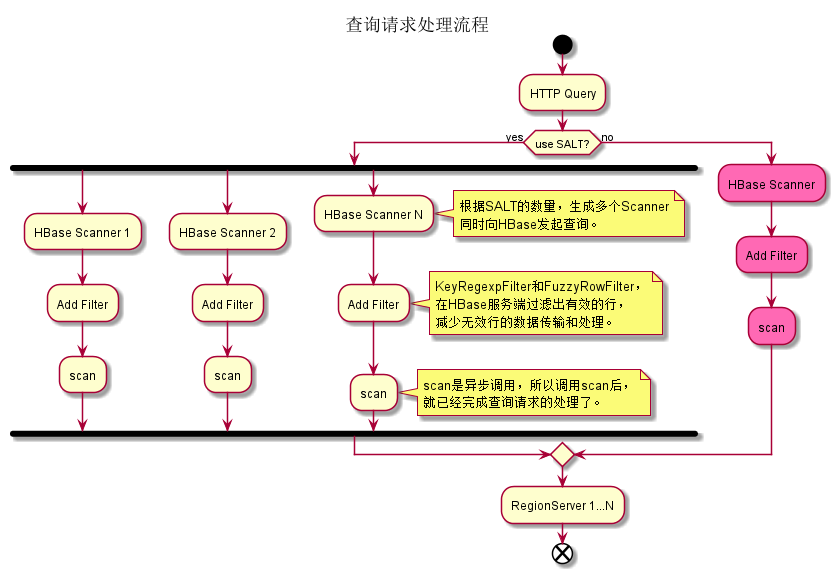
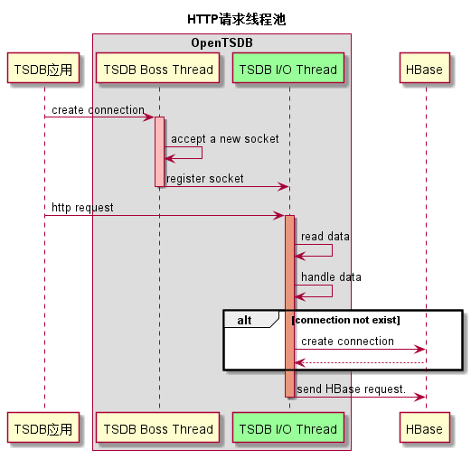
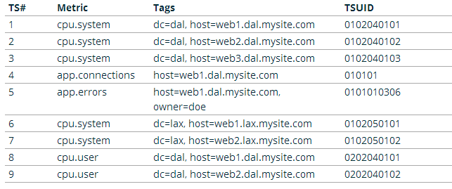

# 1.OpenTSDB原理系列：元数据模型

http://www.nosqlnotes.com/technotes/opentsdb-schema/


本文作为介绍OpenTSDB原理系列文章的第一篇，主要介绍了时序数据以及OpenTSDB的一些基础概念，以及OpenTSDB中的元数据模型定义。 

## 什么是时序数据？

Wiki中关于”**时间序列（Time Series）**“的定义： 

> **时间序列**（Time Series）是一组按照时间发生先后顺序进行排列的**数据点序列**，通常一组时间序列的时间间隔为一恒定值（如1秒，5分钟，1小时等）。 

**时间序列数据**可被简称为**时序数据**。 

**实时监控**系统所收集的监控指标数据，通常就是**时序数据** 。时序数据具有如下特点： 

- 每一个**时间序列**通常为某一**固定类型**的**数值** 
- 数据按一定的时间间隔持续产生，每条数据拥有自己的**时间戳**信息 
- 通常只会不断的**写入**新的数据，几乎不会有**更新**、**删除**的场景 
- 在读取上，也往往倾向于**读取最近写入**的数据。 


正是因为这些特点，通常使用专门的时序数据库来存储，因为这类数据库更能理解**时序数据((TSDB))**的特点，而且在读写上做一些针对性的优化。相信在在即将大范围普及的**物联网(IoT)**应用场景中，**时序数据库(TSDB)**会得到更加广泛的应用。 


## OpenTSDB


OpenTSDB是其中一种**时序数据库**实现，因为基于HBase生态构建而获得了广泛的关注。目前，华为云的CloudTable服务已经推出了OpenTSDB特性。 

如下是源自OpenTSDB官方资料中的**时序数据样例**： 

> sys.cpu.user host=webserver01 1356998400 50 
>
> sys.cpu.user host=webserver01,cpu=0 1356998400 1 
>
> sys.cpu.user host=webserver01,cpu=1 1356998400 0 
>
> sys.cpu.user host=webserver01,cpu=2 1356998400 2 
>
> sys.cpu.user host=webserver01,cpu=3 1356998400 0 
>
> ………… 
>
> sys.cpu.user host=webserver01,cpu=63 1356998400 1 

对于上面的任意一行数据，在OpenTSDB中称之为一个**时间序列**中的一个**Data Point**。以最后一行为例我们说明一下OpenTSDB中关于Data Point的每一部分组成定义如下： 

|   构成信息   |    名称     |
| :----------: | :---------: |
| sys.cpu.user | **metrics** |
|     host     |   tagKey    |
| webserver01  |  tagValue   |
|     cpu      |   tagKey    |
|      63      |  tagValue   |
|  1356998400  |  timestamp  |
|      1       |    value    |

可以看出来，每一个Data Point，都关联一个metrics名称，但可能关联多组<tagKey,tagValue>信息。而关于时间序列，事实上就是具有相同的metrics名称以及相同的<tagKey,tagValue>组信息的Data Points的集合。在存储这些Data Points的时候，大家也很容易可以想到，可以将这些metrics名称以及<tagKey,tagValue>信息进行特殊编码来优化存储，否则会带来极大的数据冗余。OpenTSDB中为每一个metrics名称，tagKey以及tagValue都定义了一个唯一的数字类型的标识码(UID)。 


### UID设计


UID的全称为Unique Identifier。这些UID信息被保存在OpenTSDB的元数据表中，默认表名为”tsdb-uid”。 

OpenTSDB分配UID时遵循如下规则： 

- metrics、tagKey和tagValue的UID分别独立分配 
- 每个metrics名称（tagKey/tagValue）的UID值都是唯一。不存在不同的metrics（tagKey/tagValue）使用相同的UID，也不存在同一个metrics（tagKey/tagValue）使用多个不同的UID 
- UID值的范围是0x000000到0xFFFFFF，即metrics（或tagKey、tagValue）最多只能存在16777216个不同的值。  

### 元数据HBase表设计

为了从UID索引到metrics（或tagKey、tagValue），同时也要从metrics（或tagKey、tagValue）索引到UID，OpenTSDB同时保存这两种映射关系数据。 在元数据表中，把这两种数据分别保存到两个名为”id”与”name”的Column Family中，Column Family描述信息如下所示： 

> {NAME => ‘id’, BLOOMFILTER => ‘ROW’, COMPRESSION => ‘SNAPPY’}
>
>  {NAME =>’name’,BLOOMFILTER => ‘ROW’, COMPRESSION => ‘SNAPPY’, MIN_VERSIONS => ‘0’, BLOCKCACHE => ‘true’, BLOCKSIZE => ‘65536’, REPLICATION_SCOPE => ‘0’} 


### 元数据模型

关于metrics名为”cpu.hum”，tagKey值为”host”，tagValue值分别为”189.120.205.26″、”189.120.205.27″的UID信息定义如下： 


说明： 

- RowKey为”0″的行中，分别保存了metrics、tagKey和tagValue的当前UID的最大值。当为新的metrics、tagKey和tagValue分配了新的UID后，会更新对应的最大值 
- RowKey为”1″的行中，RowKey为UID，Qualifier为”id:metrics”的值”metrics”，Qualifier为”id:tagk”的值为tagKey，Qualifier为id:tagv的值为tagValue 
- RowKey为”2″的行中，RowKey为UID，Qualifier为”id:tagv”的值为tagValue，暂不存在UID为”2″的metrics和tagKey 
- RowKey为”189.120.205.26″的行中，Qualifer为”name:tagv”的值为UID。表示当”189.120.205.26″为tagValue时，其UID为1 
- RowKey为”189.120.205.27″的行中，Qualifer为”name:tagv”的值为UID。表示当”189.120.205.26″为tagValue时，其UID为2 
- RowKey为”cpu.hum”的行中，Qualifer为”name:metrics”的值为UID。表示当cpu.hum为metrics时，其UID为1 
- RowKey为”host”的行中，Qualifer为”name:tagk”的值为UID。表示当host为tagValue时，其UID为1 

下面为Hbase shell一段代码的执行过程：

> hbase(main):009:0> scan 'tsdb-uid'
> ROW                                        COLUMN+CELL                                                                                                                 
>  \x00                                      column=id:metrics, timestamp=1530288910326, value=\x00\x00\x00\x00\x00\x00\x00\x12                                          
>  \x00                                      column=id:tagk, timestamp=1529652270537, value=\x00\x00\x00\x00\x00\x00\x00\x0A                                             
>  \x00                                      column=id:tagv, timestamp=1530288910343, value=\x00\x00\x00\x00\x00\x00\x00\x12                                             
>  \x00\x00\x01                              column=name:metrics, timestamp=1528879705241, value=sys.cpu.user                                                             \x00\x00\x01                              column=name:tagk, timestamp=1528879705280, value=host                                                                        \x00\x00\x01                              column=name:tagv, timestamp=1528879705313, value=web01                                                                       \x00\x00\x02                              column=name:metrics, timestamp=1528880100259, value=sys.cpu.sys                                                              \x00\x00\x02                              column=name:tagk, timestamp=1528879705347, value=user                                                                        \x00\x00\x02                              column=name:tagv, timestamp=1528879705377, value=10001                                                                       \x00\x00\x03                              column=name:metrics, timestamp=1528962192246, value=metricA                                                                  \x00\x00\x03                              column=name:tagk, timestamp=1529574234656, value=dc                                                                          \x00\x00\x03                              column=name:tagv, timestamp=1528965987449, value=10.0.101.145                                                                \x00\x00\x04                              column=name:metrics, timestamp=1528962192259, value=metricB                                                                  \x00\x00\x04                              column=name:tagk, timestamp=1529648725057, value=a                                                                           \x00\x00\x04                              column=name:tagv, timestamp=1528968931442, value=1                                                                           \x00\x00\x05                              column=name:tagk, timestamp=1529652213865, value=city                                                                        \x00\x00\x05                              column=name:tagv, timestamp=1529574746120, value=web02                                                                       \x00\x00\x06                              column=name:metrics, timestamp=1528967584681, value=metricC                                                                  \x00\x00\x06                              column=name:tagk, timestamp=1529652213894, value=district                                                                    \x00\x00\x06                              column=name:tagv, timestamp=1529636497119, value=lga                                                                         \x00\x00\x07                              column=name:metrics, timestamp=1528968931430, value=metricD                                                                  \x00\x00\x07                              column=name:tagk, timestamp=1529652213919, value=prov                                                                        \x00\x00\x07                              column=name:tagv, timestamp=1529648725071, value=foo                                                                         \x00\x00\x08                              column=name:metrics, timestamp=1529028217606, value=metricF                                                                  \x00\x00\x08                              column=name:tagk, timestamp=1529652270494, value=latitude                                                                    \x00\x00\x08                              column=name:tagv, timestamp=1529649560735, value=sw                                                                          \x00\x00\x09                              column=name:metrics, timestamp=1529574234633, value=sys.test.shan                                                            \x00\x00\x09                              column=name:tagk, timestamp=1529652270516, value=zip_code                                                                    \x00\x00\x09                              column=name:tagv, timestamp=1529652213881, value=cit_0_0                                                                     \x00\x00\x0A                              column=name:metrics, timestamp=1529636497101, value=sys.cpu.nice                                                             \x00\x00\x0A                              column=name:tagk, timestamp=1529652270542, value=longitude                                                                   \x00\x00\x0A                              column=name:tagv, timestamp=1529652213906, value=district_0_0_6                                                              \x00\x00\x0B                              column=name:metrics, timestamp=1529648725026, value=mymetric.test.data                                                      
>  \x00\x00\x0B                              column=name:tagv, timestamp=1529652213932, value=prov_0                                                                      \x00\x00\x0C                              column=name:metrics, timestamp=1529652213853, value=city.pm25                                                                \x00\x00\x0C                              column=name:tagv, timestamp=1529652270481, value=??                                                                          \x00\x00\x0D                              column=name:metrics, timestamp=1529652270468, value=shan_temperature                                                        
>  \x00\x00\x0D                              column=name:tagv, timestamp=1529652270505, value=39.913078                                                                   \x00\x00\x0E                              column=name:metrics, timestamp=1529653382675, value=shan.temperature                                                        
>  \x00\x00\x0E                              column=name:tagv, timestamp=1529652270530, value=100000                                                                      \x00\x00\x0F                              column=name:metrics, timestamp=1529657714078, value=sys.cpu.vice                                                             \x00\x00\x0F                              column=name:tagv, timestamp=1529652270553, value=116.39718                                                                   \x00\x00\x10                              column=name:metrics, timestamp=1529912577231, value=test.cpu.system1                                                        
>  \x00\x00\x10                              column=name:tagv, timestamp=1529657092899, value=xyd_host                                                                    \x00\x00\x11                              column=name:metrics, timestamp=1529912577262, value=test.cpu.system2                                                        
>  \x00\x00\x11                              column=name:tagv, timestamp=1529912577249, value=116.39719                                                                   \x00\x00\x12                              column=name:metrics, timestamp=1530288910336, value=mytest.cpu                                                               \x00\x00\x12                              column=name:tagv, timestamp=1530288910345, value=master1                                                                     1                                         column=id:tagv, timestamp=1528968931444, value=\x00\x00\x04                                                                  10.0.101.145                              column=id:tagv, timestamp=1528965987451, value=\x00\x00\x03                                                                  100000                                    column=id:tagv, timestamp=1529652270532, value=\x00\x00\x0E                                                                  10001                                     column=id:tagv, timestamp=1528879705387, value=\x00\x00\x02                                                                  116.39718                                 column=id:tagv, timestamp=1529652270555, value=\x00\x00\x0F                                                                  116.39719                                 column=id:tagv, timestamp=1529912577251, value=\x00\x00\x11                                                                  39.913078                                 column=id:tagv, timestamp=1529652270507, value=\x00\x00\x0D                                                                  ??                                        column=id:tagv, timestamp=1529652270483, value=\x00\x00\x0C                                                                  a                                         column=id:tagk, timestamp=1529648725059, value=\x00\x00\x04                                                                  cit_0_0                                   column=id:tagv, timestamp=1529652213883, value=\x00\x00\x09                                                                  city                                      column=id:tagk, timestamp=1529652213868, value=\x00\x00\x05                                                                  city.pm25                                 column=id:metrics, timestamp=1529652213855, value=\x00\x00\x0C                                                               dc                                        column=id:tagk, timestamp=1529574234659, value=\x00\x00\x03                                                                  district                                  column=id:tagk, timestamp=1529652213896, value=\x00\x00\x06                                                                  district_0_0_6                            column=id:tagv, timestamp=1529652213909, value=\x00\x00\x0A                                                                  foo                                       column=id:tagv, timestamp=1529648725074, value=\x00\x00\x07                                                                  host                                      column=id:tagk, timestamp=1528879705287, value=\x00\x00\x01                                                                  latitude                                  column=id:tagk, timestamp=1529652270496, value=\x00\x00\x08                                                                  lga                                       column=id:tagv, timestamp=1529636497121, value=\x00\x00\x06                                                                  longitude                                 column=id:tagk, timestamp=1529652270544, value=\x00\x00\x0A                                                                  master1                                   column=id:tagv, timestamp=1530288910347, value=\x00\x00\x12                                                                  metricA                                   column=id:metrics, timestamp=1528962192249, value=\x00\x00\x03                                                               metricB                                   column=id:metrics, timestamp=1528962192261, value=\x00\x00\x04                                                               metricC                                   column=id:metrics, timestamp=1528967584683, value=\x00\x00\x06                                                               metricD                                   column=id:metrics, timestamp=1528968931432, value=\x00\x00\x07                                                               metricF                                   column=id:metrics, timestamp=1529028217612, value=\x00\x00\x08                                                               mymetric.test.data                        column=id:metrics, timestamp=1529648725029, value=\x00\x00\x0B                                                               mytest.cpu                                column=id:metrics, timestamp=1530288910338, value=\x00\x00\x12                                                               prov                                      column=id:tagk, timestamp=1529652213922, value=\x00\x00\x07                                                                  prov_0                                    column=id:tagv, timestamp=1529652213935, value=\x00\x00\x0B                                                                  shan.temperature                          column=id:metrics, timestamp=1529653382678, value=\x00\x00\x0E                                                               shan_temperature                          column=id:metrics, timestamp=1529652270470, value=\x00\x00\x0D                                                               sw                                        column=id:tagv, timestamp=1529649560737, value=\x00\x00\x08                                                                  sys.cpu.nice                              column=id:metrics, timestamp=1529636497104, value=\x00\x00\x0A                                                               sys.cpu.sys                               column=id:metrics, timestamp=1528880100264, value=\x00\x00\x02                                                               sys.cpu.user                              column=id:metrics, timestamp=1528879705251, value=\x00\x00\x01                                                               sys.cpu.vice                              column=id:metrics, timestamp=1529657714081, value=\x00\x00\x0F                                                               sys.test.shan                             column=id:metrics, timestamp=1529574234637, value=\x00\x00\x09                                                               test.cpu.system1                          column=id:metrics, timestamp=1529912577234, value=\x00\x00\x10                                                               test.cpu.system2                          column=id:metrics, timestamp=1529912577264, value=\x00\x00\x11                                                               user                                      column=id:tagk, timestamp=1528879705356, value=\x00\x00\x02                                                                  web01                                     column=id:tagv, timestamp=1528879705321, value=\x00\x00\x01                                                                  web02                                     column=id:tagv, timestamp=1529574746123, value=\x00\x00\x05                                                                  xyd_host                                  column=id:tagv, timestamp=1529657092903, value=\x00\x00\x10                                                                  zip_code                                  column=id:tagk, timestamp=1529652270518, value=\x00\x00\x09

由于HBase的存储数据类型是Bytes，所以UID在存储时会被转换为3个字节长度的Bytes数组进行存储。 


### TSUID

对每一个Data Point，metrics、timestamp、tagKey和tagValue都是必要的构成元素。除timestamp外，metrics、tagKey和tagValue的UID就可组成一个TSUID，每一个TSUID关联一个**时间序列**，如下所示： 

> *<metrics_UID><tagKey1_UID><tagValue1_UID>[…<tagKeyN_UID><tagValueN_UID>]* 

在上一章节的例子中，就涉及两个TSUID，分别是： 


# 2.OpenTSDB原理系列: 数据表设计

http://www.nosqlnotes.com/technotes/opentsdb-tabledesign/

上一篇文章《[OpenTSDB原理系列-元数据模型](http://www.nosqlnotes.com/technotes/opentsdb-schema/)》讲到了OpenTSDB的基础概念，以及元数据模型，这篇文章介绍OpenTSDB的HBase数据表设计。OpenTSDB共涉及两种类型的数据：Metrics数据以及Annotation(注释)数据，在将这些数据存到HBase表中时，针对RowKey, Qualifier以及Value信息都做了特殊设计，从而使得存储更加高效。

## Metrics RowKey设计

metrics数据的HBase RowKey中包含主要组成部分为：盐值（Salt）、metrics名称、时间戳、tagKey、tagValue等部分。上篇文章已经讲到，为了统一各个值的长度以及节省空间，对metrics名称、tagKey和tagValue分配了UID信息。所以，在HBase RowKey中实际写入的metrics UID、tagKey UID和tagValue UID。

HBase RowKey的数据模型如下图所示：

 

- SALT：建议开启SALT功能，可以有效提高性能。SALT数据的长度是变长的：如果SALT的值少于256，那么只用一个字节表示即可；如果需要设置更大的SALT值，也会相应地占用更多的空间。
- Metric ID：metrics名经过编码后，每个Metric ID的长度为三个字节。
- Timestamp：这里是整点小时时间戳。
- tagKey UID & tagValue UID：tagKey和tagValue经过编码后，每个tagKey UID和tagValue UID的长度都为三个字节。tagKey UID和tagValue UID必须成对出现，最少必须存在1对，最多存在8对。


> net.opentsdb.core.IncomingDataPoints

```
/**
 * Returns a partially initialized row key for this metric and these tags. The
 * only thing left to fill in is the base timestamp.
 */
static byte[] rowKeyTemplate(final TSDB tsdb, final String metric,
    final Map<String, String> tags) {
  final short metric_width = tsdb.metrics.width();
  final short tag_name_width = tsdb.tag_names.width();
  final short tag_value_width = tsdb.tag_values.width();
  final short num_tags = (short) tags.size();

  int row_size = (Const.SALT_WIDTH() + metric_width + Const.TIMESTAMP_BYTES 
      + tag_name_width * num_tags + tag_value_width * num_tags);
  final byte[] row = new byte[row_size];

  short pos = (short) Const.SALT_WIDTH();

  copyInRowKey(row, pos,
      (tsdb.config.auto_metric() ? tsdb.metrics.getOrCreateId(metric)
          : tsdb.metrics.getId(metric)));
  pos += metric_width;

  pos += Const.TIMESTAMP_BYTES;

  for (final byte[] tag : Tags.resolveOrCreateAll(tsdb, tags)) {
    copyInRowKey(row, pos, tag);
    pos += tag.length;
  }
  return row;
}
```

## Metrics Qualifier设计

Qualifier用于保存一个或多个DataPoint中的时间戳、数据类型、数据长度等信息。

由于时间戳中的小时级别的信息已经保存在RowKey中了，所以Qualifier只需要保存一个小时中具体某秒或某毫秒的信息即可，这样可以减少数据占用的空间。

一个小时中的某一秒（少于3600）最多需要2个字节即可表示，而某一毫秒（少于3600000）最多需要4个字节才可以表示。为了节省空间，OpenTSDB没有使用统一的长度，而是对特定的类型采用特性的编码方法。Qualifer的数据模型主要分为如下三种情况：秒、毫秒、秒和毫秒混合。

  

```
/** Mask to verify a timestamp on 4 bytes in seconds */
  public static final long SECOND_MASK = 0xFFFFFFFF00000000L;
```

> net.opentsdb.core.Internal

```
/**
 * Returns a 2 or 4 byte qualifier based on the timestamp and the flags. If
 * the timestamp is in seconds, this returns a 2 byte qualifier. If it's in
 * milliseconds, returns a 4 byte qualifier 
 * @param timestamp A Unix epoch timestamp in seconds or milliseconds
 * @param flags Flags to set on the qualifier (length &| float)
 * @return A 2 or 4 byte qualifier for storage in column or compacted column
 * @since 2.0
 */
public static byte[] buildQualifier(final long timestamp, final short flags) {
  final long base_time;

  if ((timestamp & Const.SECOND_MASK) != 0) {
    // drop the ms timestamp to seconds to calculate the base timestamp
    base_time = ((timestamp / 1000) - ((timestamp / 1000) 
        % Const.MAX_TIMESPAN));
    final int qual = (int) (((timestamp - (base_time * 1000) 
        << (Const.MS_FLAG_BITS)) | flags) | Const.MS_FLAG);
    return Bytes.fromInt(qual);
  } else {
    base_time = (timestamp - (timestamp % Const.MAX_TIMESPAN));
    final short qual = (short) ((timestamp - base_time) << Const.FLAG_BITS
        | flags);
    return Bytes.fromShort(qual);
  }
}
```

```
public Deferred<Object> addPoint(final String metric,
                                 final long timestamp,
                                 final long value,
                                 final Map<String, String> tags) {
  final byte[] v;
  if (Byte.MIN_VALUE <= value && value <= Byte.MAX_VALUE) {
    v = new byte[] { (byte) value };
  } else if (Short.MIN_VALUE <= value && value <= Short.MAX_VALUE) {
    v = Bytes.fromShort((short) value);
  } else if (Integer.MIN_VALUE <= value && value <= Integer.MAX_VALUE) {
    v = Bytes.fromInt((int) value);
  } else {
    v = Bytes.fromLong(value);
  }

  //因为long是8个字节，但是表示8需要4bit，所以减去1之后最多就是7，只需要3bit表示就够了
  final short flags = (short) (v.length - 1);  // Just the length.
  return addPointInternal(metric, timestamp, v, tags, flags);
}
```

### 秒类型

当OpenTSDB接收到一个新的DataPoint的时候，如果请求中的时间戳是秒，那么就会插入一个如下模型的数据。

判断请求中的时间戳为秒或毫秒的方法是基于时间戳数值的大小，如果时间戳的值的超过无符号整数的最大值（即4个字节的长度），那么该时间戳是毫秒，否则为秒。


- Value长度：Value的实际长度是Qualifier的最后3个bit的值加1，即(qualifier & 0x07) + 1。表示该时间戳对应的值的字节数。所以，值的字节数的范围是1到8个字节。
- Value类型：Value的类型由Qualifier的倒数第4个bit表示，即(qualifier & 0x08)。如果值为1，表示Value的类型为float；如果值为0，表示Value的类型为long。
- 时间戳：时间戳的值由Qualifier的第1到第12个bit表示，即(qualifier & 0xFFF0) >>>4。由于秒级的时间戳最大值不会大于3600，所以qualifer的第1个bit肯定不会是1。

### 毫秒类型

当OpenTSDB接收到一个新的DataPoint的时候，如果请求中的时间戳是毫秒，那么就会插入一个如下模型的数据。


- Value长度：与秒类型相同。
- Value类型：与秒类型相同。
- 时间戳： 时间戳的值由Qualifier的第5到第26个bit表示，即(qualifier & 0x0FFFFFC0) >>>6。
- 标志位：标志位由Qualifier的前4个bit表示。当该Qualifier表示毫秒级数据时，必须全为1，即(qualifier[0] & 0xF0) == 0xF0。
- 第27到28个bit未使用。

### 混合类型

当同一小时的数据发生合并后，就会形成混合类型的Qualifier。

合并的方法很简单，就是按照时间戳顺序进行排序后，从小到大依次拼接秒类型和毫秒类型的Qualifier即可。


- 秒类型和毫秒类型的数量没有限制，并且可以任意组合。
- 不存在相同时间戳的数据，包括秒和毫秒的表示方式。
- 遍历混合类型中的所有DataPoint的方法是：
  - 从左到右，先判断前4个bit是否为0xF
  - 如果是，则当前DataPoint是毫秒型的，读取4个字节形成一个毫秒型的DataPoint
  - 如果否，则当前DataPoint是秒型的，读取2个字节形成一个秒型的DataPoint
  - 以此迭代即可遍历所有的DataPoint


## Metrics Value设计

HBase Value部分用于保存一个或多个DataPoint的具体某个时间戳对应的值。

由于在Qualifier中已经保存了DataPoint Value的类型和DataPoint Value的长度，所以无论是秒级还是毫秒级的值，都可以用相同的表示方法，而混合类型就是多个DataPoint Value的拼接。

HBase Value按照长度可以分为如下几种类型：

### 单字节

当DataPoint Value为long型，且大于等于-128（Byte.MIN_VALUE），且少于或等于127（Byte.MAX_VALUE）的时候，使用1个字节存储。

### 两字节

当DataPoint Value为long型，且大于等于-32768（Short.MIN_VALUE），且少于或等于32767（Short.MAX_VALUE）的时候，使用2个字节存储。

### 四字节

当DataPoint Value为long型，且大于等于0x80000000（Integer.MIN_VALUE），且少于或等于0x7FFFFFFF（Integer.MAX_VALUE）的时候，使用4个字节存储。

### 八字节

当DataPoint Value为long型，且不是上面三种类型的时候，使用8个字节存储。

当DataPoint Value为float型的时候，使用8个字节表示。

### 多字节

按照时间戳的顺序，把多个Value拼接起来的数据模型如下：


- 每个格子表示一个DataPoint Value的值，这个DataPoint Value的长度可能是1或2或4或8个字节。
- DataPoint Value的顺序与Qualifier中时间戳的顺序一一对应。
- 混合标志：如果最后1个字节为0x01，表示存在秒级类型和毫秒级类型混合的情况。

## Annotation数据

Annotation用于描述某一个时间点发生的事件，Annotation的数据为字符串类型，这与数字类型的metrics数据并不同。

> 注意：
>
> 1. Annotation数据只支持秒级时间戳的数据。
> 2. Annotation数据不会合并。

### Annotation RowKey设计

RowKey的数据模型如下图：


-  Salt/Timestamp/Metric UID/ tagKey UID /tagValue UID的意义与metrics RowKey中的意义相同。

- 把[Metric UID/ tagKey UID /tagValue UID]部分统称为TSUID。实际上，读写注释数据的时候，需要指定的是TSUID，而不是像metrics数据中那样分开指定的。


### **Annotation Qualifier设计**

由于注释数据只支持秒级类型的数据，同时注释类型的数据不支持合并，所以Qualifier的设计相对metrics数据简单一些。Qualifier定义如下：

与metrics数据的Qualifier相比，注释数据的HBase Qualifer的长度是3个字节。

**标志位**：使用第1个字节表示，而且值必须为0x01。即(qualifier & 0xFF0000)>>>16 == 0x01。

**时间戳**：使用第2到第3个字节表示。即时间戳的值为(qualifier & 0x00FFFF)。

### **Annotation Value设计**

注释数据中的Value保存的是字符串类型的数据，整个HBase Value部分就是注释数据的值。

## **Append写入模式**

当OpenTSDB启动Append写入模式后，每个插入的新DataPoint，都会以HBase的append的方式写入。

注意：

由于使用了HBase的append的接口，每次插入一个新数据，都需要对同一小时的数据都执行一次读取和插入的操作；另外多线程对同一小时的数据进行更新的时候，是不能并发的。这样就大大限制了数据写入的速度了，一般情况下不建议使用这种模式。

append的数据其实就是合并过的数据了，所以不会参与OpenTSDB的Compaction流程。

Append模式下的RowKey设计与普通写入模式是相同的，不单独介绍。

### **Append Qualifier设计**

Append模式下，由于同1小时的数据中不存在多个Qualifier，所以只需要使用一个固定的Qualifier即可。

Append模式的Qualifier使用3个字节表示

标志位： 由第1个字节表示，而且值必须为0x05。即(qualifier & 0xFF0000)>>>16 == 0x05

固定部分：由第2到第3个字节表示，这部分的值固定为0x0000，因此，Append模式的Qualifier固定为0x050000

### **Append Value设计**

Append模式下， Value部分既要保存时间戳，数值类型和数值长度，也要保存对应的数值。Value的数据结构如下：

上图每一个方块表示的Qualifier与Value的定义，与普通写入模式下的定义相同

遍历Value中的所有DataPoint的方法是：

从左到右，先判断前4个bit是否为0xF

如果是，则当前DataPoint是毫秒型的读取4个字节形成一个毫秒型的Qualifier，从Qualifier中获得Value的长度，然后再读取对应长度的字节数

如果否，则当前DataPoint是秒型的，读取2个字节形成一个秒型的Qualifier，从Qualifier中获得Value的长度，然后再读取对应长度的字节数；

依此迭代即可遍历所有的DataPoint。

**小结**

OpenTSDB共涉及到两个HBase表，第一篇文章中讲到了元数据表的定义，这篇文章讲到了存放Data Points的数据表定义。在后面的文章中，将会陆续介绍OpenTSDB的线程模型以及读写流程。


# 3.OpenTSDB原理系列：读取流程

http://www.nosqlnotes.com/technotes/tsdb/opentsdb-query/

一个完整的OpenTSDB HTTP Query请求，分别由OpenTSDB I/O Thread和AsyncHBase I/O Thread完成。OpenTSDB I/O Thread线程负责处理HTTP Query请求，AsyncHBase I/O Thread负责处理HBase的响应并发送HTTP响应。 

## 请求处理流程




**1.OpenTSDB I/O Thread收到HTTP Query请求后，会根据OpenTSDB是否使用了SALT进行不同的处理。** 

相关配置项： 

**参数1：**tsd.storage.salt.width 

> **默认值**：0
>
> **说明**：SALT的字节长度。当设置为0时，表示不使用SAL。

**参数2：**tsd.storage.salt.buckets

> **默认值**：20
>
> **说明**： SALT的数量。当“tsd.storage.salt.width”为非0时，才发挥作用。该配置项的值，不能超过SALT的字节长度所能表示的最大数字。例如SALT的字节长度为1时，该配置项的不能配置成大于256。这两个配置在OpenTSDB初始化就必须确定，运行过程中不能随意修改，否则会导致历史数据读取错误。


是否使用了SALT，只会对生成的HBase Scanner数量产生影响，每个HBase Scanner的处理流程都是相同的。 

当使用了SALT，就会生成相应SALT数量的HBase Scanner。 

需要注意的是，Scanner的StatKey和StopKey中，只包含了{SALT+Metric ID+Timestamp}。如果需要查询的Metric中包含大量不同的TagName或者TagValue的话，这个Scanner可能需要扫描大量的数据，影响OpenTSDB查询的性能。 

**2.为每个Scanner设置Filter，设置Filter可以更精确的过滤HBase的行，减少无效数据行的传输和处理，以提高查询的性能。** 

如果HTTP Query中设置了Tag的查询条件，Scanner中就会设置KeyRegexpFilter；如果同时设置了explicitTags 为true，Scanner中还会再设置FuzzyRowFilter。 

**参数3：**tsd.query.enable_fuzzy_filter

> **默认值**：true
>
> **说明**：当查询请求中包含explicitTags字段的时候，是否在HBase的Scan请求中使用FuzzyRowFilter

**注意：** 

虽然设置了Filter，但是在HBase服务端需要扫描的数据量并不会减少，只是减少了返回的数据量。 

Scan caching默认值为128，可以通过如下配置项进行配置： 


**参数4：**tsd.storage.hbase.scanner.maxNumRows**

> **默认值**：128
>
> **说明**：每次scan时从HBase一次返回的数据行数。

**最后调用Scanner的scan方法，scan方法采用了异步调用。** 

到这里，一个HTTP Query的请求调用已经被处理完了。 


## 响应处理流程


**1**. 一个HTTP Query所生成的多个Scanner，可能发送到了多个RegionServer上，所以OpenTSDB可能收到多个RegionServer发送过来的scanner结果。 

**2**. 每个RegionServer的scanner结果，都由其绑定的一个线程进行处理。这个线程既负责从socket中接收Scanner结果，也要负责处理这些scanner结果。因此，它只能逐个处理这些Scanner结果。 

**3**. 当处理完一个scanner结果后，如果这个scanner的所有结果还没有传输完，就继续异步调用scan方法，以获得后续的scanner结果。调用完后，就继续处理下一个scanner结果。 

**4**. 当一个scanner的所有结果都已经处理完了，而且这个scanner不是所关联HTTP Query请求的最后一个被处理的Scanner，那么就把处理后的数据暂时缓存起来。然后继续处理下一个scanner结果；如果是最后一个scanner，就把这个HTTP Query请求的所有scanner结果进行合并，生成一个HTTP Query的Response，并发送回到OpenTSDB应用。 


**至此，在OpenTSDB的应用端，就已经完成了一次完整的HTTP Query查询。** 


# 4.OpenTSDB原理系列：线程模型

http://www.nosqlnotes.com/technotes/opentsdb-threadmodel/

前面两篇文章介绍了 OpenTSDB的元数据模型以及数据表定义，这篇文章介绍OpenTSDB的线程模型，主要是处理HTTP请求的线程池以及负责HBase响应的线程池。 


## HTTP请求处理线程池

OpenTSDB启动时，会创建一个Netty服务端（默认端口为4242），以接收OpenTSDB服务端发送过来的HTTP请求。Netty的服务端实现包括了一个Boss线程和多个业务处理线程（默认线程数为CPU核数的两倍）。 




1. OpenTSDB应用通过Socket连接到OpenTSDB的服务端，OpenTSDB的Boss线程会处理这个连接请求； 

2. OpenTSDB Boss Thread通过监听端口，接受该连接请求，并生成一个新的socket连接。 

3. OpenTSDB Boss Thread把新的socket注册到业务处理线程池中。每个socket绑定I/O线程池中的某个线程。 

4. OpenTSDB I/O Thread通过轮询各个Socket，从Socket中取出HTTP请求的内容。 

   **说明**：上述1~4步骤，都是在Netty的框架中完成。 

5. OpenTSDB I/O Thread处理HTTP请求数据（不同的请求有不同的处理流程，另文进行说明）。 

6. 如果OpenTSDB与HBase之间的连接不存在，就创建一个新连接。 

7. OpenTSDB I/O Thread处理HTTP请求数据后，发送HBase请求到HBase服务。 

8. 由上面的流程可以知道，OpenTSDB的请求都是由OpenTSDB I/O Thread线程池进行处理的。 


## HBase响应处理线程池

OpenTSDB发送请求到HBase后，需要处理HBase返回的相应消息，这是通过OpenTSDB中的一个Netty客户端实现的。 

Netty的客户端实现包括了一个Boss线程和多个业务处理线程（默认线程数为CPU核数*2）。 


1. 每个HBase与OpenTSDB之间的Socket连接，在OpenTSDB向HBase发起请求的时候就已经建立了。 也会把该Socket绑定到AsyncHBase I/O Threads线程池的一个线程中。 

2. AsyncHBase I/O Thread读取Socket中的HBase响应消息。 

   **说明**：上述1~2步骤是在Netty的框架中完成的。 

3. AsyncHBase I/O Thread 处理HBase的响应消息。而后，发送HTTP响应消息到OpenTSDB应用端。 

   

   由上面的流程可以知道，OpenTSDB的HTTP响应都是由AsyncHBase I/O Thread线程池处理的。 

## 小结


在OpenTSDB中，对HTTP请求和HBase响应是**异步处理**的，这部分主要是借助了Netty的框架。异步处理使得线程资源的利用更加高效，一定程度上能够提升读写的并发度，带来吞吐量的提升。目前，HBase也已经支持了异步RPC框架。 


# 5.快速理解OpenTSDB的Schema设计

http://www.nosqlnotes.com/technotes/tsdb/opentsdb-schema-concept/


在时序数据库中，Time Series是一个基础概念。我们先来看看Wiki中关于Time Series的定义： 

> *Time Series是一组按照时间发生先后顺序进行排列的数据点序列。通常一组时间序列的时间间隔为一恒定值（如1秒，5分钟，1小时等）。* 

我们可以这样命名一个Time Series:

webserver01.sys.cpu.0.user

这样从名称中可以很容易获知该Time Series关联了如下信息：

Web Server: webserver01

CPU Core:  0

如果我们的查询可以同时指定web server以及cpu core的话，这种设计则非常适合。

但对于一个拥有64 Cores的Web Server，如果查询所有CPU Cores的聚合结果的话，可以通过如下的通配符来匹配所有相关的Time Series:

查询1: webserver01.sys.cpu.*.user

这样，可以获取到64个Time Series，然后聚合结果即可。

但如果有1000个Web Servers呢？我们需要基于如下的通配符来匹配所有的相关Time Series：

查询2: *.sys.cpu.*.user


关于如上两种查询，一种可选的加速方案为：在这64个Time Series之外，记录一个名为”webserver01.sys.cpu.user.all”的Time Series，这样可以加速查询1中所有CPU Cores的聚合统计计算。 而关于查询2，可以记录一个名为”webservers.sys.cpu.user.all”的Time Series来进行加速。

在OpenTSDB的Schema定义中，引入了Tag的概念。每一个Time Series包含一个Metric名称，但可能包含包含1组或多组Tags信息(每一个Tag包含一个TagKey与TagValue)，以前面的”webserver01.sys.cpu.0.user”为例，在OpenTSDB表示为：

sys.cpu.user host=webserver01, cpu=0

将其拆解后的构成信息：

sys.cpu.user : <Metric Name>

host : <TagKey>

webserver01 : <TagValue>

cpu : <TagKey>

0 : <TagValue>

OpenTSDB中的一个Time Series，由Metric Name与X个Tags(X>=1)唯一决定。

例如：

sys.cpu.user host=webserver01

sys.cpu.user host=webserver01, cpu=0

sys.cpu.user host=webserver02, cpu=1

代表了三个不同的Time Series。


如果查询时指定Web Server，指定CPU Core的聚合结果，可以简单表达为：

sum: sys.cpu.user {host=webserver01, cpu=42}

*注：实际查询时需要指定时间信息，这里为了简单起见，省略了时间信息，下同。*

如果查询Web Server上所有的CPU Cores的聚合结果，可以这么表达：

sum: sys.cpu.user {host=webserver01}

这样就可以汇聚了webserver01上所有CPU Cores所关联的Time Series的结果。

再进一步，如果查询所有的Web Servers所有CPU Cores的聚合结果，可以这么表达：

*sum: sys.cpu.user*

与同一metric name相关的所有的Time Series信息，都是相邻存储的，因此，我们可以轻易实现与此metric相关的快速聚合查询或结果钻取。

既然了解了OpenTSDB的schema由Metric与Tags构成，我们接下来看看需要注意的一个问题：

继续上面的例子，假设我们记录了一个Web Server的64个CPU Cores相关的Time Series：

sys.cpu.user host=webserver01,cpu=0  1356998400  1
sys.cpu.user host=webserver01,cpu=1  1356998400  0
sys.cpu.user host=webserver01,cpu=2  1356998400  2
sys.cpu.user host=webserver01,cpu=3  1356998400  0
…
sys.cpu.user host=webserver01,cpu=63 1356998400  1

而且我们使用了如下命名的Time Series来记录关于这个Web Server上的所有CPU Cores的聚合结果：

sys.cpu.user host=webserver01        1356998400  50

也就是说，表中一共存储了65条记录。

关于如下查询：sum:sys.cpu.user {host=webserver01}

我们期望的聚合结果应该为50，但实际的查询结果却会变为100，这是因为这次查询共聚合了下面的65条记录的结果：
sys.cpu.user host=webserver01 1356998400 50
sys.cpu.user host=webserver01,cpu=0  1356998400  1
sys.cpu.user host=webserver01,cpu=1  1356998400  0
sys.cpu.user host=webserver01,cpu=2  1356998400  2
sys.cpu.user host=webserver01,cpu=3  1356998400  0
…
sys.cpu.user host=webserver01,cpu=63 1356998400  1

再举一个典型的例子来阐述说明一下这里的查询行为：

如果查询条件为”sum:sys.cpu.user {host=webserver01}”， 如下这些Time Series都将会被包含其中：
sys.cpu.user host=webserver01,cpu=0
sys.cpu.user host=webserver01,cpu=0,manufacturer=Intel
sys.cpu.userhost=webserver01,foo=bar
sys.cpu.user host=webserver01,cpu=0,datacenter=lax,department=ops

因为这些与”sys.cpu.use”的Time Series中都包含了Tag {host=webserver01}（尽管有一些Time Series中包含了更多的Tags）。

因此，使用OpenTSDB时需要注意关于Tags定义方面的问题。

**参考信息：**

OpenTSDB Document


# 6.解密OpenTSDB的表存储优化

https://yq.aliyun.com/articles/54785


## 摘要 

OpenTSDB是一个分布式的、可伸缩的时间序列数据库，在DB-engines的时间序列数据库[排行榜](http://db-engines.com/en/ranking/time+series+dbms)上排名第五。它的特点是能够提供最高毫秒级精度的时间序列数据存储，能够长久保存原始数据并且不失精度。它拥有很强的数据写入能力，支持大并发的数据写入，并且拥有可无限水平扩展的存储容量。

​        它的强大的数据写入能力与存储能力得益于它底层依赖的HBase数据库，也得益于它在表结构设计上做的大量的存储优化。

​        本篇文章会详细讲解其表结构设计，在理解它的表结构设计的同时，分析其采取该设计的深层次原因以及优缺点。它的表结构设计完全贴合HBase的存储模型，而表格存储（TableStore、原OTS）与HBase有类似的存储模型，理解透OpenTSDB的表结构设计后，我们也能够对这类数据库的存储模型有一个更深的理解。

## 存储模型

在解析OpenTSDB的表结构设计前，我们需要先对其底层的HBase的存储模型有一个理解。

## 表分区

HBase会按Rowkey的范围，将一张大表切成多个region，每个region会由一个region server加载并提供服务。Rowkey的切分与表格存储的分区类似，一个良好设计的表，需要保证读写压力能够均匀的分散到表的各个region，这样才能充分发挥分布式集群的能力。


如图所示为表结构以及对应的存储结构示例，在HBase或表格存储这类底层采用LSM-tree的数据库中，表数据会按列存储。每行中的每一列在存储文件中都会以Key-value的形式存在于文件中。其中Key的结构为：行主键 + 列名，Value为列的值。该种存储结构的特点是：

​        a. 每行主键会重复存储，取决于列的个数

​        b. 列名会重复存储，每一列的存储都会携带列名

​        c. 存储数据按row-key排序，相邻的row-key会存储在相邻的块中

## OpenTSDB的基本概念

OpenTSDB定义每个时间序列数据需要包含以下属性：

1.  指标名称（metric name）
2.  时间戳（UNIX timestamp，毫秒或者秒精度）
3.  值（64位整数或者单精度浮点数）
4.  一组标签（tags，用于描述数据属性，至少包含一个或多个标签，每个标签由tagKey和tagValue组成，tagKey和tagValue均为字符串）

举个例子，在监控场景中，我们可以这样定义一个监控指标：

> 指标名称： sys.cpu.user 标签： host = 10.101.168.111 cpu = 0 指标值： 0.5 

指标名称代表这个监控指标是对用户态CPU的使用监控，引入了两个标签，分别标识该监控位于哪台机器的哪个核。


OpenTSDB支持的查询场景为：指定指标名称和时间范围，给定一个或多个标签名称和标签的值作为条件，查询出所有的数据。

以上面那个例子举例，我们可以查询：

​    a. sys.cpu.user (host=\*,cpu=\*)(1465920000 <= timestamp < 1465923600)：查询凌晨0点到1点之间，所有机器的所有CPU核上的用户态CPU消耗。

​    b. sys.cpu.user (host=10.101.168.111,cpu=\*)(1465920000 <= timestamp < 1465923600)：查询凌晨0点到1点之间，某台机器的所有CPU核上的用户态CPU消耗。

​    c. sys.cpu.user (host=10.101.168.111,cpu=0)(1465920000 <= timestamp < 1465923600)：查询凌晨0点到1点之间，某台机器的第0个CPU核上的用户态CPU消耗。


## OpenTSDB的存储优化

了解了OpenTSDB的基本概念后，我们来尝试设计一下表结构。


如上图是一个简单的表结构设计，rowkey采用metric name + timestamp + tags的组合，因为这几个元素才能唯一确定一个指标值。

这张表已经能满足我们的写入和查询的业务需求，但是OpenTSDB采用的表结构设计远没有这么简单，我们接下来一项一项看它对表结构做的一些优化。

### **优化一：缩短row key**

观察这张表内存储的数据，在rowkey的组成部分内，其实有很大一部分的重复数据，重复的指标名称，重复的标签。以上图为例，如果每秒采集一次监控指标，cpu为2核，host规模为100台，则一天时间内sys.cpu.user这个监控指标就会产生17280000行数据，而这些行中，监控指标名称均是重复的。如果能将这部分重复数据的长度尽可能的缩短，则能带来非常大的存储空间的节省。

OpenTSDB采用的策略是，为每个metric、tag key和tag value都分配一个UID，UID为固定长度三个字节。

 

上图为优化后的存储结构，可以看出，rowkey的长度大大的缩短了。rowkey的缩短，带来了很多好处：

​    a. 节省存储空间

​    b. 提高查询效率：减少key匹配查找的时间

​    c. 提高传输效率：不光节省了从文件系统读取的带宽，也节省了数据返回占用的带宽，提高了数据写入和读取的速度。

​    d. 缓解Java程序内存压力：Java程序，GC是老大难的问题，能节省内存的地方尽量节省。原先用String存储的metric name、tag key或tag value，现在均可以用3个字节的byte array替换，大大节省了内存占用。

### 优化二：减少Key-Value数

优化一是OpenTSDB做的最核心的一个优化，很直观的可以看到存储的数据量被大大的节省了。原理也很简单，将长的变短。但是是否还可以进一步优化呢？

在上面的存储模型章节中，我们了解到。HBase在底层存储结构中，每一列都会以Key-Value的形式存储，每一列都会包含一个rowkey。如果要进一步缩短存储量，那就得想办法减少Key-Value的个数。

OpenTSDB分了几个步骤来减少Key-Value的个数：

\1. 将多行合并为一行，多行单列变为单行多列。

\2. 将多列合并为一列，单行多列变为单行单列。

#### 多行单列合并为单行单列


OpenTSDB将同属于一个时间周期内的具有相同TSUID（相同的metric name，以及相同的tags）的数据合并为一行存储。OpenTSDB内默认的时间周期是一个小时，也就是说同属于这一个小时的所有数据点，会合并到一行内存储，如图上所示。合并为一行后，该行的rowkey中的timestamp会指定为该小时的起始时间（所属时间周期的base时间），而每一列的列名，则记录真实数据点的时间戳与该时间周期起始时间（base）的差值。

这里列名采用差值而不是真实值也是一个有特殊考虑的设计，如存储模型章节所述，列名也是会存在于每个Key-Value中，占用一定的存储空间。如果是秒精度的时间戳，需要4个字节，如果是毫秒精度的时间戳，则需要8个字节。但是如果列名只存差值且时间周期为一个小时的话，则如果是秒精度，则差值取值范围是0-3600，只需要2个字节；如果是毫秒精度，则差值取值范围是0-360000，只需要4个字节；所以相比存真实时间戳，这个设计是能节省不少空间的。

#### 单行多列合并为单行单列

多行合并为单行后，并不能真实的减少Key-Value个数，因为总的列数并没有减少。所以要达到真实的节省存储的目的，还需要将一行的列变少，才能真正的将Key-Value数变少。

OpenTSDB采取的做法是，会在后台定期的将一行的多列合并为一列，称之为『compaction』，合并完之后效果如下。


同一行中的所有列被合并为一列，如果是秒精度的数据，则一行中的3600列会合并为1列，Key-Value数从3600个降低到只有1个。

### 优化三：并发写优化

上面两个优化主要是OpenTSDB对存储的优化，存储量下降以及Key-Value个数下降后，除了直观的存储量上的缩减，对读和写的效率都是有一定提升的。

时间序列数据的写入，有一个不可规避的问题是写热点问题，当某一个metric下数据点很多时，则该metric很容易造成写入热点。OpenTSDB采取了和这篇[文章](https://yq.aliyun.com/articles/54644?spm=a2c4e.11153940.blogcont54785.7.42eb5567Hm9z5g)中介绍的一样的方法，允许将metric预分桶，可通过『tsd.storage.salt.buckets』配置项来配置。


如上图所示，预分桶后的变化就是在rowkey前会拼上一个桶编号（bucket index）。预分桶后，可将某个热点metric的写压力分散到多个桶中，避免了写热点的产生。

## 总结

OpenTSDB作为一个应用广泛的时间序列数据库，在存储上做了大量的优化，优化的选择也是完全契合其底层依赖的HBase数据库的存储模型。表格存储拥有和HBase一样的存储模型，这部分优化经验可以直接借鉴使用到表格存储的应用场景中，值得我们好好学习。有问题欢迎大家一起探讨。


# 7.Opentsdb的数据存储

http://kabike.iteye.com/blog/2164633   

## Hbase宽列存储     

假设一般关系型数据库存储某指标ABX在2014年5月1日08时左右的如下数据      

可以看出时间数据前缀有重复,在Hbase中可以通过提取共同前缀,达到减小存储空间,提高存储效率的目标.将上述时序数据在Hbase中以宽列形式存储,逻辑结构表示如下  :


    


Hfile中keyvalue的物理存储格式(略去column family和version部分)如下  

  

宽列存储的优势在于Hfile中的row(相同rowkey的keyvalue是一个row)数量会大大减少,提高查询效率,原因如下:    1)Hfile中meta block中会存储bloom filter,用来判定特定的rowkey是否在Hfile中.随着row数量的减少,bloom filter的体积会显著减小,因为bloom filter entry的生成是以row为单位.    

2)Hbase中除了rowkey作为检索条件,还可以利用filter在rowkey,keyvalue,keyvalue的集合上进行过滤.在filter执行的早期阶段进行rowkey的比较,如果发现整个row不符合条件,能迅速跳过大量keyvalue,减少filter比对的次数.  

## 宽列存储的compact  

宽列存储的硬盘空间节省非常有限,因为keyvalue的数量受column qualifier数量影响.因此可以在宽列存储的基础上进行二次compact,将同一个row的多个column qualifier存储为一个column qualifier.     


其keyvalue物理存储格式(略去column family和version部分)为  

   

进过二次compact的时序数据,在存储体积上也显著减小.配合其他压缩算法,可以极大的节省存储空间,提高访问效率.   Opentsdb在添加数据点的时候,把需要compact的row放到一个队列中,然后定时compact.   TSDB的addPointInternal方法中,调用scheduleForCompaction将row放入队列, CompactionQueue类中,启动Thrd这个线程来进行compact   但是有时候一个row已经被compact过了,这个row仍有可能插入数据,所以要对已经compact的row进行第二次compact,所以在scan的时候,仍然有可能进行compact.  ScannerCB类中,每次scan完成仍然调用compact方法进行数据compaction   下图表示一个已经compact的row,插入了新的数据后,又一次进行了compact   


    


## Opentsdb中的tree  


Opents中的监控指标都是metric,每个metric都互相独立,带有tag,由用户自定义metric和tag,但是可以通过自定义规则,将metric,tag分解为树的形式进行结构化展现. 

     


比如有上面的metric和tag,可以通过规则(提取tag value,正则表达式分解metric等),变换为如下的tree  

先按照数据中心分级,然后按主机,然后按监控类型  

 

 


# 8.OpenTSDB中的Compaction

Compaction作为一个可选项，如果在配置中启用，则OpenTSDB会启动一个守护线程，在后台周期性地执行compact操作。

OpenTSDB的compact操作，其实质为将一个小时的3600秒数据（对应于HBase中3600个KeyValue），合并为一个KeyValue（包括qualifier以及value），来节约存储资源。因为在HBase中，rowkey的大量重复是低效的，因此compact显得很有必要。

具体而言，OpenTSDB中，采用了ConcurentSkipListMap这一数据结构作为CompactionQueue，该队列存储了所有的插入HBase的DataPoint所对应的rowkey，CompactionThread周期性地(`tsd.storage.compation.flush_interval`）从这个队列中进行compact操作。执行compact操作还需要满足队列大小大于`tsd.storage.compaction.min_flush_threshold`，以及只有old enough的row才会被compact.关于Old enough的衡量，在OpenTSDB中被写死为1个小时，注意，这里并非为整点，而是距离当前系统时间的1个小时。

CompactionThread对于每一个old enough的rowkey，会调用TSDB类的get方法来取出整个row的数据（List<KeyValue>)，然后对这一row进行compact操作。Compact的过程在Compaction类中。

> in 2.2, writing to HBase columns via appends is now supported. This can improve both read and write performance in that TSDs will no longer maintain a queue of rows to compact at the end of each hour, thus preventing a massive read and re-write operation in HBase. However due to the way appends operate in HBase, an increase in CPU utilization, store file size and HDFS traffic will occur on the region servers. Make sure to monitor your HBase servers closely.

 

 

 Compaction

在 OpenTSDB 中，会将多列合并到一列之中以减少磁盘占用空间，这个过程会在 TSD 写数据或者查询过程中不定期的发生。


例如图中，将列 1890 和 列 1892 合并到了一起。

 

# 9. OpenTSDB Digest：HBase 数据的写入和压缩

本文主要介绍 OpenTSDB 时间数据点写入 HBase 和压缩过程中的几个主要步骤，话不多说，上代码。

## 1.UID 的写入

### 1.1 UID 的获取和创建

UID 与其代表的字符串的对应关系存放于 tsdb-uid 表，该表有两个列族：NAME 和 ID，当 OpenTSDB 接收到一个的 metric/tagk/tagv 的值的时候，会先检查在这个表中有没有对应的 UID 存在，如果有就返回对应的 UID 供后续使用，如果没有就会创建一个新的。

`class: net.opentsdb.uid.UniqueId`

```
public Deferred<byte[]> getOrCreateIdAsync(final String name) {
  // Look in the cache first.
  final byte[] id = getIdFromCache(name);
  if (id != null) {
    cache_hits++;
    return Deferred.fromResult(id);
  }
  // Not found in our cache, so look in HBase instead.

  class HandleNoSuchUniqueNameCB implements Callback<Object, Exception> {
    public Object call(final Exception e) {
      if (e instanceof NoSuchUniqueName) {
        
        Deferred<byte[]> assignment = null;
        
        ...
        
        // start the assignment dance after stashing the deferred
        return new UniqueIdAllocator(name, assignment).tryAllocate();
      }
      return e;  // Other unexpected exception, let it bubble up.
    }
  }

  // Kick off the HBase lookup, and if we don't find it there either, start
  // the process to allocate a UID.
  return getIdAsync(name).addErrback(new HandleNoSuchUniqueNameCB());
}
```

### 1.2 新的 UID 的创建过程

创建一个新的 UID 的步骤如下：

- 确定 UID 的值（tsdb-uid 表的 row key 递增）
- 写入 UID 到 NAME 的对应关系，即 row key 为 UID，column family 选择 NAME，column qualifier 选择 UID 的类型（metric / tagk / tagv）
- 写入 NAME 到 UID 的对应关系，即 row key 为NAME，column family 选择 ID，column qualifier 选择 UID 的类型（metric / tagk/ tagv）
- 返回新建的 UID

所以对一对 UID 和 NAME， tsdb-uid 表中存放了两条记录（如下图所示），支持按照 NAME 获取 UID 和按照 UID 获取对应类型的 NAME。

[](http://7xjkvk.com1.z0.glb.clouddn.com/UID%20create%20example.png)UID Create Example

因为 HBase 只支持行级事务，所以这个过程中先写入 UID 到 NAME 的 mapping，这样即使后边失败了，这行数据也不会有坏的影响；反过来的话可能会导致根据 NAME 拿到的 UID 在表中并不存在。

`class: net.opentsdb.uid.UniqueId`

```
private final class UniqueIdAllocator implements Callback<Object, Object> {
  private final String name;  // What we're trying to allocate an ID for.
  private final Deferred<byte[]> assignment; // deferred to call back
  private short attempt = MAX_ATTEMPTS_ASSIGN_ID;  // Give up when zero.

  private HBaseException hbe = null;  // Last exception caught.

  private long id = -1;  // The ID we'll grab with an atomic increment.
  private byte row[];    // The same ID, as a byte array.

  private static final byte ALLOCATE_UID = 0;
  private static final byte CREATE_REVERSE_MAPPING = 1;
  private static final byte CREATE_FORWARD_MAPPING = 2;
  private static final byte DONE = 3;
  private byte state = ALLOCATE_UID;  // Current state of the process.

  UniqueIdAllocator(final String name, final Deferred<byte[]> assignment) {
    this.name = name;
    this.assignment = assignment;
  }

  Deferred<byte[]> tryAllocate() {
    attempt--;
    state = ALLOCATE_UID;
    call(null);
    return assignment;
  }

  @SuppressWarnings("unchecked")
  public Object call(final Object arg) {
    
    ...
          
    final Deferred d;
    switch (state) {
      case ALLOCATE_UID:
        d = allocateUid();
        break;
      case CREATE_REVERSE_MAPPING:
        d = createReverseMapping(arg);
        break;
      case CREATE_FORWARD_MAPPING:
        d = createForwardMapping(arg);
        break;
      case DONE:
        return done(arg);
      default:
        throw new AssertionError("Should never be here!");
    }
    return d.addBoth(this).addErrback(new ErrBack());
  }

  private Deferred<Long> allocateUid() {
    LOG.info("Creating an ID for kind='" + kind()
             + "' name='" + name + '\'');

    state = CREATE_REVERSE_MAPPING;
    return client.atomicIncrement(new AtomicIncrementRequest(table, MAXID_ROW,
                                                             ID_FAMILY,
                                                             kind));
  }

  private Deferred<Boolean> createReverseMapping(final Object arg) {
  
    ...

    state = CREATE_FORWARD_MAPPING;
    return client.compareAndSet(reverseMapping(), HBaseClient.EMPTY_ARRAY);
  }

  private PutRequest reverseMapping() {
    return new PutRequest(table, row, NAME_FAMILY, kind, toBytes(name));
  }

  private Deferred<?> createForwardMapping(final Object arg) {
  
    ...

    state = DONE;
    return client.compareAndSet(forwardMapping(), HBaseClient.EMPTY_ARRAY);
  }

  private PutRequest forwardMapping() {
      return new PutRequest(table, toBytes(name), ID_FAMILY, kind, row);
  }

  private Deferred<byte[]> done(final Object arg) {
  
    ...
    
  }

}
```

## 2. 数据点的写入

### 2.1 生成单个数据点的 Row Key 模板

根据数据点的 metric 和 tags 生成 row key 的 byte 数组，byte 数组的顺序是：metric_id, timestamp, tag key 1, tag value 1, tag key 2, tag value 2, … 。其中 timestamp 部分的值未设置，tag 部分是排过序的。

`class: net.opentsdb.core.IncomingDataPoints`

```
/**
 * Returns a partially initialized row key for this metric and these tags.
 * The only thing left to fill in is the base timestamp.
 */
static byte[] rowKeyTemplate(final TSDB tsdb,
                              final String metric,
                              final Map<String, String> tags) {
   final short metric_width = tsdb.metrics.width();
   final short tag_name_width = tsdb.tag_names.width();
   final short tag_value_width = tsdb.tag_values.width();
   final short num_tags = (short) tags.size();

   int row_size = (metric_width + Const.TIMESTAMP_BYTES
                   + tag_name_width * num_tags
                   + tag_value_width * num_tags);
   final byte[] row = new byte[row_size];

   short pos = 0;

   copyInRowKey(row, pos, (tsdb.config.auto_metric() ? 
       tsdb.metrics.getOrCreateId(metric) : tsdb.metrics.getId(metric)));
   pos += metric_width;

   pos += Const.TIMESTAMP_BYTES;

   for(final byte[] tag : Tags.resolveOrCreateAll(tsdb, tags)) {
     copyInRowKey(row, pos, tag);
     pos += tag.length;
   }
   return row;
 }
```

### 2.2 生成单个数据点的 Column Qualifier

根据 timestamp 生成 column qualifier 的 byte 数组，timestamp 的单位是秒和毫秒的时候，返回的数组的长度分别是 2 和 4。

column qualifier 由两部分组成：第一部分代表该数据点与上一个整点的时间差，第二部分（最后四位）代表该数据点值的数据类型，byte、short、int、long、float、double类型对应的分别是：0000、0001、0011、0111、1011、1111。如下图所示：

[](http://7xjkvk.com1.z0.glb.clouddn.com/opentsdb_cf.png)OpenTSDB Column Qualifier

`class: net.opentsdb.core.Internal`

```
/**
  * Returns a 2 or 4 byte qualifier based on the timestamp and the flags. If
  * the timestamp is in seconds, this returns a 2 byte qualifier. If it's in
  * milliseconds, returns a 4 byte qualifier 
  * @param timestamp A Unix epoch timestamp in seconds or milliseconds
  * @param flags Flags to set on the qualifier (length &| float)
  * @return A 2 or 4 byte qualifier for storage in column or compacted column
  * @since 2.0
  */
 public static byte[] buildQualifier(final long timestamp, final short flags) {
   final long base_time;
   if ((timestamp & Const.SECOND_MASK) != 0) {
     // drop the ms timestamp to seconds to calculate the base timestamp
     base_time = ((timestamp / 1000) - ((timestamp / 1000) 
         % Const.MAX_TIMESPAN));
     final int qual = (int) (((timestamp - (base_time * 1000) 
         << (Const.MS_FLAG_BITS)) | flags) | Const.MS_FLAG);
     return Bytes.fromInt(qual);
   } else {
     base_time = (timestamp - (timestamp % Const.MAX_TIMESPAN));
     final short qual = (short) ((timestamp - base_time) << Const.FLAG_BITS
         | flags);
     return Bytes.fromShort(qual);
   }
 }
```

### 2.3 写入单个数据点

写入一个数据点，会生成该数据点的 row key、column qualifier，然后发送写入 HBase 的请求，并将此数据点加入到 OpenTSDB 自身的 compaction 队列中，OpenTSDB 的 compaction 与 HBase 的 compaction 是两回事。

可以看出，对于同一个 metric，如果 tags 这部分相同，那么同一个小时的数据点的 row key 也是相同的。

`class: net.opentsdb.core.TSDB`

```
private Deferred<Object> addPointInternal(final String metric,
                                           final long timestamp,
                                           final byte[] value,
                                           final Map<String, String> tags,
                                           final short flags) {
   // we only accept positive unix epoch timestamps in seconds or milliseconds
   if (timestamp < 0 || ((timestamp & Const.SECOND_MASK) != 0 && 
       timestamp > 9999999999999L)) {
     throw new IllegalArgumentException((timestamp < 0 ? "negative " : "bad")
         + " timestamp=" + timestamp
         + " when trying to add value=" + Arrays.toString(value) + '/' + flags
         + " to metric=" + metric + ", tags=" + tags);
   }
   IncomingDataPoints.checkMetricAndTags(metric, tags);
   final byte[] row = IncomingDataPoints.rowKeyTemplate(this, metric, tags);
   final long base_time;
   final byte[] qualifier = Internal.buildQualifier(timestamp, flags);
   
   if ((timestamp & Const.SECOND_MASK) != 0) {
     // drop the ms timestamp to seconds to calculate the base timestamp
     base_time = ((timestamp / 1000) - 
         ((timestamp / 1000) % Const.MAX_TIMESPAN));
   } else {
     base_time = (timestamp - (timestamp % Const.MAX_TIMESPAN));
   }
   
   Bytes.setInt(row, (int) base_time, metrics.width());
   scheduleForCompaction(row, (int) base_time);
   final PutRequest point = new PutRequest(table, row, FAMILY, qualifier, value);
   
   // TODO(tsuna): Add a callback to time the latency of HBase and store the
   // timing in a moving Histogram (once we have a class for this).
   Deferred<Object> result = client.put(point);
   if (!config.enable_realtime_ts() && !config.enable_tsuid_incrementing() && 
       !config.enable_tsuid_tracking() && rt_publisher == null) {
     return result;
   }
   
   final byte[] tsuid = UniqueId.getTSUIDFromKey(row, METRICS_WIDTH, 
       Const.TIMESTAMP_BYTES);
   
   // for busy TSDs we may only enable TSUID tracking, storing a 1 in the
   // counter field for a TSUID with the proper timestamp. If the user would
   // rather have TSUID incrementing enabled, that will trump the PUT
   if (config.enable_tsuid_tracking() && !config.enable_tsuid_incrementing()) {
     final PutRequest tracking = new PutRequest(meta_table, tsuid, 
         TSMeta.FAMILY(), TSMeta.COUNTER_QUALIFIER(), Bytes.fromLong(1));
     client.put(tracking);
   } else if (config.enable_tsuid_incrementing() || config.enable_realtime_ts()) {
     TSMeta.incrementAndGetCounter(TSDB.this, tsuid);
   }
   
   if (rt_publisher != null) {
     rt_publisher.sinkDataPoint(metric, timestamp, value, tags, tsuid, flags);
   }
   return result;
 }
```

## 3. 数据点的压缩

### 3.1 将所有数据点加载到内存

将队列中的所有数据点转成 ColumnDatapointIterator 类型，然后存放在一个 ArrayList 中，方便后续的操作。

从 ColumnDatapointIterator 类的定义看，这里的数据点可以是单个数据点，也可以是之前压缩过的数据点。

`class: net.opentsdb.core`

```
/**
    * Build a heap of columns containing datapoints.  Assumes that non-datapoint columns are
    * never merged.  Adds datapoint columns to the list of rows to be deleted.
    *
    * @return an estimate of the number of total values present, which may be high
    */
   private int buildHeapProcessAnnotations() {
     int tot_values = 0;
     for (final KeyValue kv : row) {
       final byte[] qual = kv.qualifier();
       final int len = qual.length;
       if ((len & 1) != 0) {
         // process annotations and other extended formats
         if (qual[0] == Annotation.PREFIX()) {
           annotations.add(JSON.parseToObject(kv.value(), Annotation.class));
         } else {
           LOG.warn("Ignoring unexpected extended format type " + qual[0]);
         }
         continue;
       }
       // estimate number of points based on the size of the first entry
       // in the column; if ms/sec datapoints are mixed, this will be
       // incorrect, which will cost a reallocation/copy
       final int entry_size = Internal.inMilliseconds(qual) ? 4 : 2;
       tot_values += (len + entry_size - 1) / entry_size;
       if (longest == null || longest.qualifier().length < kv.qualifier().length) {
         longest = kv;
       }
       ColumnDatapointIterator col = new ColumnDatapointIterator(kv);
       if (col.hasMoreData()) {
         heap.add(col);
       }
       to_delete.add(kv);
     }
     return tot_values;
   }
```

### 3.2 将所有的数据点合并到一个列表中

对所有需要压缩的数据点，创建两个 ByteBufferList，分别存放这些数据点的 column qualifier 和对应的 column value。

如果是之前压缩过的数据点，在这一步会被重新打散成单个数据点。

`class: net.opentsdb.core`

```
/**
 * Process datapoints from the heap in order, merging into a sorted list.  Handles duplicates
 * by keeping the most recent (based on HBase column timestamps; if duplicates in the )
 *
 * @param compacted_qual qualifiers for sorted datapoints
 * @param compacted_val values for sorted datapoints
 */
private void mergeDatapoints(ByteBufferList compacted_qual, ByteBufferList compacted_val) {
  int prevTs = -1;
  while (!heap.isEmpty()) {
    final ColumnDatapointIterator col = heap.remove();
    final int ts = col.getTimestampOffsetMs();
    if (ts == prevTs) {
      // check to see if it is a complete duplicate, or if the value changed
      final byte[] existingVal = compacted_val.getLastSegment();
      final byte[] discardedVal = col.getCopyOfCurrentValue();
      if (!Arrays.equals(existingVal, discardedVal)) {
        duplicates_different.incrementAndGet();
        if (!tsdb.config.fix_duplicates()) {
          throw new IllegalDataException("Duplicate timestamp for key="
              + Arrays.toString(row.get(0).key()) + ", ms_offset=" + ts + ", older="
              + Arrays.toString(existingVal) + ", newer=" + Arrays.toString(discardedVal)
              + "; set tsd.storage.fix_duplicates=true to fix automatically or run Fsck");
        }
        LOG.warn("Duplicate timestamp for key=" + Arrays.toString(row.get(0).key())
            + ", ms_offset=" + ts + ", kept=" + Arrays.toString(existingVal) + ", discarded="
            + Arrays.toString(discardedVal));
      } else {
        duplicates_same.incrementAndGet();
      }
    } else {
      prevTs = ts;
      col.writeToBuffers(compacted_qual, compacted_val);
      ms_in_row |= col.isMilliseconds();
      s_in_row |= !col.isMilliseconds();
    }
    if (col.advance()) {
      // there is still more data in this column, so add it back to the heap
      heap.add(col);
    }
  }
}
```

### 3.3 从合并后的列表中得到压缩后的数据点

将上一步得到的两个 ByteBufferList 转换成 byte 数组，便得到了压缩后单个数据点的 column qualifier 和 column value。转换的逻辑也非常简单，就是简单的拼接。例如：

压缩前：

```
数据点 1：qualifier = \xA0\xA0    value = \x10
数据点 2: qualifier = \xBD\xB0    value = \x11
```

压缩后：

```
数据点：qualifier = \xA0\xA0\xBD\xB0    value = \x10\x11
```

如果压缩前的数据点中秒级和毫秒级数据都有的话，value 后边还会加一位 flag 来标识一下。

`class: net.opentsdb.core`

```
/**
 * Build the compacted column from the list of byte buffers that were
 * merged together.
 *
 * @param compacted_qual list of merged qualifiers
 * @param compacted_val list of merged values
 *
 * @return {@link KeyValue} instance for the compacted column
 */
private KeyValue buildCompactedColumn(ByteBufferList compacted_qual,
    ByteBufferList compacted_val) {
  // metadata is a single byte for a multi-value column, otherwise nothing
  final int metadata_length = compacted_val.segmentCount() > 1 ? 1 : 0;
  final byte[] cq = compacted_qual.toBytes(0);
  final byte[] cv = compacted_val.toBytes(metadata_length);

  // add the metadata flag, which right now only includes whether we mix s/ms datapoints
  if (metadata_length > 0) {
    byte metadata_flag = 0;
    if (ms_in_row && s_in_row) {
      metadata_flag |= Const.MS_MIXED_COMPACT;
    }
    cv[cv.length - 1] = metadata_flag;
  }

  final KeyValue first = row.get(0);
  return new KeyValue(first.key(), first.family(), cq, cv);
}
```


